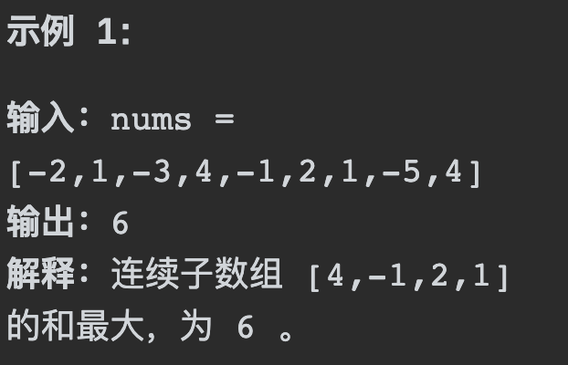
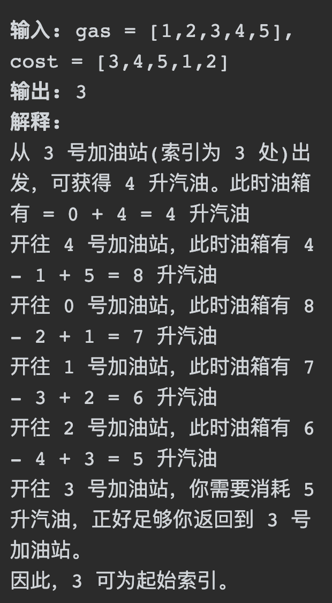

# 53最大子序和

## 题目要求：

给你一个整数数组 `nums` ，请你找出一个具有最大和的连续子数组（子数组最少包含一个元素），返回其最大和。**子数组** 是数组中的一个连续部分。



```rust
1 <= nums.length <= 105
-104 <= nums[i] <= 104
```

## 第一想法：

这个题目的出法就意味着一定有正有负，初始想法是滑动窗口，每次都去记录当前的子序和，但是如何控制新进来的和尾部出去的呢？贪心听着容易，做起来果然难以想象何处使用贪心

## 题解：

### 贪心法：

- 贪心贪在哪里，每次取数的时候如果当前的数加上前面的求和结果为负数，那我们就不应该再要这个数，应从下一个数出发，并将当前和置为0重新计算（但是**注意要保存之前的result**）
- 遍历 nums，从头开始用 count 累积，如果 count 一旦加上 nums[i]变为负数，那么就应该从 nums[i+1]开始从 0 累积 count 了，因为已经变为负数的 count，只会拖累总和。

### 代码一：

```java
class Solution {
    public int maxSubArray(int[] nums) {
        if (nums.length == 1) return nums[0];
        int count = 0;
        int result = Integer.MIN_VALUE;
        //
        for (int i = 0; i < nums.length; i++) {
            count += nums[i];
            if (count > result){
                result = count;//result至少保存着上一次的最大值
            }
            if (count <= 0) count = 0;//如果当前值的加入使子数组和小于0，那么就应该从下一个位置开始找元素。
        }
        return result;
    }
}
```

- 时间复杂度为n

### 动态规划：（分治法）


# 134加油站

## 题目要求：

在一条环路上有 `n` 个加油站，其中第 `i` 个加油站有汽油 `gas[i]` 升。

你有一辆油箱容量无限的的汽车，从第 `i` 个加油站开往第 `i+1` 个加油站需要消耗汽油 `cost[i]` 升。你从其中的一个加油站出发，开始时油箱为空。

给定两个整数数组 `gas` 和 `cost` ，如果你可以按顺序绕环路行驶一周，则返回出发时加油站的编号，否则返回 `-1` 。如果存在解，则 **保证** 它是 **唯一** 的。



## 第一想法：

可以先进行初步的判断看那些加油站不能出发，比较相同位置上的gas和cost即可，如果gas小于cost肯定不能作为起点，只能从大于等于的地方出发。（注意如果有解是唯一的，这个保证应该不用我保证唯一吧）但是知道了可能的结果我们该如何模拟整个过程呢？存在环形过程。

找到每一个可能的位置写一个for循环，加油，用油，只要每一个时刻邮箱里的油大于等于0即可？

## 题解：

### 暴力双循环：

想法与第一想法相近，但是如何处理就是技术了：对于存在的环形过程：**使用while循环进行遍历和取模运算来获得下一次的加油站下标**

```Java
class Solution {
    public int canCompleteCircuit(int[] gas, int[] cost) {
        for (int i = 0; i < cost.length; i++) {
            int rest = gas[i] - cost[i];//可以剩余的油量
            int nextIndex = (i + 1) % cost.length;
            while (rest > 0 && nextIndex != i){//对当前加油站开始环形判断
                rest = rest - cost[nextIndex] + gas[nextIndex];
                nextIndex = (nextIndex+1) % cost.length;
            }
            //出了while循环意味着有一个条件不满足了
            if (rest >= 0 && nextIndex == i){
                return i;
            }
        }
        return -1;
    }
}
```

- 很明显这是一个n平方的复杂度，一定会超时哈哈哈。

### 贪心1：

这种贪心思路的大前提是每个加油站的油量差值的总和只要大于0，就一定是有解的。(隐藏着使用了环形思路，因为只要总和大于0，就一定能够保证从某个点开始环形地移动最终油箱里还有油（比较难证明）)

- 贪心贪的也有些奇怪，从头开始遍历加油站，如果某个站的当前剩余油量（即当前油量差值的和）< 0，证明其到达不了，所以贪心从这里出发，我们就以下个站作为起始站再去判断。
- 总结一下其实是**currentSum作为当前站点能否到达的依据；totalSum作为整个加油站序列是否有合理的出发点的依据。**

```java
class Solution {
    public int canCompleteCircuit(int[] gas, int[] cost) {
        int currentSum = 0;
        int totalSum = 0;
        int startIndex = 0;
        for (int i = 0; i < cost.length; i++) {
            currentSum += gas[i] - cost[i];
            totalSum += gas[i] - cost[i];
            if (currentSum < 0){
                //证明从0到i的区间不满足条件，到达不了i
                startIndex = i + 1;
                currentSum = 0;//重置
            }
        }
        //出了for循环
        if (totalSum < 0) return -1;
        return startIndex;
    }
}
```

- 感觉这个方法有点取巧，具体逻辑如下：
  - 遍历所有加油站作为起点。
  - 如果在某个点油量不够到达下一个加油站，那么这个点之前的所有加油站都不可能作为起始点。
  - 如果能够回到起点，那么这个起点就是答案

### 贪心2：

min记录这一路上出现油量亏空的最大值，从后往前看哪里能够填平这个亏空，哪里就是那个唯一的起始点。

```java
class Solution134{
    public int canComplete(int[] gas,int[] cost){
        int curSum = 0;//
        int min = Integer.MAX_VALUE;//
        for (int i = 0; i < gas.length; i++) {
            int rest = gas[i] - cost[i];
            curSum += rest;
            if (curSum < min){
                min = curSum;
            }
        }
        //分为三种情况
        if (curSum < 0) return  -1;//情况1整个过程油量就不够
        if (min >= 0) return 0;//情况2，从0开始没有出现过油量亏空，那么0就是起点。
        //情况3，从后往前找能够填平的位置
        for (int i = gas.length - 1; i>= 0; i--) {
            int rest = gas[i] - cost[i];
            min += rest;
            if (min >= 0) return i;
        }
        return -1;
    }

}
```

