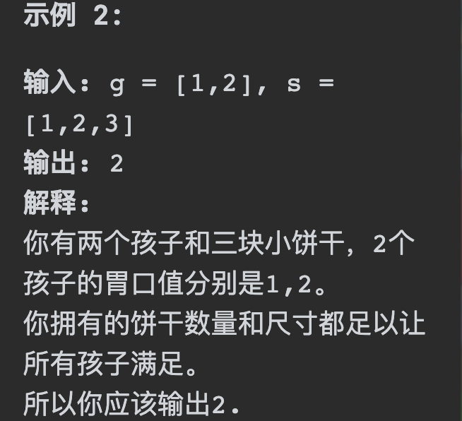
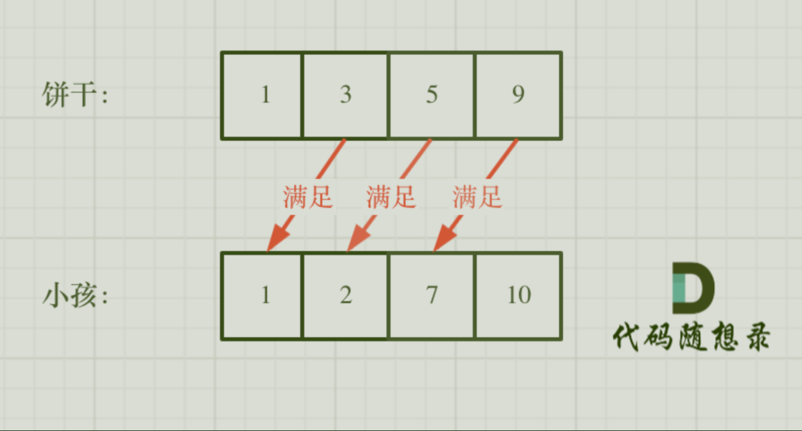

# 455分发饼干

## 题目要求：

假设你是一位很棒的家长，想要给你的孩子们一些小饼干。但是，每个孩子最多只能给一块饼干。

对每个孩子 `i`，都有一个胃口值 `g[i]`，这是能让孩子们满足胃口的饼干的最小尺寸；并且每块饼干 `j`，都有一个尺寸 `s[j]` 。如果 `s[j] >= g[i]`，我们可以将这个饼干 `j` 分配给孩子 `i` ，这个孩子会得到满足。你的目标是尽可能满足越多数量的孩子，并输出这个最大数值。



- `1 <= g.length <= 3 * 104`
- `0 <= s.length <= 3 * 104`
- `1 <= g[i], s[j] <= 231 - 1`

## 第一想法：

尽可能满足更多数量的人，我认为要迁就g和s其中一个。对于每一个孩子，我拿着他的胃口值去尺寸里面找第一个大于等于它的，即最少可以满足他的（这是否是一种贪心的体现？）

- 在寻找时其实最好将尺寸就行排序，然后对其进行二分查找（需要双指针）

- 如果找到了一个满足的尺寸，需要将这个尺寸设置为已使用，所以对于尺寸数组我们还需要进行标记。每次选取时得判断标记。

- 要对胃口数组进行排序吗？我觉得没必要，一个一个找就行（for循环的话注意两个数组的长度）

- 还需要一个计数器来记录当前满足了多少的孩子。

### 问题：
- 在二分法里我们要找的是第一个大于等于它的，所以普通二分找的是等于的？感觉在二分法里最终要找到的其实是最终的mid位置。
- 二分查找到底要返回什么？如果返回下标的话，其实我们要的是尺寸值是否被使用过，所以每次进入二分查找也要去改那个使用过的used数组？

## 题解：
想法太多，其实没有那么复杂，正常遍历即可。两种贪心策略，从小饼干出发，喂饱小胃口；从大饼干出发喂饱大胃口。（但我还是疑惑为什么就正常遍历，时间复杂度不是很高吗？）

- 现在问题变成了两种方法的出发逻辑不同，并且外层的for循环控制的也不同。
- 但是需要注意的是**二者都要控制`index`的范围**，防止异常。



### 代码一：小饼干满足小胃口

- 既然是小饼干满足小胃口，自然从饼干的最小部分出发。

```java
class Solution {
    public int findContentChildren(int[] g, int[] s) {
        Arrays.sort(s);
        Arrays.sort(g);
        int res = 0;
        int index = 0;
        //小饼干满足小胃口
        for (int i = 0; i < s.length && index < g.length; i++) {//从头开始要防止两个数组都会超出
            if (s[i] >= g[index]){
                res ++;
                index ++;
            }
        }
        return res;
    }
}
```

### 代码二：大胃口需要大饼干

- 既然是大胃口需要大饼干，自然从胃口最大的地方出发。且for循环不能从饼干出发，因为从尾部比较如果遇到一个大胃口其他的饼干全都不能满足（死循环了）（从尾部出发的特点）

```java
class Solution {
    public int findContentChildren(int[] g, int[] s) {
        Arrays.sort(s);
        Arrays.sort(g);
        int res = 0;
        int index = s.length - 1;
        //大胃口需要大饼干
        for (int i = g.length - 1; i >= 0 ; i--) {
            if (index >= 0 && s[index] >= g[i]){//注意控制index
                res ++;
                index --;
            }
        }
        return res;
    }
}
```

