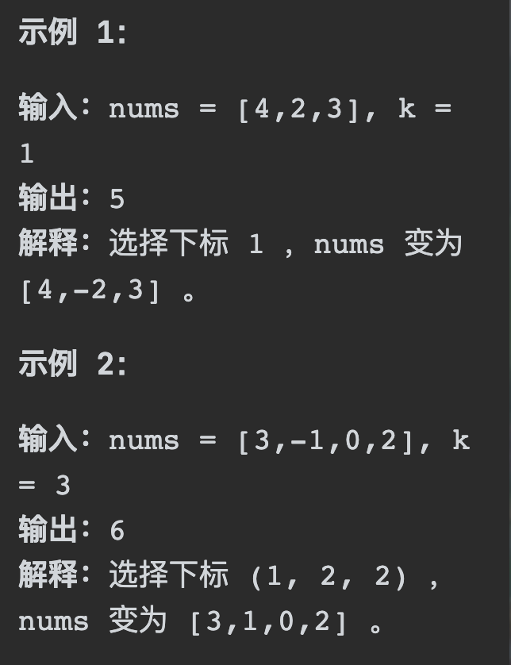
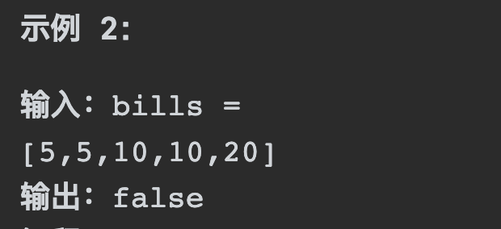

# 455分发饼干

## 题目要求：

假设你是一位很棒的家长，想要给你的孩子们一些小饼干。但是，每个孩子最多只能给一块饼干。

对每个孩子 `i`，都有一个胃口值 `g[i]`，这是能让孩子们满足胃口的饼干的最小尺寸；并且每块饼干 `j`，都有一个尺寸 `s[j]` 。如果 `s[j] >= g[i]`，我们可以将这个饼干 `j` 分配给孩子 `i` ，这个孩子会得到满足。你的目标是尽可能满足越多数量的孩子，并输出这个最大数值。


- `1 <= g.length <= 3 * 104`
- `0 <= s.length <= 3 * 104`
- `1 <= g[i], s[j] <= 231 - 1`

## 第一想法：

尽可能满足更多数量的人，我认为要迁就g和s其中一个。对于每一个孩子，我拿着他的胃口值去尺寸里面找第一个大于等于它的，即最少可以满足他的（这是否是一种贪心的体现？）

- 在寻找时其实最好将尺寸就行排序，然后对其进行二分查找（需要双指针）

- 如果找到了一个满足的尺寸，需要将这个尺寸设置为已使用，所以对于尺寸数组我们还需要进行标记。每次选取时得判断标记。

- 要对胃口数组进行排序吗？我觉得没必要，一个一个找就行（for循环的话注意两个数组的长度）

- 还需要一个计数器来记录当前满足了多少的孩子。

### 问题：
- 在二分法里我们要找的是第一个大于等于它的，所以普通二分找的是等于的？感觉在二分法里最终要找到的其实是最终的mid位置。
- 二分查找到底要返回什么？如果返回下标的话，其实我们要的是尺寸值是否被使用过，所以每次进入二分查找也要去改那个使用过的used数组？

## 题解：
想法太多，其实没有那么复杂，正常遍历即可。两种贪心策略，从小饼干出发，喂饱小胃口；从大饼干出发喂饱大胃口。（但我还是疑惑为什么就正常遍历，时间复杂度不是很高吗？）

- 现在问题变成了两种方法的出发逻辑不同，并且外层的for循环控制的也不同。
- 但是需要注意的是**二者都要控制`index`的范围**，防止异常。


### 代码一：小饼干满足小胃口

- 既然是小饼干满足小胃口，自然从饼干的最小部分出发。

```java
class Solution {
    public int findContentChildren(int[] g, int[] s) {
        Arrays.sort(s);
        Arrays.sort(g);
        int res = 0;
        int index = 0;
        //小饼干满足小胃口
        for (int i = 0; i < s.length && index < g.length; i++) {//从头开始要防止两个数组都会超出
            if (s[i] >= g[index]){
                res ++;
                index ++;
            }
        }
        return res;
    }
}
```

### 代码二：大胃口需要大饼干

- 既然是大胃口需要大饼干，自然从胃口最大的地方出发。且for循环不能从饼干出发，因为从尾部比较如果遇到一个大胃口其他的饼干全都不能满足（死循环了）（从尾部出发的特点）

```java
class Solution {
    public int findContentChildren(int[] g, int[] s) {
        Arrays.sort(s);
        Arrays.sort(g);
        int res = 0;
        int index = s.length - 1;
        //大胃口需要大饼干
        for (int i = g.length - 1; i >= 0 ; i--) {
            if (index >= 0 && s[index] >= g[i]){//注意控制index
                res ++;
                index --;
            }
        }
        return res;
    }
}
```

# 1005k次取反后最大化的数组和

## 题目要求：

给定一个整数数组 A，我们只能用以下方法修改该数组：我们选择某个索引 i 并将 A[i] 替换为 -A[i]，然后总共重复这个过程 K 次。（我们可以多次选择同一个索引 i。）

以这种方式修改数组后，返回数组可能的最大和。



## 第一想法：

大体意思是给定反转次数，求最大总和。既然求最大和，反转的一定要是负数，（如果有负数）并且反转次数的奇偶性也会带来影响。这道题该如何贪心呢？每次反转负数中的最小值，或者反转正数中的最小值？

- 带着这个思路，我们寻找负数中的最小值，会有n的复杂度；再寻找正数中的最小值，（其实这个过程可以一起实现）但是负数即使不是最小值也比正数的最小值优先级高——负数最小-负数其他-0-正数最小-正数其他（并且正数的翻转也是迫不得已的时候，这个迫不得已情况好像也挺复杂，需要比较反转的负数的绝对值和这个正数的绝对值？）
- 需要判断数组中的负数数目与反转次数k的大小关系，*如果k小，那么很好反转，从负数最小往上反转；如果k大，那么k-负数数目>1且为偶数，不变，为奇数得判断反转正数最小的收益大还是翻回来；k-负数数目=1，同刚才的奇数情况*

```java
class Solution {
    public int largestSumAfterKNegations(int[] nums, int k) {
        int result = 0;
        /**
         * 先统计负数数目，与k作比较，如果>1且为偶数
         *
         */
        int numOFNegtive = getNumOFNegtive(nums);
        int flag = Math.abs((k - numOFNegtive));
        if ( flag > 1 && flag % 2 == 0){

        }
        if (flag > 1 && flag % 2 != 0){

        }
        if (flag == 1){
            
        }
    }
    private int getNumOFNegtive(int[] nums){
        int count = 0;
        for (int i = 0; i < nums.length; i++) {
            if (nums[i] < 0) count ++;
        }
        return count;
    }
}
```

- 写到一半发现不对啊，差值也可能小于0啊，即使小于0你也得翻转的吧。

## 题解：

其实没有这么复杂，**最关键的步骤在于先对整个数组进行排序**，按照绝对值的顺序从大到小进行排序。

- 这样从前往后进行遍历时只需要对负数进行遇到即反转

- 对正数的处理逻辑也很重要，我们只需要看最后k是否为奇数，如果k是奇数我们只需要对数组的最后一个数进行翻转即可（奇数再大，反复反转那一个元素即可）；如果是偶数不影响最终结果，因为我们还能反转其他的奇数。

```java
class Solution {
    public int largestSumAfterKNegations(int[] nums, int k) {
        //为了使用sort排序，需要装箱为对象
        Integer[] numsInteger = new Integer[nums.length];
        for (int i = 0; i < nums.length; i++) {
            numsInteger[i] = nums[i];
        }
        //对数组进行绝对值从大到小排序
        Arrays.sort(numsInteger,(a,b) -> Math.abs(b) - Math.abs(a));
        //
        int result = 0;
        for (int i = 0; i < numsInteger.length; i++) {
            if (numsInteger[i] < 0 && k > 0){
                numsInteger[i] *= -1;
                k --;
            }
        }
        //如果此时k还有值
        if (k % 2 == 1) numsInteger[nums.length - 1] *= -1;
        for (Integer integer : numsInteger) {
            result += integer;
        }
        return result;
    }
}
```

- 在写代码时本题的难点是如何对数组进行按照绝对值从大到小的排序，如果我们使用`Arrays.sort(nums,(a,b) -> Math.abs(b) - Math.abs(a))`这样的方法，必须确保传入的数组类型为对象，而不是普通的int[]类型。

# 860柠檬水找零

## 题目要求：

在柠檬水摊上，每一杯柠檬水的售价为 `5` 美元。顾客排队购买你的产品，（按账单 `bills` 支付的顺序）一次购买一杯。

每位顾客只买一杯柠檬水，然后向你付 `5` 美元、`10` 美元或 `20` 美元。你必须给每个顾客正确找零，也就是说净交易是每位顾客向你支付 `5` 美元。注意，一开始你手头没有任何零钱。

给你一个整数数组 `bills` ，其中 `bills[i]` 是第 `i` 位顾客付的账。如果你能给每位顾客正确找零，返回 `true` ，否则返回 `false` 。



## 第一想法：

说白了，来回操作的还是bills里面的元素值，我们手上的钞票全都来自于这个数组。为了启动我们必须要从5开始吗？还真是，第一个元素必须是5，第二个元素也不能是20（这算是健壮性条件）是否需要创建一个已有的货币数组：如果进来5，接受；如果进来10，找5，找到去掉5，原位置上接受10；如果进来20，找15（可以由10和5构成，也可以三个5），接受20（但是20对我们找零没有作用，我认为无需接受）；直到进来的10或者20我们没法找到对应的数，就返回false

```java
class Solution {
    public boolean lemonadeChange(int[] bills) {
        int[] cash = new int[bills.length];
        if (bills[0] != 5 || bills[1] == 20) return false;
        for (int i = 0; i < bills.length; i++) {
            if (bills[i] == 5){
                cash[i] == 5;
            }
            if (bills[i] == 10){
                //去cash里面找5
                for (int j = 0; j < bills.length; j++) {
                    if (cash[j] == 5){
                        cash[j] == 10;
                        break;
                    }
                }
            }
            if (bills[i] == 20){
                //找组合成15的？
            }
        }
    }
}//这样模拟太复杂了，也很冗余，一定有巧妙的方法
```

## 题解：

去模拟过程显然是很复杂的，但是可以**用手头钞票的数量来替换模拟过程**。

- 如果遇到5，钞票5的数量+1
- 如果遇到10，钞票5的数量-1，钞票10的数量+1
- 如果遇到20，分两种情况：钞票5的数量-1，钞票10的数量-1（这种情况显然是我们优先选择的贪心）；钞票5的数量-3

```java
class Solution {
    public boolean lemonadeChange(int[] bills) {
        int CashFive = 0,CashTen = 0;
        if (bills[0] != 5 || bills[1] == 20) return false;
        for (int bill : bills) {
            if (bill == 5){
                CashFive ++;
            }
            //
            if (bill == 10){
                if (CashFive > 0){
                    CashFive --;
                    CashTen ++;
                }else return false;
            }
            //
            if (bill == 20){
                if (CashFive > 0 && CashTen > 0){
                    CashFive --;
                    CashTen --;
                } else if (CashFive >= 3) {
                    CashFive = CashFive - 3;
                }else return false;
            }
        }
        return true;
    }
}
```

