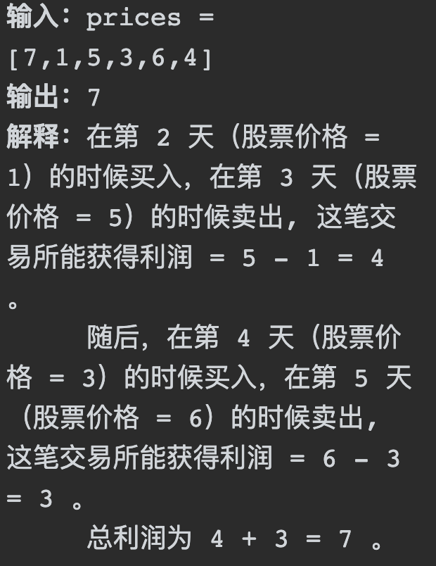
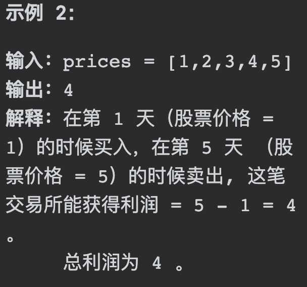
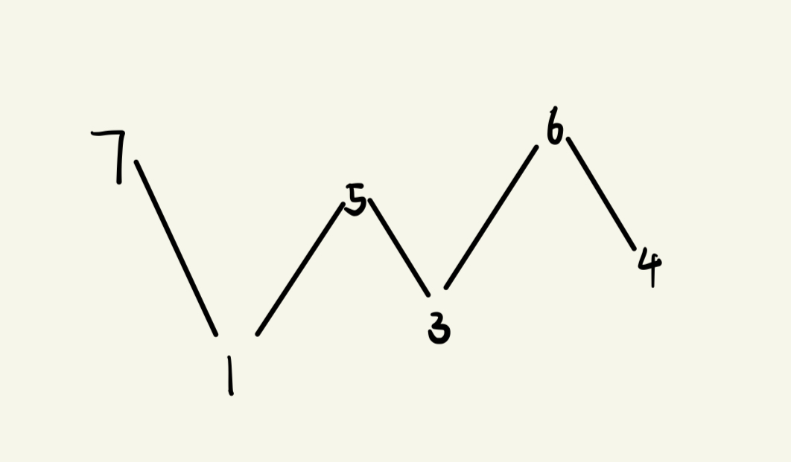

# 122买卖股票的最佳时机II

## 题目要求：

给你一个整数数组 `prices` ，其中 `prices[i]` 表示某支股票第 `i` 天的价格。

在每一天，你可以决定是否购买和/或出售股票。你在任何时候 **最多** 只能持有 **一股** 股票。你也可以先购买，然后在 **同一天** 出售。

返回 *你能获得的 **最大** 利润* 。



```rust
1 <= prices.length <= 3 * 104
0 <= prices[i] <= 104
```

## 第一想法：

这道题目最适用于贪心二字，想要获取最大利润，第一想法自然是买的时候股价较低，卖的时候股价较高，但是由于数组的长度不确定即天数不确定，买卖的时机我认为是本题的关键。

局部最优是前后差值较大，推到全局最优。又该如何判断什么是小呢？虽然你看着1是小，但代码中你怎么知道这是小？一定是不能对其进行排序的，因为买卖的时机很重要。

## 题解：

想偏了，想当然的认为本题与生活中的股票一样找到峰值点才会卖出：

- 考虑股价连续上升的情况。使用您提到的方法，您可能会在开始时买入，在结束时卖出，获得一次大的利润。但是，**贪心算法会在每个子区间买入和卖出，累积的利润与您一次性买卖的利润相同**。例如，股价从1元上升到5元，您可以在1元买入、5元卖出获得4元的利润，而贪心算法会在每一天的上升中都买卖，最终累积同样的4元利润。（来自于ChatGpt）
- 更直观的是将数组视作一个上升下降序列，与357摆动序列一样：

- 我们只需要去找每一个上升区间的值即可。贪心算法通过简化决策过程，使我们能够在不需要预测价格走势的情况下，通过累积所有可能的小利润来实现最大化总利润。这种方法在这类问题上通常是有效且实用的。

```java
class Solution {
    public int maxProfit(int[] prices) {
        //使用贪心，每次找到上升区间，为整体带来正反馈
        int result = 0;
        for (int i = 1; i < prices.length; i++) {//i从1开始，从第二天才可以收集到利润
            result += Math.max(prices[i] - prices[i-1], 0);
        }
        return result;
    }
}
//其实最难理解的还是为什么这样每一小段的上升利润（局部最优）可以跟我的全局最大最后的和相同，还真就推到了全局贪心上去了...
```

