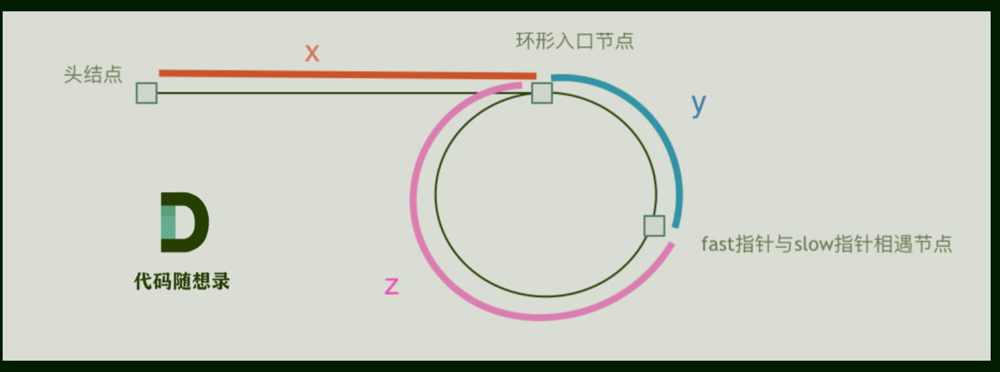

# 142环形链表(141判断是否有环)

## 题目要求：

- 给定一个链表的头节点  `head` ，返回链表开始入环的第一个节点。 *如果链表无环，则返回 `null`。*

- 如果链表中有某个节点，可以通过连续跟踪 `next` 指针再次到达，则链表中存在环。 为了表示给定链表中的环，评测系统内部使用整数 `pos` 来表示链表尾连接到链表中的位置（**索引从 0 开始**）。如果 `pos` 是 `-1`，则在该链表中没有环。**注意：`pos` 不作为参数进行传递**，仅仅是为了标识链表的实际情况。

**不允许修改** 链表。

## 思路：

### 第一想法：

- 怎么去找这个环，链表中只有一个环吗？

### 困难：

- 判断环
- 如何找到入口处

### 正解：
#### 快慢指针判断是否有环：
- 如果无环，快慢指针走完整个链表永远不可能相遇；如果有环，**在相对速度为1的前提下，二者一定会在环内相遇**。因为就像操场跑圈，相对速度1，快指针会一个一个地追，最终一定会追上。
- slow 走过的距离：x+y ; fast 走过的距离：`x+y+n(y+z)` ;**进圈之后！！！这里慢指针不可能在圈里面走超过一圈，因为我们设定快指针速度是其两倍**，相同时间路程也是两倍，当慢指针马上走完一圈时，快指针一定都走了两圈了，早就相遇了！
- 

- 可以根据—**由于fast速度为slow的两倍，相同时间内fast走过的结点数是slow的两倍**来列出二者路程的等式——`2(x+y) = x+y + n(z+y)`——化简后得到:`x=(n-1)(z+y)+z`
- 可以发现当n=1时，即走到相遇点后快指针又绕了一圈与慢指针相遇了。x=z，故等式里的前面那一坨就是快指针多绕了多少圈罢了

#### 如何找到环的入口：
- 原因：这是因为当快指针和慢指针第一次相遇时，快指针比慢指针多走了环的整数倍的距离。`x=(n-1)(z+y)+z`
- 当n=1时，`x=z`,在相遇点的指针和在起始的指针一起移动，一定会在环的入口处相遇。若n 不等于1，x = 整数倍的环的长度 + z（所以可以忽略掉多走的n圈，x = z）
- **找入口就可以定义一个在相遇处的指针，一个在起始位置的指针，二者相遇的点一定是入口。**

### 代码
```java
/**
 * Definition for singly-linked list.
 * class ListNode {
 *     int val;
 *     ListNode next;
 *     ListNode(int x) {
 *         val = x;
 *         next = null;
 *     }
 * }
 */
public class Solution {
    public ListNode detectCycle(ListNode head) {
        //根据思路，我们先设置快慢指针，一个速度为2一个为1
        ListNode fastNode = head;
        ListNode slowNode = head;
        //判断是否有环
        while(fastNode != null && fastNode.next != null){//因为快指针两步去走得看next
            fastNode = fastNode.next.next;
            slowNode = slowNode.next;
            //相遇之后说明有环
            if(slowNode == fastNode){
                //有环之后再去找入口,设置两个指针，一个在相遇点，一个在起始位置
                ListNode Node1 = fastNode;
                ListNode Node2 = head;
                while(Node1 != Node2){
                    //这时是公式里的x=z环节，速度是一样的
                    Node1 = Node1.next;
                    Node2 = Node2.next;
                }
                return Node1;
            }
        }
        //如果找不到环即退出返回null，其实找到环就一定会有入口的
        return null;
    }
}
```

##二刷启发：
- 可以发现本题没有设置虚拟头结点，并且题目要求也是只返回环的入口（而不是整个链表）。下面是何时需要虚拟头结点：
- **插入操作**：当你需要在链表的头部插入新节点时，虚拟头结点可以帮助简化代码，因为你不需要单独处理头节点的情况。
- **删除操作**：同样，当删除链表中的节点时，特别是删除头节点时，虚拟头结点可以避免单独处理头节点的情况。
- **统一操作**：虚拟头结点有时用于统一链表操作，使得对链表的处理更加一致，无需对头节点进行特殊处理。