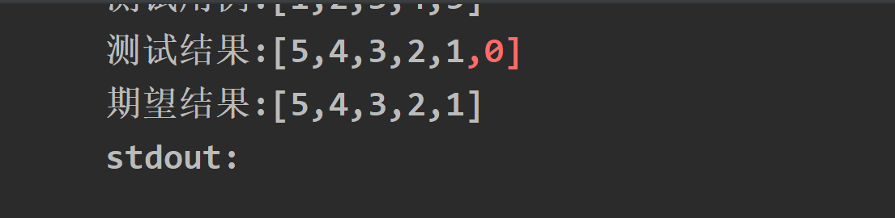
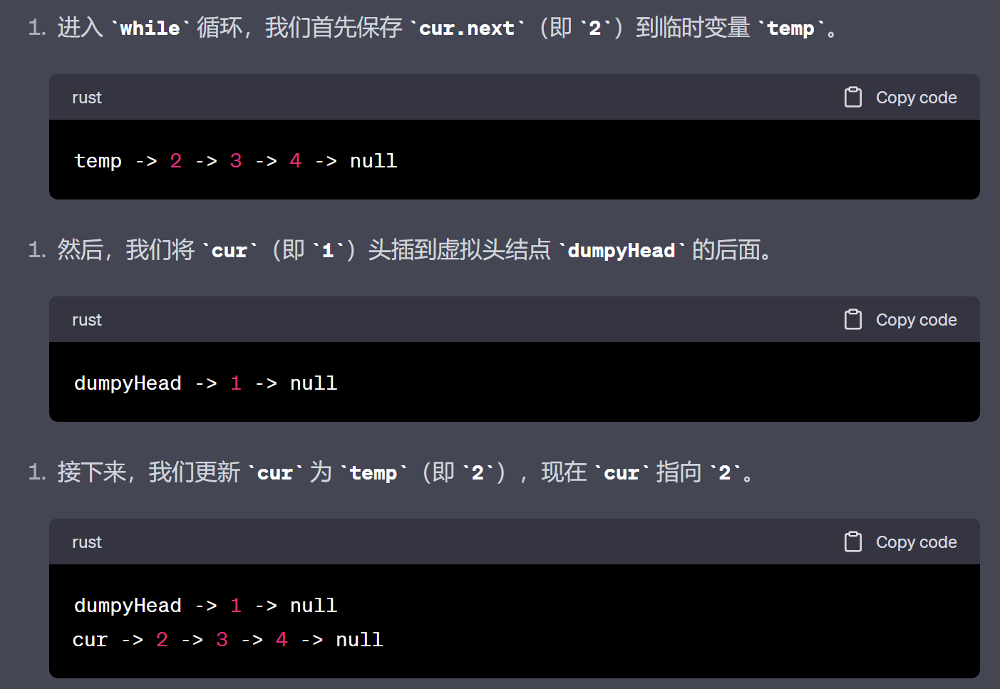

# 206 翻转链表

## 题目要求

## 思路一双指针法

- 只需要改变每个结点的next指向，从指向自己的后方改为前方，往回甩一下。要注意保存每个正操作结点的下一个结点。
- 时间复杂度：N
### 二刷总结方法：
- 二刷：将思路一**总结为三合一夹中间**——**既要保存前面操作过的，又要保存后面即将要操作的（并且先保存后者）**。
### 三刷小细节：

- 是否需要虚拟头结点：不需要，且如果加上了话返回的值会多出一个结点来；并且因为反转的缘故，你不能通过改变`return`来消除这个影响。
- 

## 代码一

```java
/**
 * Definition for singly-linked list.
 * public class ListNode {
 *     int val;
 *     ListNode next;
 *     ListNode() {}
 *     ListNode(int val) { this.val = val; }
 *     ListNode(int val, ListNode next) { this.val = val; this.next = next; }
 * }
 */
class Solution {
    public ListNode reverseList(ListNode head) {
        /**思路一，修改掉每个结点的next指针，让他的箭头向前甩，但是注意要保存结点的下一个位置 */
        ListNode pre = null;
        ListNode cur = head;
        ListNode serv ;
        while(cur != null){
           serv = cur.next;//保存当时的下一个结点，因为要修改next
           cur.next = pre;
           pre = cur;//注意这里不要写成pre.next因为pre是你自己假设的
           cur = serv;
            //先保存下一个，再甩链子，再移动pre；最后移动当前位置。
        }
        return pre;
    }
}
```

## 思路二头插法（1）

- 使用头插法，从第二个结点开始，依次头插，直到最后一个结点也完成头插。**但头节点上面的指针`master`不变，一直停在原来的头结点的上方**，目的就是精确定位要删除的那个第二个第三个第四个结点。

- 头插过程：注意要先保存，再删除，最后头插。——即**返回那个要删除的结点（完成保存）**
- 时间复杂度：删除操作复杂度为1，循环操作里由于操作了n个元素，所以实际的时间复杂度也是N

## 代码二

```java
/**
 * Definition for singly-linked list.
 * public class ListNode {
 *     int val;
 *     ListNode next;
 *     ListNode() {}
 *     ListNode(int val) { this.val = val; }
 *     ListNode(int val, ListNode next) { this.val = val; this.next = next; }
 * }
 */
class Solution {
    public ListNode reverseList(ListNode head) {
        /**思路二，头插法。从第二个开始到最后一个结点，先保存下一个，再删除它，最后头插在头部。
        并且注意保存头结点，用来最后返回。 */
        ListNode master = head;
        //这么看来master一直是指在原来的头结点上方的
        while(master != null){
            ListNode newhead = DeletServe(master);//这里为什么传master，因为第二个第三个结点都是需要原来那个首结点来定位的，master的下一个每次指向第二个第三个...最后有一个。
            if(newhead != null){
                //头插
                newhead.next = head;
                head = newhead;
            }else{
                break;//会直接退出整个while循环。
            }
        }
        return head;//而head是不断变化，一直在跑的。所以最后返回head
    }
    //写一个保存，然后删除的方法.删除now的next结点
    public ListNode DeletServe(ListNode now){
        if(now == null || now.next ==null ){
            return null;
        }
        ListNode del = now.next;
        now.next = now.next.next;//删除
        return del;//这里返回的被删除的结点，因为最后还要头插
    }
}
```
## 思路二：头插法（2）
- 与上面思路不同的是，我们同样引入了虚拟头结点，可以发现引入了虚拟头结点后就不需要使用`master`一直标记着最头部的结点。
- 突然发现chatgpt写的那种代码示例执行过程也很不错，可以稍微借鉴一下:
## 代码二：
```java
class Solution {
    public ListNode reverseList(ListNode head) {
        ListNode dummyHead = new ListNode(0);
        dummyHead.next = null;
        //头插法
        ListNode cur = head;
        ListNode tmp;
        while (cur != null){
            tmp = cur.next;
            cur.next = dummyHead.next;
            dummyHead.next = cur;
            cur = tmp;
        }
        return dummyHead.next;
    }
}
```
## 思路三 栈

使用栈来逆转链表。但是写这道题时，对于Java的栈操作不是很熟悉，照着抄了一遍。

注意防止成环。但是为什么有环呢,因为最后的next并不知道指向哪里，万一指回去了呢？

## 代码三

```java
/**
 * Definition for singly-linked list.
 * public class ListNode {
 *     int val;
 *     ListNode next;
 *     ListNode() {}
 *     ListNode(int val) { this.val = val; }
 *     ListNode(int val, ListNode next) { this.val = val; this.next = next; }
 * }
 */
class Solution {
    public ListNode reverseList(ListNode head) {
        Stack<ListNode>stack = new Stack<>();//新建栈
        //把链表的元素全部放入栈中
        while(head != null){
            stack.push(head);
            head =head.next;
        }
        if(stack.isEmpty()){
            return null;
        }
        ListNode master = stack.pop();
        ListNode dummy = master;//用dummy来保存栈顶元素指向，最后要返回输出的
        //将栈中元素全部输出组成一个链表
        while(!stack.isEmpty()){
            ListNode tempNode = stack.pop();
            master.next = tempNode;
            master = master.next;//master一直指向链表的最后
        }
        //防止成环
        master.next = null;
        return dummy;
    }
}
```