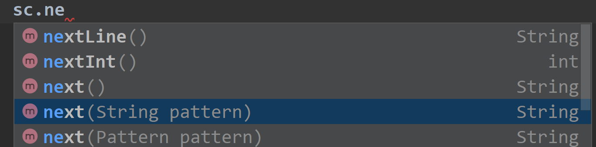

# 6判断素数

## 题目要求：

给出一个正整数 x，判断它是不是一个素数。

每组测试包涵一个正整数 X(3 <= x <= 1000)，表示你要判断的数。

## 第一想法：

根据提示：将 x 作为被除数，将 2 ~ x-1 各个整数先后作为除数，如果都不能被整除，则 x 为素数。

## 本题核心

- 如果使用提示的方法，时间复杂度是N；在判断时我设置了一个`flag`作为判断标志。
- 其他方法：

## 代码解决

从2~x-1依次去除法

```java
import java.util.Scanner;
public class Main{
      public static void main(String[] args) {
        /**
         * 提示的方法是不是有点烦琐了？
         */
        Scanner sc = new Scanner(System.in);
        int n = sc.nextInt();
        int index = 2;//作为除数。
        boolean flag = false;
        while (index < n){
            if (n % index == 0){//如果找到了一个因子
                System.out.println("NO");
                flag = false;
                break;
            }else {//如果当前因子不能整除则继续找
                flag = true;
                continue;
            }
        }
        //如果flag一直为true，意味着没有找到可以整除的因子
        if (flag == true) System.out.println("YES");
        sc.close();
    }
}
```

# 7求和问题

## 题目要求

输入一个整数n，求SUM（n）=1+2+3...+n的值。

## 第一想法

使用`for`循环去累加即可。

## 本题核心

## 代码解决

```java
import java.util.Scanner;
public class Main{
  public static void main(String[] args) {
        Scanner sc = new Scanner(System.in);
        while (sc.hasNext()){
            int n = sc.nextInt();
            int sum = 0;
            for (int i = 0; i <= n; i++) {
                sum += i;
            }
            System.out.println(sum);
        }
    }
}
```

# 8计算球的表面积

## 题目要求

输入一个半径R，输出以R为半径的球的表面积。

输入数据有多组，每组输入占一行，由一个实数R构成。R<=1000

输出占一行，输出该球表面积，输出结果保留三位小数。

## 第一想法

- 根据要求做即可

## 本题核心

- 球的表面积公式:**S=4πr 2=πD 2**
- 提前定义PI值，使用`static final`定义为静态变量
- 输入数据由**实数**组成，所以必须使用`double`定义
- 输出格式也有限制，需要格式化输出

## 代码解决

```java
import java.util.Scanner;
public class Main{
    private static final double PI = 3.1415927;//本题的一个小要求，提前定义PI的值
    public static void main(String[] args) {
        Scanner sc = new Scanner(System.in);
        while (sc.hasNext()){
            double r = sc.nextDouble();//注意，输入数据由实数组成
            double area = 4 * PI * r * r;
//            System.out.println("%.3f" area);//输出格式有限制，就不能使用println
            System.out.printf("%.3f%n",area);
        }
        sc.close();
    }
}
```

# 9求奇数的和

## 题目要求

给你n个整数，求他们中所有奇数的和。

输入数据包含多个测试实例，每个测试实例占一行，每行的第一个数为n，表示本组数据一共有n个数，接着是n个整数ai。n<=1000，ai<=1000。

输出每组中的所有奇数的和，对于测试实例，输出一行。如果不存在奇数，则输出0。

## 第一想法

多了一个每一行的数字的个数这个变量而已。

## 本题核心

- 先接收每一行的总数
- 再在内层的循环中处理每一行的计算

## 代码解决

```java
import java.util.Scanner;
public class Main{
  public static void main(String[] args) {
        Scanner sc = new Scanner(System.in);
        while (sc.hasNext()){
            int len = sc.nextInt();//这一行有多少个整数
            int sum = 0;
            //内层的循环处理每一行的数据
            while (len > 0){
                int num = sc.nextInt();
                if (num % 2 != 0){
                    sum += num;
                }
                len --;
            }
            System.out.println(sum);
        }
    }
}
```

# 10首字母变大写

## 题目要求

输入一个英文句子，将每个单词的第一个字母改成大写字母。

输入数据包含多个测试实例，每个测试实例是一个长度不超过100的英文句子，占一行。

请输出按照要求改写后的英文句子。

## 第一想法

十道题目里最难的一道题，自己对于字符串的输入输出处理完全不熟练。

## 本题核心

- sc中`next() nextLine()`的区别，是解决本题的关键之一：

- 前者读取输入直到遇到空格；后者读取一整行句子，**直到遇到行结束符（例如，回车键）**。

如果使用后者，将得到的句子利用`split()`空格进行划分成为多个单词，对这多个单词进行处理最终拼接成一个句子作为最终的返回结果。

- 处理方式就是取每个单词的第一个字母进行大写，后面的所有字母进行小写
- 记得所有单词拼接时使用空格分割

使用`next()`的后果：

- `next()` **无法识别行结束符（例如回车或换行符）作为一个特殊的输入**。它只会读取并返回空格之前的字符串，并忽略行结束符。这意味着，即使输入了多行，`next()` 会连续读取这些行上的词，而不会因为换行而停止


## 代码解决

```java
import java.util.Scanner;
public class Main{
  public static void main(String[] args) {
        Scanner sc = new Scanner(System.in);
        while (sc.hasNext()){
            //我该怎样接收一个字符串，且字符串如果是String类型要注意他是不可变的，是否需要用一个可变的Builder
            String input = sc.nextLine();
            System.out.println(capitalizeFirstLetter(input));
        }
        sc.close();
    }
    private static String capitalizeFirstLetter(String sentence){
        String[] words = sentence.split(" ");// 用于根据空格分割句子为单词。
        StringBuilder capitalizedSentence = new StringBuilder();//由于字符串是不可变的，需要使用可变的Builder来处理
        for (String word : words){
            if (! word.isEmpty()){
                //进行首字母大写操作,注意substring可以取出特定的字符
                String capitalizedWord = word.substring(0,1).toUpperCase() + word.substring(1).toLowerCase();
                capitalizedSentence.append(capitalizedWord).append(" ");//将处理完的单词放入到句子中，每次都使用空格分割
            }
        }
        return capitalizedSentence.toString().trim();//去除开头和末尾的空格
    }
}
```

