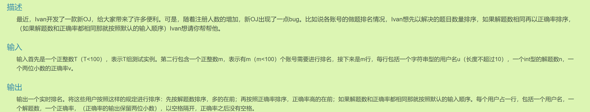
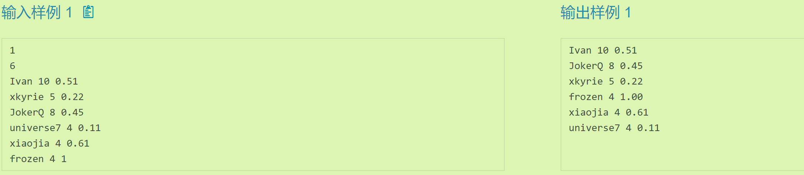
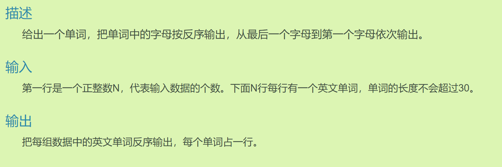

# 21能被三整除的个数

## 题目要求

给定一个n，求出[1,n]内所有能被3整除的数的个数。

输入包含多组数据。每组数据输入一个n

输出[1,n]内所有能被3整除的数的个数

## 第一思路

使用for循环对从1-n的每一个数进行判断即可

## 本题核心

- 如果简单的使用for循环去判断会造成超时，因为n特别大的时候时间复杂度就会很大
- **小技巧**：当我们说一个数 `n` 除以另一个数 `d`，并取其整数部分，这个操作给出的是在从 `1` 到 `n`（包括 `n`）这个范围内，有多少个数是 `d` 的倍数。
- 原理：当我们计算 `n / d` 时，实际上是在计算在 `1` 到 `n` 的范围内，有多少个这样的间隔。结果就是 `d` 的倍数的数量

## 代码实现

```java
    public static void main(String[] args) {
        Scanner sc = new Scanner(System.in);
        int result = 0;
        while (sc.hasNext()){
            int n = sc.nextInt();
            result = n / 3;
            System.out.println(result);
        }
        sc.close();
    }
```

# 22 结构体排序

## 题目要求





## 第一思路

- 在C语言里是结构体排序，到了Java里将其声明为类即可，

- 接收多个同类型的类，将其全部存入列表中；再写一个根据条件排序的方法，其中使用compartor匿名内部类比较器

## 本题核心

比较器的实现及特点要牢记。（其实尝试一下谁-谁也能试出来）
- `compare` 方法的返回值决定了排序的顺序。
- 如果返回负数，表示第一个参数（`u1`）应该排在第二个参数（`u2`）之前。
- 如果返回正数，表示第一个参数应该排在第二个参数之后。
- 如果返回 `0`，表示两个参数相等，在排序中的位置可以互换。

## 代码实现：

- 在比较double时没有使用普通的减法，而是使用`Double.compare`来避免精度损失和无穷，返回的结构规则与上面compare一样。

```java
import java.util.*;
public class Main{
  public static void main(String[] args) {
        //
        Scanner sc = new Scanner(System.in);
        int T = sc.nextInt();//T组测试实例
        while (T -- > 0){
            List<User> users = new ArrayList<>();
            int m = sc.nextInt();
            while (m -- > 0){
                //对这m个账号进行信息的接收,放入一个列表当中
                String name = sc.next();
                int num = sc.nextInt();
                double rate = sc.nextDouble();
                User user = new User(name, num, rate);
                users.add(user);
            }
            Sort(users);
            //
            for(User user : users){
                System.out.printf("%s %d %.2f\n", user.getName(),user.getNum(),user.getRate());
            }
        }
    }

    /**
     * 对每一组用户列表进行排序
     * @param list
     */
    private static void Sort(List<User> list){
        Collections.sort(list, new Comparator<User>() {
            @Override
            public int compare(User u1, User u2) {
                if (u1.getNum() != u2.getNum()){
                    return u2.getNum() - u1.getNum();//降序？
                }else if (u1.getRate() != u2.getRate()){
                    return Double.compare(u2.getRate(), u1.getRate());
                }
                return 0;//都相同
            }
        });
    }
}
class User{
    private String name;
    private int num;//解题数
    private double rate;//正确率

    public User() {
    }

    public User(String name, int num, double rate) {
        this.name = name;
        this.num = num;
        this.rate = rate;
    }

    public String getName() {
        return name;
    }

    public void setName(String name) {
        this.name = name;
    }

    public int getNum() {
        return num;
    }

    public void setNum(int num) {
        this.num = num;
    }

    public double getRate() {
        return rate;
    }

    public void setRate(double rate) {
        this.rate = rate;
    }
}
```

# 23逆序输出

## 题目要求



## 第一思路

使用双指针进行翻转，不过String是一个不可变的类型，需要将其先转换为字符串数组，进行操作后再转换回字符串。

使用Java中StringBuilder自带的`reverse`方法也可以。

## 本题核心

关于`Scanner.nextInt()`和`Scanner.nextLine()`之间的冲突陷阱（这个问题前面的题目都没出现过！）

- 当您使用 `Scanner` 的 `nextInt()` 和 `nextLine()` 方法混合读取输入时，`nextInt()` 只会读取整数值，而不会读取行尾的换行符 `\n`
- 当您在调用 `nextInt()` 后紧接着调用 `nextLine()` 时，`nextLine()` 会读取并返回位于整数后面的换行符之后的内容，通常这会是一个空字符串
- 为了解决这个问题，您可以在 `nextInt()` 和 `nextLine()` 之间额外调用一次 `nextLine()` 来消耗掉这个换行符

## 代码实现

```java
import java.util.Scanner;
public class Main{
  public static void main(String[] args) {
        Scanner sc = new Scanner(System.in);
        int N = sc.nextInt();
        sc.nextLine();//解决nextInt和nextLine之间的陷阱，这里接受掉换行符

        while (N  > 0){
            String word = sc.nextLine();//如果使用nextLine刚进来的时候word=''？
            Reverse(word);
            N --;
        }
        sc.close();
    }
    private static void Reverse(String word){
        //先将String转换为字符串数组
        char[] arr = word.toCharArray();
        int left = 0;
        int right = word.length() - 1;
        while (left < right){
            char temp = arr[left];
            arr[left] = arr[right];
            arr[right] = temp;
            left ++;
            right --;
        }
        //将字符数组转换为字符串
        String result = new String(arr);
        System.out.println(result);
    }
}
```


