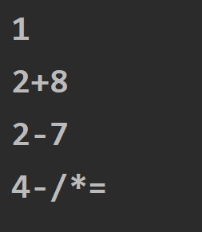

# 北林OJ堆栈

## 240 基于栈的中缀求和

### 题目要求：

输入一个中缀算术表达式，求解表达式的值。运算符包括+、-、*、/、(、)、=，参加运算的数为double类型且为正数。（要求：直接针对中缀算术表达式进行计算，不能转换为后缀或前缀表达式再进行计算，只考虑二元运算即可。）

多组数据，每组数据一行，对应一个算术表达式，每个表达式均以“=”结尾。当表达式只有一个“=”时，输入结束。参加运算的数为double类型。

### 第一想法：

没想法，只会做后缀表达式求和。

### 正解：

使用双栈思想，一个保存操作数，一个保存操作符。

首先，即使你传进来的东西是有数字有符号，但是使用scanner接收后为了方便，统一将其设置为字符串类型。

其次，注意在遍历字符串时，遇到连续的数字字符，要把他当作是一个完整的数字，这就需要一个方法实现。直到遇到操作符才停止。

最后，注意优先级问题，遇到高优先级的让人家先算，而加减的优先级最低，如果栈里面有操作符，直接进行计算即可。

### 代码实现：

```java
package com.luluedu.beilin.stack;

import java.util.Scanner;
import java.util.Stack;

/**
 * @author 陆涛
 * @version 1.0
 * 又来抄代码啦
 */
public class MidSum {
    public static void main(String[] args) {
        double result = evaluate("2+2=");
        System.out.println(result);
    }
    public static double evaluate(String expression){
        Stack<Double> operands = new Stack<>();
        Stack<Character> operators = new Stack<>();
        int i = 0;
        //开始对输入字符进行遍历
        while (i < expression.length()){
            char c = expression.charAt(i);
            if (Character.isDigit(c)){
                //如果是数字的话需要得到一个完整的数字，比如20，我不能把他当作2和0
                int j = i;
                while (j < expression.length() && (Character.isDigit(expression.charAt(j)))){
                    //对这个表达式进行遍历，只要是遍历到的字符是数字就继续；注意这个方法专门用来判断是否是1-9
                    j ++;
                }
                String operand = expression.substring(i,j);//退出while循环意味着遇到操作符了，返回从i到j的一个操作数
                operands.push(Double.parseDouble(operand));//这里转为了Double类型，按道理输入的不就是int吗
                i = j - 1;//i继续从j前一个位置出发，这步没看懂,因为后面还有个i++向后遍历
            }else if (c == '('){
              operators.push(c);
            }else if (c == ')'){
                while (operators.peek() !='('){
                    char operator = operators.pop();
                    double operand2 = operands.pop();
                    double operand1 = operands.pop();
                    double result = compute(operator,operand1,operand2);
                    operands.push(result);
                    //遇到右括号时，意味着前面的数据都要出来了，并且出也是直到遇到左括号为止，使用while循环。
                }
                operators.pop();//这句话我理解是将碰到的那个左括号弹出
            }else if (c =='+' || c =='-'){
            while (!operators.isEmpty() && operators.peek() != '('){
                //当操作符栈不为空并且顶部不是左括号时就要计算，遇到左括号才暂时不计算
                //因为此时栈里面有要计算的运算符，把它该算的算了才把自己入栈；意思是无论栈里面有什么运算符，运算的优先级都大于等于加减
                char operator = operators.pop();
                double operand2 = operands.pop();
                double operand1 = operands.pop();
                double result = compute(operator,operand1,operand2);
                operands.push(result);
            }
            operators.push(c);
            }else if (c =='*' || c=='/'){
                while (! operators.isEmpty() && (operators.peek() =='*') || operators.peek() =='/'){
                    //遇到乘除号时，如果栈顶有对应的乘除号才进行运算，如果是加减号，优先级不如乘除，又没有括号，所以乘除号直接入栈
                    char operator = operators.pop();
                    double operand2 = operands.pop();
                    double operand1 = operands.pop();
                    double result = compute(operator,operand1,operand2);
                    operands.push(result);
                }
                operators.push(c);
            }
            i ++;//继续向后遍历
        }
        //当遍历完整个字符串时，如果操作符栈里面还有数据，最后进行处理
        while (! operators.isEmpty()){
            char operator = operators.pop();
            double operand2 = operands.pop();
            double operand1 = operands.pop();
            double result = compute(operator,operand1,operand2);
            operands.push(result);
        }
        return operands.pop();
    }
    //计算方法
    public static double compute(char operator,double operand1,double operand2){
        if (operator =='+'){
            return operand1 +operand2;
        }else if (operator =='-'){
            return operand1 - operand2;
        }else if (operator =='*'){
            return operand1 * operand2;
        }else {
            return operand1 / operand2;
        }
    }
}

```

## 242基于栈的回文序列判断

### 题目要求：

回文序列是正反读均相同的字符序列，如“abba”和“abdba”均是回文，但是“good”不是回文。请设计一个算法判定给定的字符序列是否为回文。

输入：多组数据，每组数据有一行。每一行为一个长度不定的字符序列A。当A为“0”时，输入结束。

输出：对于每组数据输出一行。若字符序列A是回文序列，则输出“YES”，否则输出“NO”。

### 第一想法：

第一时间想到的双指针，往中间走，直到索引的位置大小相反。但是这道题让我用栈来做。一个栈能解决吗？

### 正解：

当时完全没想到还能与原字符串进行比较的，思路全在如何设计光用栈来完成操作了。——先把元素全部入栈，然后从栈顶（也就是后面开始）依次与字符串开头处比较。

栈完成逆序比较的作用。

### 代码实现：

```java
package com.luluedu.beilin.stack;

import java.util.Scanner;
import java.util.Stack;

/**
 * @author 陆涛
 * @version 1.0
 */
public class HuiWen {
    public static void main(String[] args) {
        Scanner sc = new Scanner(System.in);
        while (true){
            String A = sc.nextLine();//接收你输入的完整的一行
            if (A.equals("0")){
                break;
            }
            if (GetResult(A)){
                System.out.println("OK");
            }else {
                System.out.println("NO");
            }
        }
        sc.close();
    }
    //判断是否为回文序列
    public static boolean GetResult(String A){
        Stack<Character> stack = new Stack<>();
        //先进行入栈
        for (int i = 0; i < A.length(); i++) {
            stack.push(A.charAt(i));
        }
        //进行判断
        for (int i = 0; i < A.length(); i++) {
          char c = stack.pop();
          if (A.charAt(i) != c){
              return false;
          }
        }
        return true;
    }
}

```

## 244 基于栈的后缀表达式求值（无聊的输入样例）

### 题目要求：

从键盘上输入一个后缀表达式，试编写算法计算表达式的值。规定：后缀表达式的长度**不超过一行**，以“=”作为输入结束，操作数之间用空格分隔，操作符只可能有+、−、*、/四种运算。

1 2+8 2-7 4-/*=
1 2+=
1 2/=
=

### 第一想法：

- 与上面那道中缀不同的是，首先它的操作数之间用空格分开的，那就不用担心取到的不是一个完整的数字了；

- 原来做的力扣，是扫描输入的字符串，对于输入的字符串进行扫描，遇到操作数入栈，遇到操作符就进行判断，看具体怎么操作。操作完后结果再入栈，但是这个输入的格式很烦啊，我不能一直用nextInt去接收啊，还是要把它看作整个一行字符串。遇到空格就continue？（解决见下方代码）

### 正解一（输入样例恶心人）

- 与力扣的题目不同的是，输入样例是用空格（或者运算符）分割的，而力扣是在一个数组中紧挨着的，所以想要使用力扣那样的操作就需要分割空格之后再操作

- 但是还有2+8这种形式？？？所以我认为这道题很无聊，你要不然就把所有数字和操作符都用空格分开，要不然就全部都写在一起。

```java
public class BackAppend {
    public static void main(String[] args) {
        Scanner sc = new Scanner(System.in);
//        String input = sc.nextLine();
        while (true){
            String input = sc.nextLine();
            if (input.trim().equals("=")){
                break;
            }
            System.out.println(BackCaculate(input));
        }
        sc.close();
    }
    public static double BackCaculate(String s){
        if(s.length() == 0){
            return 0;
        }
        //双端队列作为栈
        Deque<Double> stack = new ArrayDeque<>();
        //如果都已空格进行分割，\s表示空格等空，+表示多个，多一个\表示转义字符
        String[] tokens = s.split("\\s+");
        for (String token : tokens){
            if ("=".equals(token)){
                return stack.pop();
            }else if ("+".equals(token)){
                stack.push(stack.pop() + stack.pop());
            }else if ("-".equals(token)){
                stack.push(-stack.pop() + stack.pop());
            }else if ("*".equals(token)){
                stack.push(stack.pop() * stack.pop());
            }else if ("/".equals(token)){
                double n1 = stack.pop();
                double n2 = stack.pop();
                stack.push(n2 / n1);
            }else {
                stack.push(Double.valueOf(token));
            }
        }
        //
        return stack.peek();
    }
}
```

### 正解二：解决这个输入样例

- 多写一个方法来解决这个怪异的输入样例（不是很能看明白）
- 但对于这个输入案例我能不能去解决掉中间的空格让他变为和力扣一样的输入呢？（去掉中间的空格其实某个题里弄过）尝试了一下也不行，因为现在字符数组里的结果如上图所示。

```java
    private static String[] splitExpression(String expression) {
        Matcher m = Pattern.compile("\\d+|[-+*/=]").matcher(expression);
        return m.results().map(MatchResult::group).toArray(String[]::new);
    }
```


## 245 基于栈的可操作判断

### 题目要求：

假设I和O分别代表入栈和出栈操作。栈的始态和终态均为空。入栈和出栈的操作序列可以表示为仅由I和O组成的序列，称可操作的序列为合法序列，否则称为非法序列。请设计一个算法，判断所给的操作序列是否合法。若合法输出“true”，反之输出“false”。

输入：

IOIOIO
IIOOOO
0

### 第一想法：

设置一个flag=0，每接收一个I，+1，每接收一个O，-1，如果flag 小于0，证明false。

### 正解：

- 设置flag这个思路没有问题，但是本题oj的思路是让你用堆栈完成。
- 堆栈实现的话，遇到I就入栈，遇到O如果栈不为空就出栈即可。
- 最后注意，这道题合法的意思是你最后操作栈里面不能有元素。

### 代码实现：

```java
import java.util.Scanner;
import java.util.Stack;

public class Main {
    public static void main(String[] args) {
        Scanner scanner = new Scanner(System.in);
        while (true) {
            String sequence = scanner.nextLine().trim();
            if (sequence.equals("0")) {
                break;
            }
            System.out.println(isValidSequence(sequence) ? "TRUE" : "FALSE");
        }
    }

    private static boolean isValidSequence(String sequence) {
        Stack<Character> stack = new Stack<>();
        //这里又有新方法，把字符串进行toCharArray换成字符数组
        for (char c : sequence.toCharArray()) {
            if (c == 'I') {
                stack.push(c);
            } else if (c == 'O') {
                if (stack.isEmpty()) {//注意这里先判断一下是否为空
                    return false;
                }
                stack.pop();
            } else {
                return false;
            }
        }
        //这里没看懂，for循环出来看栈是否为空——因为栈最后必须为空才是合法的序列
        return stack.isEmpty();
    }
}

```

## 254 中缀表达式转换为后缀

### 题目要求

输入一个中缀算术表达式，将其转换为后缀表达式。运算符包括+、-、*、/、(、)、=，参加运算的为小于10的自然数。（只考虑二元运算即可）

输入

多组数据，每组数据一行，对应一个算术表达式，每个表达式均以“=”结尾。当表达式只有一个“=”时，输入结束。

输出

对于每组数据输出一行，为表达式的后缀式。

### 第一想法：

使用双栈实现，一个放操作数，一个放操作符。不对，双栈不行，输出的顺序不对。

### 正解：

这其实是数据结构知识点，使用单栈即可解决。（栈只存放操作符）

- 遇到操作数直接输出，遇到操作符进行判断。
- 如果**栈顶运算符优先级大于等于当前**，则出栈；否则入栈，**如果遇到左括号入栈，遇到右括号弹出所有直到遇到左括号为止**。
- 注意出栈是一个**while的过程**，需要进行条件的判断。

### 代码实现：

```java
package com.luluedu.beilin.stack;

import java.util.Scanner;
import java.util.Stack;

/**
 * @author 陆涛
 * @version 1.0
 */
public class MidToBack {
    public static void main(String[] args) {
        Scanner sc = new Scanner(System.in);
        while (true){
            String line = sc.nextLine();
            if (line.equals("=")){
                break;
            }
            //调用方法
            System.out.println(Avert(line));
        }
    }
    public static String Avert(String e){
        //新建栈和字符串
        Stack<Character> stack = new Stack<>();
        StringBuilder sb = new StringBuilder();
        //进行遍历
        for (char c : e.toCharArray()){
            if (c >='0' && c <='9'){
                sb.append(c);
            }else if (c =='('){
                stack.push(c);
            }else if (c ==')'){
                while (! stack.isEmpty() && stack.peek() !='('){
                    sb.append(stack.pop());
                }
                stack.pop();//出while循环的话就是碰到左括号了，弹出左括号
            }else if (c =='*' || c=='/'){
                while (!stack.isEmpty() && (stack.peek() =='*' || stack.peek() =='/')){
                    sb.append(stack.pop());
                }
                stack.push(c);
            }else if (c =='+' || c=='-'){//加减法的优先级最低，只要不遇到（都得弹出
               while (!stack.isEmpty() && stack.peek()!='('){
                   sb.append(stack.pop());
               }
               stack.push(c);
            }else if (c =='='){//把剩下的运算符全部弹出
                while (!stack.isEmpty()){
                    sb.append(stack.pop());
                }
            }
        }
        return sb.toString();
    }
}

```