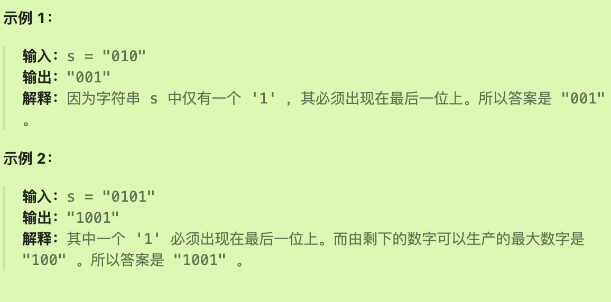
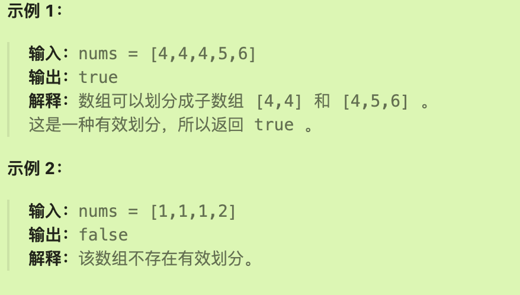
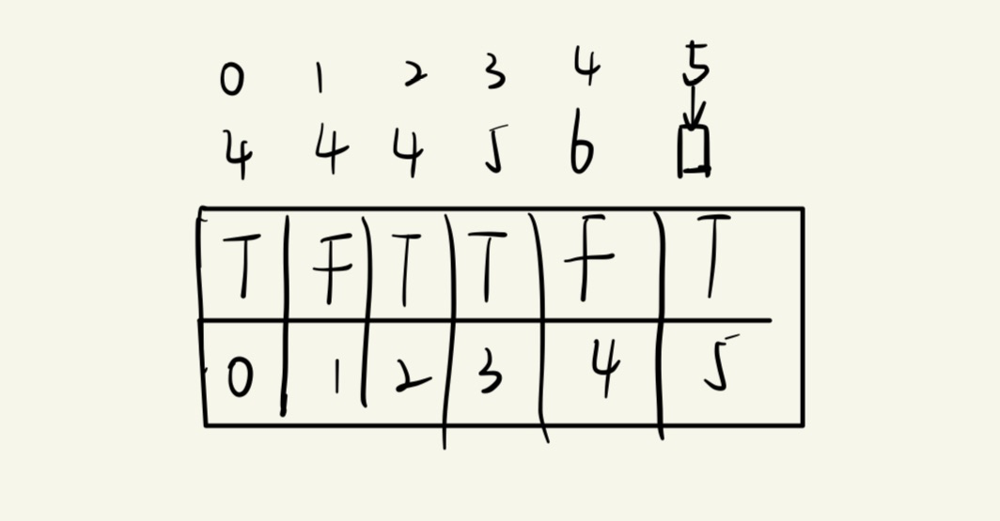
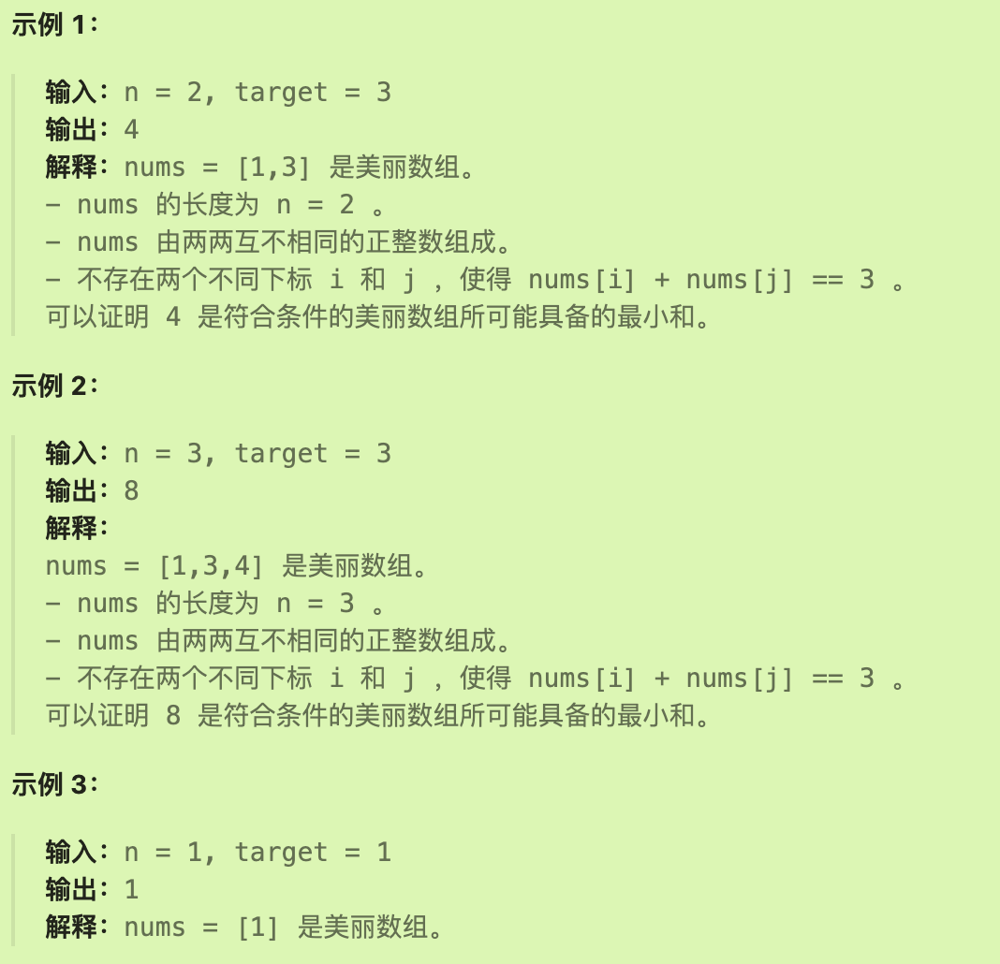
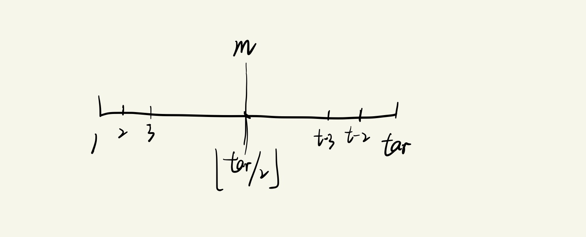
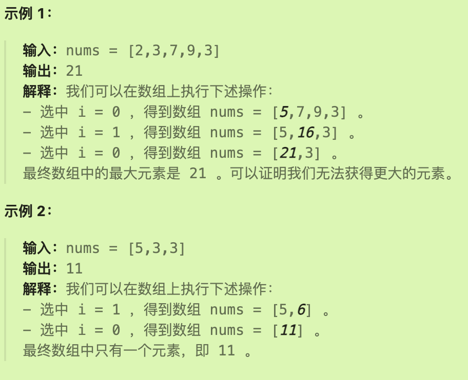
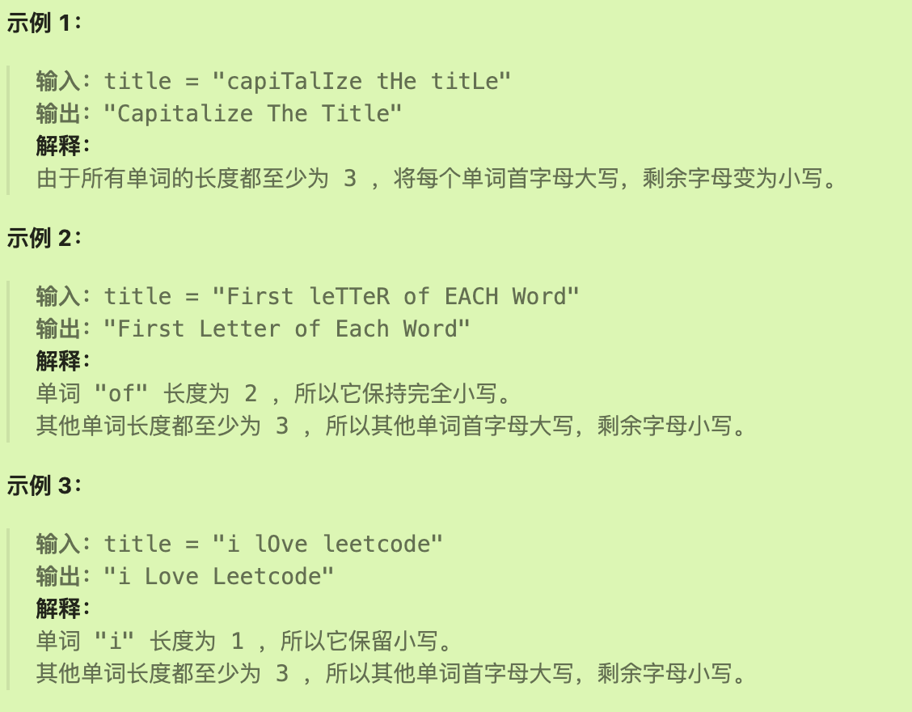
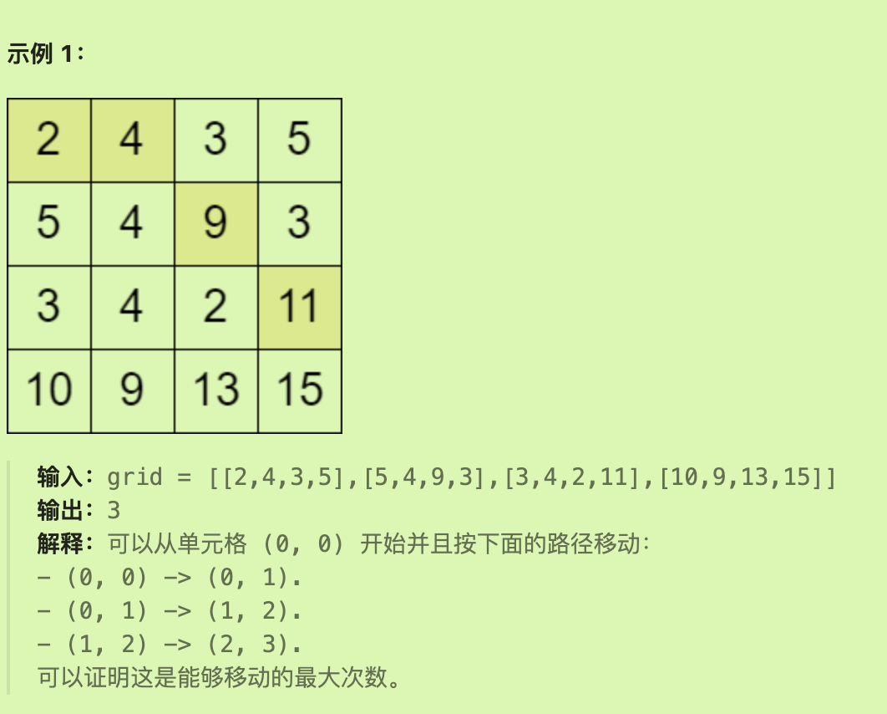
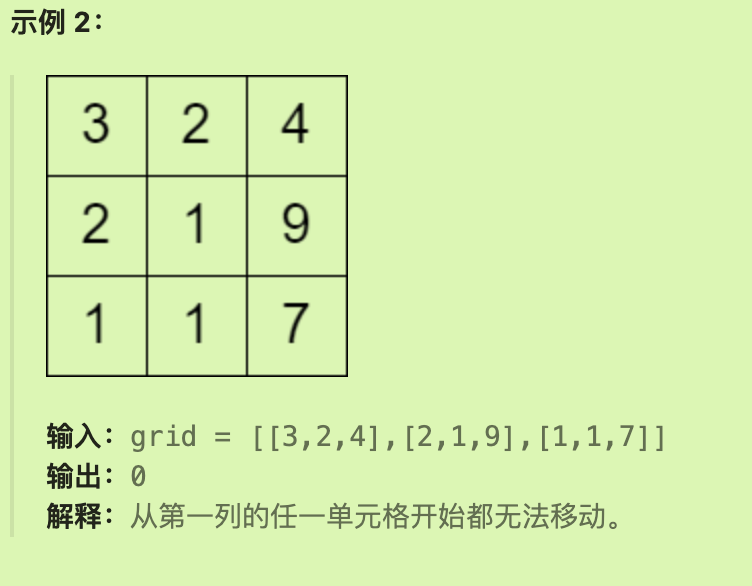
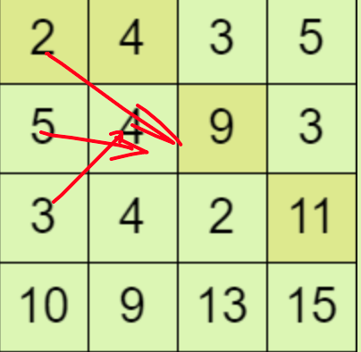

# 2864最大二进制奇数

## 题目要求

给你一个 **二进制** 字符串 `s` ，其中至少包含一个 `'1'` 。

你必须按某种方式 **重新排列** 字符串中的位，使得到的二进制数字是可以由该组合生成的 **最大二进制奇数** 。

以字符串形式，表示并返回可以由给定组合生成的最大二进制奇数。

**注意** 返回的结果字符串 **可以** 含前导零。



- `1 <= s.length <= 100`
- `s` 仅由 `'0'` 和 `'1'` 组成
- `s` 中至少包含一个 `'1'`

## 第一想法

首先，为确保是奇数，在二进制的特殊条件下我们需要将末位必须置为1（因为其他位置上的1就是2的次方）；其次为了组合出最大的二进制数，我们需要尽可能地将1往二进制的前面排列。（好像有点贪心的感觉）

暴力地来看，将字符串换为字符数组，遍历数组，遇到的第一个1将其放入新数组的结尾，遍历到的其他的1往新数组的头部放，依次排列。但是代码上很难实现。

## 题解

### 暴力法

统计字符串中的所有1和0的个数，填充新的字符串先填充1再填充0，最后补充末尾的1。

在补充末尾1的逻辑同时可以顺便处理只有一个1的情况。

```java
class Solution {
    public String maximumOddBinaryNumber(String s) {
        int len = s.length();
        int oneNum = 0;//统计二进制中1的个数
        for (int i = 0; i < len; i++) {
            if (s.charAt(i) == '1'){
                oneNum ++;
            }
        }
        //对于只有一个1的逻辑如何处理？
//        if (oneNum <= 1){
//            ret
//        }
        StringBuilder result = new StringBuilder();
        //添加除了末尾1以外的1
        for (int i = 0; i < oneNum-1; i++) {
            result.append('1');
        }
        //添加其他0
        for (int i = 0; i < len-oneNum; i++) {
            result.append('0');
        }
        //这一句可以顺便处理只有一个1的逻辑并且加上末尾的1
        if (oneNum > 0){
            result.append('1');
        }
        return result.toString();
    }
}
```

## 总结

本题标签为贪心法。

# 2369检查数组是否存在有效划分

## 题目要求

给你一个下标从 **0** 开始的整数数组 `nums` ，你必须将数组划分为一个或多个 **连续** 子数组。

如果获得的这些子数组中每个都能满足下述条件 **之一** ，则可以称其为数组的一种 **有效** 划分：

1. 子数组 **恰** 由 `2` 个相等元素组成，例如，子数组 `[2,2]` 。
2. 子数组 **恰** 由 `3` 个相等元素组成，例如，子数组 `[4,4,4]` 。
3. 子数组 **恰** 由 `3` 个连续递增元素组成，并且相邻元素之间的差值为 `1` 。例如，子数组 `[3,4,5]` ，但是子数组 `[1,3,5]` 不符合要求。

如果数组 **至少** 存在一种有效划分，返回 `true` ，否则，返回 `false` 。



- `2 <= nums.length <= 105`
- `1 <= nums[i] <= 106`

## 第一想法

看到本题的标签是动态规划所以我点进来做做。看见这三个规则，我觉得先将他们封装为三个方法，输入参数为子数组，返回类型为布尔类型；对于第一个条件，判断长度是否为2即可；对于第二个条件，长度为3并且全部相等；第三个条件，长度为3并且递增差1.

但是动态规划不是在求一些最值吗？这个题目是布尔类型返回值可以用动态规划吗？如果dp数组代表着dp[i,j]范围[i,j]之间的子数组满足三个条件之一，那么递推公式怎么推？dp[i,j] = dp[]

还是说只需要dp[i],以i为结尾的子数组满足条件即可。dp[i] = dp[i-1]?

但确实有动态规划的味道，后面的状态需要从前面推出来，前面满足了才能确定后面的。

## 题解

### 动态规划

明明这个动态规划思路不难的，为什么第一次想不出来呢？

#### 五部曲

1、确定dp数组的含义

- `dp[i]`表示以i为结尾（**但是不包括i**）的子数组是否可以有效划分
- 因为不包括i，所以循环时可以走到`i <= len`；同时dp数组长度声明为`len+1`

2、确定递推公式

- 根据这三个条件进行判断
- `if(i >= 2 && nums[i-1] == nums[i-2]) {dp[i] = dp[i] || dp[i-2]}`代表着条件1两个相等
- `if(i >=3 && (nums[i-1] == nums[i-2] && nums[i-2] == nums[i-3]) || (nums[i-1] == nums[i-2] + 1 && nums[i-2] == nums[i-3] + 1) ){dp[i] = dp[i] || dp[i-3]}`代表着后两个条件，二者的共同点在于判断长度都是3
- 注意，最后赋值时不能直接dp[i] = dp[i-2]，**否则会覆盖之前由其他条件已经被设置为true的情况**。

3、初始化dp数组

- `dp[0] = true`空数组可以代入条件1中，必须为真。

4、确定遍历顺序

- 从前向后遍历

5、打印dp数组

- 上面是nums，下面是dp数组

- 

#### 代码实现

```java
class Solution {
    public boolean validPartition(int[] nums) {
        //创建dp数组
        int len = nums.length;
        boolean[] dp = new boolean[len + 1];//多一个位置为了表示dp[0]
        dp[0] = true;
        //
        for (int i = 2; i <= len; i++) {
            //处理条件1：两个相等的数
            if (i >= 2 && nums[i-1] == nums[i-2]){
                dp[i] = dp[i] || dp[i-2];
            }
            //处理条件23，相同点在于二者都是长度为3的
            if (i >= 3 && ((nums[i-1] == nums[i-2] && nums[i-2] == nums[i-3]) ||
                          (nums[i-1] == nums[i-2]+1 && nums[i-2] == nums[i-3]+1) )){
                dp[i] = dp[i] || dp[i-3];
            }
        }
        return dp[len];
    }
}
```

# 2834找出美丽数组的最小和

## 题目要求

给你两个正整数：`n` 和 `target` 。

如果数组 `nums` 满足下述条件，则称其为 **美丽数组** 。

- `nums.length == n`.
- `nums` 由两两互不相同的正整数组成。
- 在范围 `[0, n-1]` 内，**不存在** 两个 **不同** 下标 `i` 和 `j` ，使得 `nums[i] + nums[j] == target` 。

返回符合条件的美丽数组所可能具备的 **最小** 和，并对结果进行取模 `109 + 7`。



## 第一想法

标签中有贪心。原本以为拿着三个条件去判断是美丽数组，然后在数组中找到最小和次小就行了，结果一看函数参数没有给定数组啊，就给了n和target，那这美丽数组难道从天而降吗？

n决定了长度，两两互不相同决定了里面的值不能够重复；不同下标和在一定程度上决定了其内部值。但是这怎么能完整地推出美丽数组呢？

## 题解

### 暴力法

暴力思路：我们选择从1开始的连续整数作为美丽数组，除了1以外的其他数选进来之前都需要判断和是否为target。这个判断又需要一个for循环从头开始一直到当前元素，时间复杂度会增加很多。

```java
class Solution {
    public int minimumPossibleSum(int n, int target) {
        //初始化结果数组
        int[] result = new int[n];
        int current = 1;//记录真正加入到数组中的数
        int sum = 0;//最后的返回总和
        //i代表着结果数组下标，current代表当前想要加入的数，并且current是从1开始的连续正整数
        for (int i = 0; i < n; current++) {//如果current加入不成，就得往下一个数走，所以这里是current++
            //检查是否可以将当前的数加入到数组中
            boolean canAdd = true;
            for (int j = 0; j < i; j++) {
                if (result[j] + current == target){
                    canAdd = false;
                    break;//比较了数组中当前所有的数和当前要加入的数，二者之和是否等于目标值
                }
            }
            //
            if (canAdd){
                result[i] = current;
                sum += current;
                i ++;//只有成功添加才移动到数组的下一个为止。
            }
        }
        return sum;
    }
}
```

但是不对，到一个很大的数之后就会报错:n=39636,target=49035。但我看不出这个方法有什么错。

### 数学法

还是按照刚才的思路，从1开始取连续的数字，但是加入1就不能取target-1,加入了2就不能取target-2，所以在[1,target]这个范围里面我们**只能取到target/2的数*，一旦超过了m，就会可能前面有相加等于tar的数存在。



- 如果个数不够n个，就继续*从target,target+1,target+2里面去选*。（这一点也很重要，前面根本没有想到），最小数组和是从1取到m的等差数列+target后面的连续的数（也是等差数列）
- 如果m大于n，那么最小数组和自然是从1连续取到n；等差数列的和。

#### 代码实现

```java
class Solution {
    public int minimumPossibleSum(int n, int target) {
        final int MOD = (int) 1e9 + 7;
        int m = target / 2;
        if (n <= m){
            return (int) ((long) (1+n) * n / 2 % MOD);
        }
        return (int) (((long) (1+m) * m / 2 +
                ((long) target + target + (n-m) - 1) * (n-m) / 2) %MOD);
    }
}
```

# 2789合并后数组中的最大元素

## 题目要求

给你一个下标从 **0** 开始、由正整数组成的数组 `nums` 。

你可以在数组上执行下述操作 **任意** 次：

- 选中一个同时满足 `0 <= i < nums.length - 1` 和 `nums[i] <= nums[i + 1]` 的整数 `i` 。将元素 `nums[i + 1]` 替换为 `nums[i] + nums[i + 1]` ，并从数组中删除元素 `nums[i]` 。

返回你可以从最终数组中获得的 **最大** 元素的值。



- `1 <= nums.length <= 105`
- `1 <= nums[i] <= 106`

## 第一想法

这道题目要考察什么呢？模拟这个操作过程直到不满足条件吗？这个操作就是将符合条件的和放在当前位置上，然后删除当前元素；在数组中删除可不是那么好删的，特别是中间的元素。

看了一眼提示，从数组的末尾开始遍历，如果遇到前一个元素小于自己，结合并将和作为下一次开始的值（即将前一个元素的值变为和）；大于自己就继续往前；直到走到最边缘最后一次所得的结果就是最大值。

初步尝试，虽然过了一些简单案例，但是复杂的案例没有通过。

```java
class Solution {
    public long maxArrayValue(int[] nums) {
        int len = nums.length;
        if (len == 1){
            return nums[0];
        }
        int maxValue = 0;
        //
        for (int i = len-1; i > 0; i--) {//for循环这里可以不写i--吗，因为在内部的判断中进行i--
            if (nums[i] < nums[i-1]){
//                i --;
            }else {
                nums[i-1] = nums[i] + nums[i-1];
//                i --;
            }
        }
        //接下来要找操作后的最大值，不一定是第一个元素（可能在中间）但是我直接去找整个数组的最大值也可以吗？
        for (int i = 0; i < len; i++) {
            maxValue = Math.max(maxValue, nums[i]);
        }
        return maxValue;
    }
}
```

经过看题解，我知道为什么我的方法没有通过了，并且有需要优化的地方。

- 首先，题目的数据范围很大，如果使用int类型会超出范围产生截断，数据精度丢失。所以需要使用Long类型
- 其次，本题无需使用for循环去找最大值，按照逻辑，数组的最前面就是所求的最大值。
- 所以修改的话，可以将int类型数组改为long类型，但是不能修改形参的情况下只能新建一个Long类型数组。

## 题解

### 本质

根据题意，我们需要贪心，并且从后往前贪心；因为条件是后面的值比前面的大，才能够合并，那么我们从后面开始就是要从一开始就不断地去让后面的值变大，这样才能够吞并更多前面小的值，最终使得结果能够最大化。

这样的思路就会导致整个数组都是递减数组（从左往右看的话），最大值就出现在数组的最开始。

注意题目的数据范围很大，单一的int无法返回正确结果。

### 代码实现

```java
class Solution {
    public long maxArrayValue(int[] nums) {
        int len = nums.length;
        long result = nums[len-1];//将末尾元素（或者首元素）作为结果值的初始化（我觉得这是个好习惯）
        for (int i = len - 1; i > 0; i--) {
            if (result >= nums[i-1]){
                result += nums[i-1];
            }else {
                //如果不大于当前元素，就证明后面贪心所加的元素都没这个大，那么结果就要换了
                result = nums[i-1];
            }
        }
        return result;
    }
}
```


# 2129将标题首字母大写

## 题目要求

给你一个字符串 `title` ，它由单个空格连接一个或多个单词组成，每个单词都只包含英文字母。请你按以下规则将每个单词的首字母 **大写** ：

- 如果单词的长度为 `1` 或者 `2` ，所有字母变成小写。
- 否则，将单词首字母大写，剩余字母变成小写。

请你返回 **大写后** 的 `title` 。



- `1 <= title.length <= 100`
- `title` 由单个空格隔开的单词组成，且不含有任何前导或后缀空格。
- 每个单词由大写和小写英文字母组成，且都是 **非空** 的。

## 第一想法

直觉就是遍历字符串，直到遇到空格，遇到空格之前的长度进行统计，如果大于2就将首字母大写，其他小写；如果小于等于2，就全部小写。但是最后一个单词怎么结尾呢？最后后面也没有空格啊？那就是遍历走到最后了，所以判断条件应该加一个遍历是否来到最后。

大小写怎么弄？是使用java中的upper？还是说可以用ASCII码直接拿大写的A或者小写的a去减法操作呢？

对于整体的操作而言，我要把字符串转为字符数组吗？

```java
{
        int len = title.length();
        char[] chars = title.toCharArray();
        int start = 0;
        //
        for (int i = 0; i < len;) {
            int count = 0;//是否还需要一个起始位置来确定范围？
            while (chars[i] != ' '){
                //如果不等于空格就继续往后
                i ++;
                count ++;
            }
            //出这个while循环意味着遇到空格了
            if (count > 2){
                //变大写
            }else {
                //变小写
            }
            start = i + 1;
        }
    }
```


## 题解

利用空格将字符串划分为字符单词数组（`split`方法），遍历单词数组，根据长度来进行大小写处理（`substring`方法）；最后再将整个单词数组重新组合一个字符串（`join`方法）

```java
{
        String[] words = title.split(" ");
        //
        for (int i = 0; i < words.length; i++) {
            String word = words[i];
            if (word.length() > 2){
               words[i] = word.substring(0,1).toUpperCase() + word.substring(1).toLowerCase();
            }else {
                words[i] = word.toLowerCase();//注意不能使用word，因为字符串的特点会让word指向一个新的字符串
            }
        }
        return String.join(" ",words);//这个方法可以将第二个参数由第一个参数拼接起来
    }
```

或者可以使用StringBuilder来作为最后的新字符串去收集结果——每加入一个处理好的单词，就append一个空格，最后将Builder进行toString，然后修剪掉最后多出的空格。（`trim`）

# 2684矩阵中移动的最大次数

## 题目要求

给你一个下标从 **0** 开始、大小为 `m x n` 的矩阵 `grid` ，矩阵由若干 **正** 整数组成。

你可以从矩阵第一列中的 **任一** 单元格出发，按以下方式遍历 `grid` ：

- 从单元格 `(row, col)` 可以移动到 `(row - 1, col + 1)`、`(row, col + 1)` 和 `(row + 1, col + 1)` 三个单元格中任一满足值 **严格** 大于当前单元格的单元格。

返回你在矩阵中能够 **移动** 的 **最大** 次数。





- `m == grid.length`
- `n == grid[i].length`
- `2 <= m, n <= 1000`
- `4 <= m * n <= 105`
- `1 <= grid[i][j] <= 106`

## 第一想法

从第一列任意位置[i,0]开始，可以在格子中进行右边三个位置上的移动，右上方，正右方，右下方，并且移动到的格子必须比前一个大（递增地走）问能够移动的最大次数。

最大，那就可能要用到动态规划了。dp数组的含义？dp[i,j]位置为[i,j]的当前最大已移动次数？递推公式呢？由三个位置推出来？如果满足当前位置大于那三个位置，就选一个最大的dp然后+1？初始化呢？第一列的全部声明为0，其他位置呢也应该声明为0，会被覆盖。for循环就得从第二列开始？遍历顺序列从0到n，行不止从上到下，这还有从下往上的，这个行该怎么办？



## 题解

### 从左往右遍历五部曲

1、dp数组的含义

- `dp[i,j]`代表着从第一列到位置[i,j]的最大移动次数

2、确定递推公式

- `(i-1,j-1) (i,j-1) (i+1,j-1)`可以发现，我们比较的都是上一列中的元素
- `dp[i][j] =Math.max(dp[i][j], dp[i+k][j-1] + 1)`
- 为什么与自己比较呢？因为有多种方式到这里，**自己代表着当前保存的最大移动次数**。

3、初始化dp数组

- 全部初始化为0即可。（本来第一列必须为0，但是一看全部为0就可以）

4、确定遍历顺序

- 因为多了一个从下往上遍历方式，行的方式有点难以处理，三个方向；
- 所以再多了一层for循环，来实现递推公式中的`i+k`（这个方法真的感觉很神奇）

5、打印dp数组

- 最终的结果会出现在哪里呢？整个dp数组中的最大值？

```java
{
        //声明dp数组
        int m = grid.length, n = grid[0].length;
        int[][] dp = new int[m][n];
        //初始化全部为0
        for (int j = 1; j < n; j++) {//先遍历行，再遍历列，并且列从第二列开始,因为要往前比较
            for (int i = 0; i < m; i++) {
//                int maxMove = -1;
                //这个fork循环可以检查前面的三个可能位置的情况
                for(int k = -1; k <= 1; k ++){
                    if (i + k >= 0 && i + k < m && grid[i + k][j-1] < grid[i][j]){
                        //保证这个位置在矩阵之内，并且满足大小条件
                        dp[i][j] = Math.max(dp[i][j], dp[i+k][j-1] + 1);
                    }
                }
//                dp[i][j] = maxMove;
            }
        }
        //去找到最终结果(为什么只需要从最后一列里面找呢）
        int maxMoves = 0;
        for(int i = 0; i < m; i ++){
            maxMoves = Math.max(maxMoves, dp[i][n - 1]);
        }
//        return maxMoves == -1 ? 0 : maxMoves;
        return maxMoves;
    }
```

不知道为什么从左往右无法通过样例2（debug吗？）

### 从右往左遍历

dp数组的含义发生了些许变化，并且列从右往左走，最后只要去第一列找到最大值即可，可以通过样例。