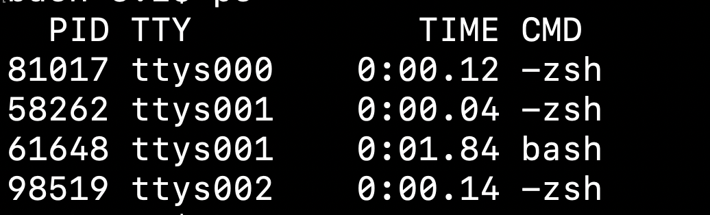
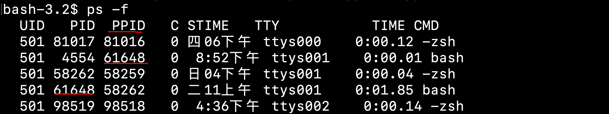
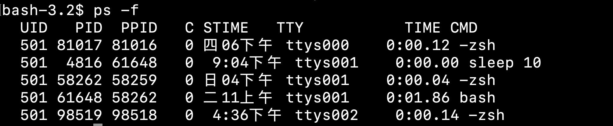
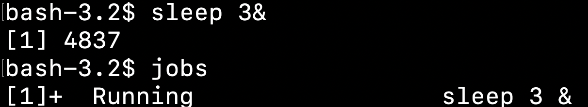
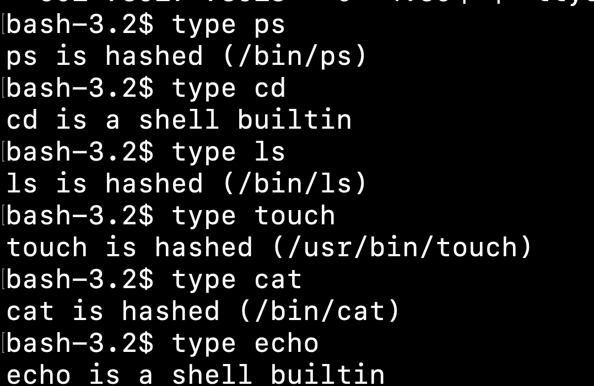

## Bash

Essentially,it is a process like qq,wechat.

We can use the `ps -f` to check the details about process,such as PID,PPID.(PPID is its parent'sPID)

Parently,when we enter`bash` to make a new bash ,you may find that this **new bash is a subshell** under the bash you have used.

## ；

Not a termination like in JAVA,but a tiny termination for one command

`pwd;cd;ls;touch xxx.md;pwd`

If you add (),you will **create a subshell** then execute the commands in the ()

## Sleep 

stagnate a process x seconds.

`sleep x&` **background running** ，use the `&` after a command can make it.

What ? Also make a **subshell** when run the command `sleep 10`

## JOBS

`jobs -l` find the PID

## Coproc

Compare with Sleep's example,who make a subshell ?

## Out command/hashed

For example,out command:When we use `ps-f`,**this command also be a process**.

- In current shell, this command can't get the number of process,so make a new one.

## Shell builtin/Inner Command

Compare with the hashed,it's an inner command.

## Alias

Rename some command if you want