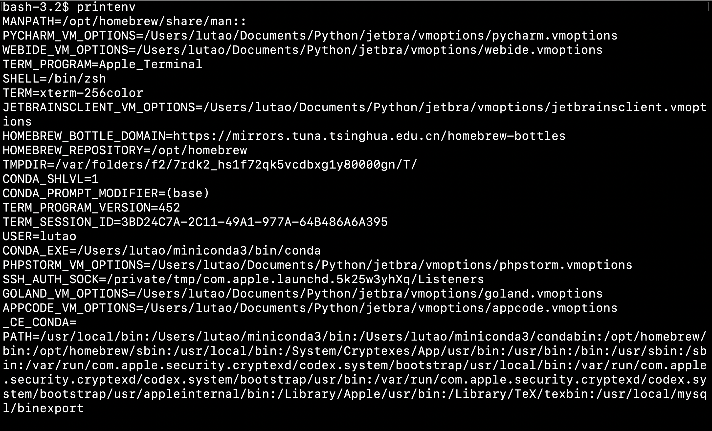
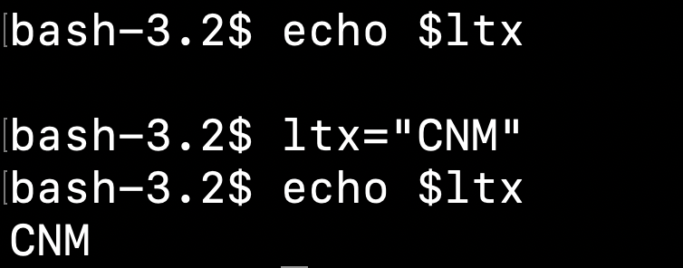

## Environment Variables

In **any files**,you can execute this process which is written in the Environment variables.

Not only the 'Path',there are so many variables.

We can use**`printenv`**command to view the En Var in my macbook

- We can view our PATH in the last of the picture.(It is divided by ":" )

- Print the specific env: **`printenv USER printenv HOME`**；

- or use the command **`echo $HOME`** also **display the env HOME's value**.

### Users

Only in the current account.

### System

If we log out this account, we can also use these variables.

### Global env

Just like the former `printenv,echo`

You can use this command to define a Global env  **`export ltx="CNM"`**,compared with the Local env.

**Delete** the env you created    **`unset xxx`**,please note you'd better don't delete the parentenv in your subshell.

### Local varibale

You can also  the echo to set the variable value which you want.But you may just use it **in the current bash.**

## Permanent Change

Every Linux version has its own configuration file.Such as **'~/.bashrc ~/.bash_profile ~/.profile ~/.bash_login'**;When we start the shell,it always find the files to initailize.

You can also find alias (rename) in configuration file.
