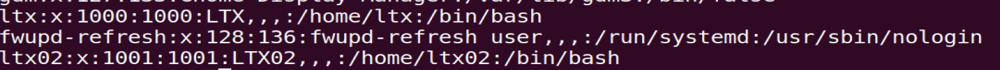
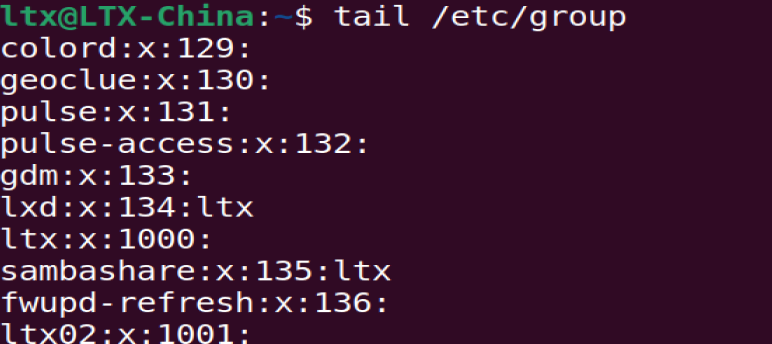

## Apt

## PMS

Like **'HomeBrew'**,

## User&Root

### UID

Use the command **`cat /etc/passwd`**to check the user's information.

- Such as this picture:The name of user,password,ID,path,default shell

Use the command **`usermod xx`**to change some information about any users.

### Group

- To share sources between users in this group.(Share permission)
- For Ubuntu,it will **create a single group for every user.**With the same name of the user name. **`tail /etc/group`**
- We can get the *name,passwd,GID,members* in this group.

To create a group,use the command **`groupadd xx`**;and use `groupmod` to edit this group,such as `sudo groupmod -g 1003 LL`(Change the GID of LL to 1003)

Also use the `usermod xx`to put the users in a group.`sudo usermod add GroupName UserName`

