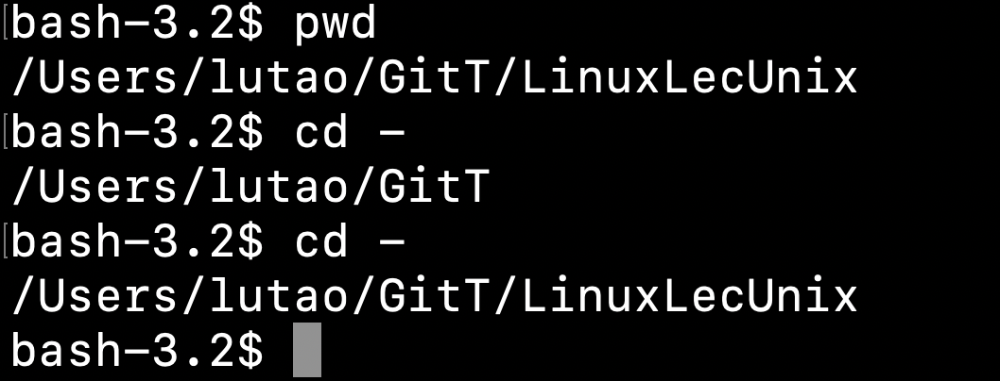
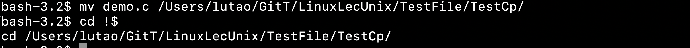
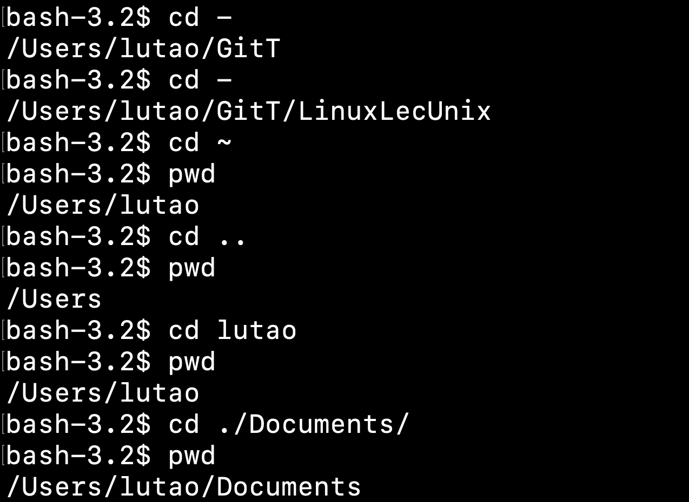
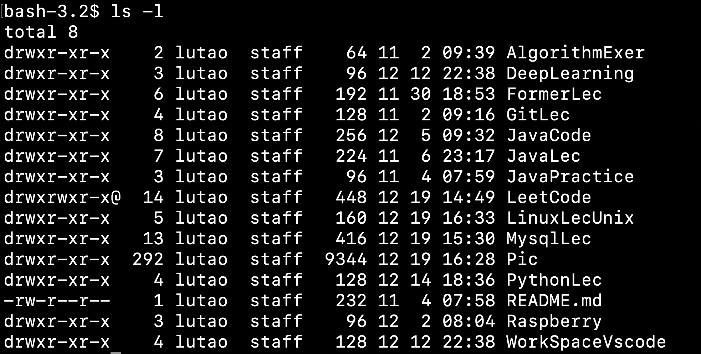
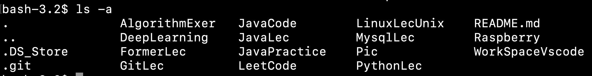
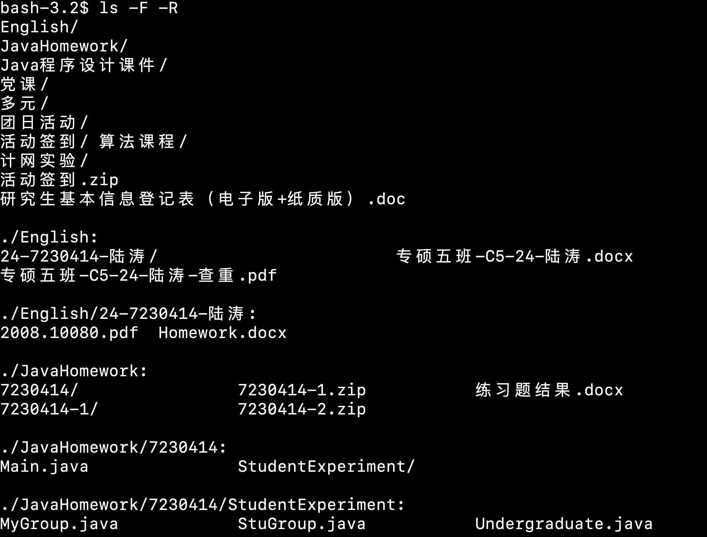
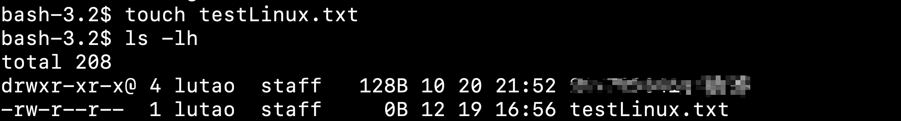
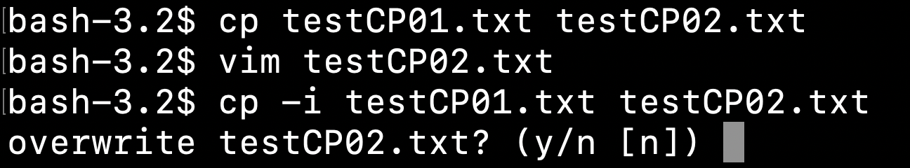
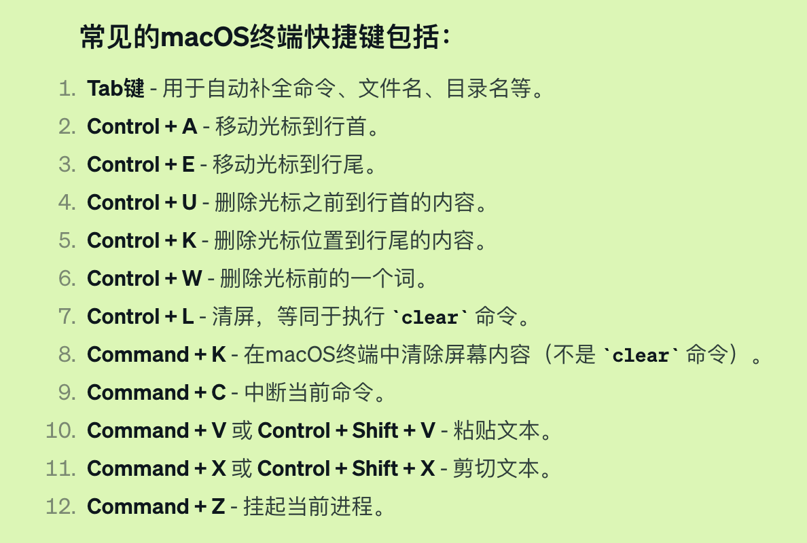

## CD

When you enter cd , it is the way to get any directory.In this note,I want to record my experience about `cd `  command

1. **Know the current path you are**
  - The most important thing is the path,you must know where you are at any time.Only by this you can make a right way to look through your directory
  - Use `pwd` command to know the current path. Or you can use the `cd -` command to get the last path and enter it again to get the next path:You can switch from these two paths
  - 
  - Ps.A cool command combination:`cd !$`:It will cd the directory which you just write in the last command.(Amazing right?)
  
2. ** Use the parameter with cd**
  - Firstly,path is also significant in this part.I can use the relative path or the abslute path to enter any directory I want.
  - Just like the photo I pick:
  - `cd ..`means the father path;`cd ~`means the root path;`cd ./`means below the current directory,you can enter xxx file;or you can just enter the abslute path of any file(but it's too long)

## LS

This command can show the details of the file in current directory.And it also has the rich and vast parameters to use.

1. The most useage command:
  - `ls -l`it shows the detail about the files,such as read-write permissions,links,user name,the size ...
  - `ls -a`it means show all files in this directory,including the hidden file(these . file in this photo)
  - You can also combine two or more parameters to show more informations about the specific file For example,the `-F` will add the specific mark after the files,such as `/`after the directory name;and the `-R` will show all the files of all directory in ths path.(with a looping way)

## MKDIR

## Touch

You can use this  command to create a specific file which you want.(I just learned it a little)

1. Create a simple file:

##CP

CP means copy,you can use CP to copy  one file to another file,and it will  cover the latter file.But you can ues the parameter `-i` to make a guard about covering.

## SHORTCUT KEY

There are so many shortcut key for Linux(Unix),and I just search it from ChatGpt.These are common command for macos:

That's it 12/19 17:12,Just a normal copy worker LTX,the X is hhh