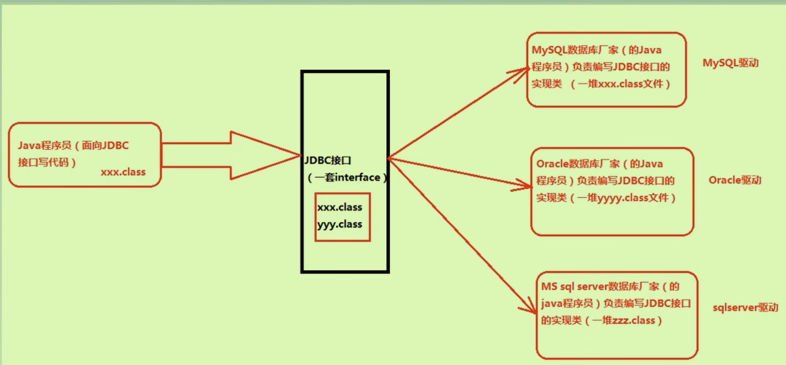

# JDBC

## 是什么

Java DataBase Connectivity；是Sun公司指定的**一套接口**。（解耦合，提高扩展性）

Java.sql.*包下的接口。

## 为什么

各大数据库的底层实现原理不同，他们去**实现同一个接口**，满足同一套规则；而Java程序员**调用此接口**，但不用关心数据库的实现。（只需要new 接口对象，使用接口对象去调用方法即可连接不同数据库）



## 开发准备

下载对应数据库jar包，将其配置环境变量。

### 编程六步

1. 注册驱动（何种数据库）:`DriveManager.registerDriver(new com.mysql.jdbc.Driver())`注意new的对象来自于不同的数据库jar包中具体实现
2. 获取连接（进程之间通信）:`Connection conn = DriverManager.getConnection(url,user,password)`
3. 获取数据库操作对象（专门来执行SQL语句）:`Statement stmt = conn.createStatement()`
4. 执行SQL语句:` int count = stmt.executeUpdat(sql)(适用于DML)`返回值是影响数据库中的记录条数 
5. 处理查询结果集:`ResultSet rs = null`存放查询对象 ，`ResultSet rs = stmt.executeQuery(sql)`
6. 释放资源，先关stmt，再关conn；从小到大依次释放（一定在finally语句块中释放）

常用的注册驱动方式：**使用字符串传输，可以写入配置文件中**

```java
Class.forName("com.mysql.jdbc.Driver")//不需要接受返回值，只想用反射的类加载动作
```

### 使用资源绑定器绑定配置文件

实际开发中连接数据库的信息不写在java程序中

```java
REsourceBundle bundele = ResourceBundle.getBundle("jdbc");
String driver = bundle.getString("key");//会得到key对应的value
```

### 在处理查询结果时取数据

`getInt\getDouble\getString`

```java
boolean flag1 = rs.next();//光标指向的行数据
if(flag1){
  String empno = rs.getString(1);//JDBC中所有下标从1开始
  String ename = rs.getString(2);//不管类型是什么都以String类型取出
  String sal = rs.getString(3);//这个123是该行的第几列
}
```

最好getString中**使用查询语句中的列名（小心别名）获取**。

### 实际代码

```java
public class JDBCTest05{
  public static void main(String[] args){
    Connection conn = null;
    Statement stmt = null;
    ResultSet rs = null;
    try{
      Class.forName("com.mysql.jdbc.Driver");//1注册驱动
      conn = DriverManager.getConnection("jdbc:mysql://localhost:3306/bjpowenode","root","333");//2建立连接对象
      stmt = conn.createStatement();//3在连接下获取数据库的操作对象
      String sql = "select empno,ename,sal from emp";
      rs = stmt.executeQuery(sql);//4执行相关sql语句
      //5处理查询结果集
      while(rs.next()){
        String empno = rs.getString(1);
        String ename = rs.getString(2);
        String sal = rs.getString(3);
      }
    }catch(Exception e){
      e.printStackTrace();
    }finally{
      //6释放资源
      if(rs != null){
        try{
          rs.close();
        }catch(Exception e){
          e.printStackTrace();
        }
      }
      if(stmt != null){
        try{
          stmt.close();
        }catch(Exception e){
          e.printStackTrace();
        }
      }
      if(conn != null){
        try{
          conn.close();
        }catch(Exception e){
          e.printStackTrace();
        }
      }
    }
  }
}
```


##  IDEA中JDBC

导入目标数据库的对应jar包。

## 具体实现登录和验证

登录过程中的信息存入Map中用来跟数据库中的存储信息作为比对，来验证是否存在该用户。

```java
public class JDBCTest06 {
    public static void main(String[] args) {
        //初始化界面
        Map<String,String> userLoginInfo =  initUI();
        //验证用户
        boolean loginSuccess =  logIn(userLoginInfo);
        //
        System.out.println(loginSuccess ? "登录成功" : "登录失败");
    }

    /**
     * 表示用户登录是否成功，编写jdbc代码
     * @param userLoginInfo
     * @return
     */
    private static boolean logIn(Map<String, String> userLoginInfo) {
        Connection conn = null;
        Statement stmt = null;
        ResultSet rs = null;
        String loginName = userLoginInfo.get("loginName");
        String loginPwd = userLoginInfo.get("loginPwd");
        boolean loginSuccess = false;
        //
        try {
            //注册驱动
            Class.forName("com.mysql.jdbc.Driver");
            //获取连接
            conn = DriverManager.getConnection("jdbc:mysql://localhost:3306/ltx","root","iutaol123");
            //获取数据库操作对象
            stmt = conn.createStatement();
            //执行sql语句，小心sql注入，用户提供的关键字参与了编译
            String sql = "select * from t_user where loginName = '"+loginName+"' and loginPwd = '"+loginPwd+"' ";
            //以下代码将sql语句发给DBMS进行sql编译
            rs = stmt.executeQuery(sql);
            if (rs.next()){
                loginSuccess = true;//如果查到有内容即登录成功
            }
        } catch (Exception e) {
            e.printStackTrace();
        }finally {
            //
            if (rs != null){
                try {
                    rs.close();
                }catch (SQLException e){
                    e.printStackTrace();
                }
            }
            if (stmt != null){
                try {
                    stmt.close();
                }catch (SQLException e){
                    e.printStackTrace();
                }
            }
            if (conn != null){
                try {
                    conn.close();
                }catch (SQLException e){
                    e.printStackTrace();
                }
            }
        }
        return loginSuccess;//
    }

    /**
     * 初始化用户界面
     * @return 用户输入的用户名和密码
     */
    private static Map<String, String> initUI() {
        Scanner s = new Scanner(System.in);
        System.out.println("用户名");
        String username = s.nextLine();
        System.out.println("密码：");
        String password = s.nextLine();
        HashMap<String, String> userLoginInfo = new HashMap<>();
        userLoginInfo.put("loginName" , username);
        userLoginInfo.put("loginPwd", password);
        return userLoginInfo;
    }


}

```

### 解决SQL注入问题

只要用户提供的信息中**不参与SQL编译过程**

- 将Statement对象换为PreparedStatement(其继承了Statement)
- 原理：*预先对SQL语句框架进行编译，然后再给SQL语句传递“值”*——将单引号+其中内容换为?占位符
- 先写sql框架，将框架传给DBMS，**进行预先编译。这样就不会改变原sql语句的意图。**

```java
PreparedStatement ps = null;
//将sql语句提到获取数据库操作对象之前
String sql = "select * from t_user where loginName = ? and loginPwd = ? ";
//将conn.createStatement换为
ps = conn.prepareStatement(sql);
//给占位符传入值，第一个问号下标是1
ps.setString(1,loginName);
ps.setString(2,loginPwd);//在上面已经编译了，这里再传不影响。注意getString会自带''
//sql语句也不用传入
rs = ps.excuteQuery();
```

- 预先编译的好处是，编译一次可执行n次。
- 编译阶段还会做类型安全检查

### 对比两个Statement

- Pre适合传值
- Statement适合拼接，有的业务适合注入。

## JDBC事务提交

JDBC事务自动提交，只要执行一条DML语句就自动提交一次。

但我们需要手动提交。

- 开启事务（关闭其自动提交）`conn.setAutoCommit(false)` 

- 手动提交 `conn.commit()`  

- 手动回滚`conn.rollback()`

## 锁

### 悲观锁

### 乐观锁

### 行级锁