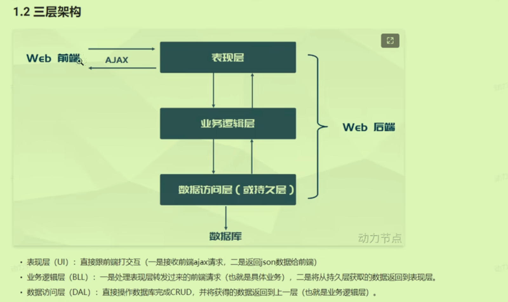
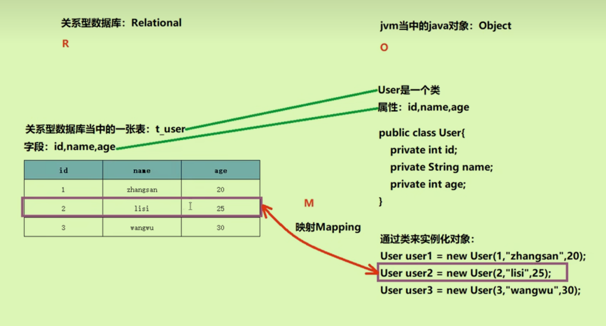

# 第一章

## 框架概述

MVC架构模式

MyBatis在持久层，是JDBC的更精进版本

## 为何不用JDBC

- sql语句写死在java代码中
- 代码过于繁琐，getString等等

使用MyBatis为了让设置值，获取值等自动完成

## 配置Mybatis

使用Maven在项目中自动配置即可；或者可以在github上下载相关源码

## 理解Mybatis

### ORM对象关系映射

对象和数据库中一条记录相互映射，可以相互转换

Mybatis是半自动化的ORM，SQL语句需要自己编写。