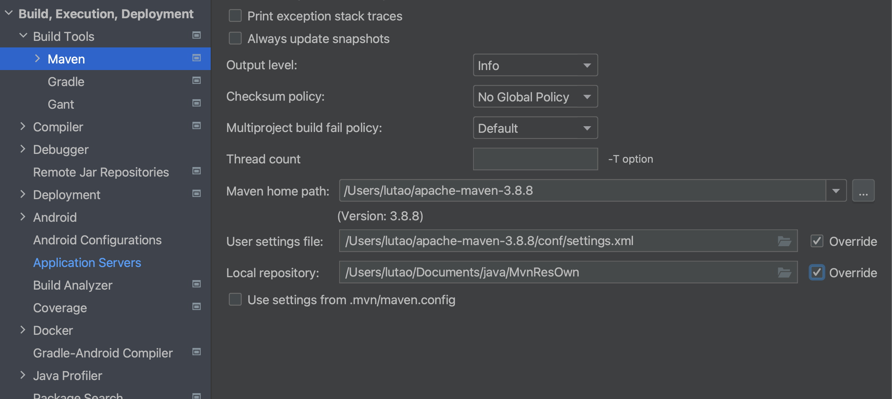

## MyBatis入门程序

## 配置IDEA

使用Maven构建项目,设置相关的配置文件路径



新建模块，设置相应坐标。

注意，src/main/resources目录,此目录中的资源等同于放在类的根路径下。

## 初始步骤

1. 设置打包方式
2. 引入依赖：mybatis依赖和mysql驱动依赖
3. 编写mybatis核心配置文件.xml,一般命名为`mybatis-config.xml`,一般放在类的根路径下（即resources下）;通过此文件创建一个重要的对象：SqlSessionFactory
   - `mybatis-config.xml`核心配置文件配置数据库信息，一般只有一个
   - `XXXMapper.xml`配置文件一般一个表一个，专门来编写SQL语句
4. 编写XXXmapper.xml配置文件，一般也放在resources目录下：
5. 在核心配置文件中mapper的resources下关联想要的mapper文件；*自动会从根路径下查找文件。*
6. 编写Mybatis程序（即编写java程序，连接数据库做crud）
	- 负责执行sql语句的对象就是`SqlSession`，是java程序和数据库之间的一次会话；而Session需要由`SqlSeesionFactory`对象来获取（一个数据库一个，工厂生产）
	- 由SqlSessionFactoryBuilder对象的build方法获得工厂对象

```java
public static void main(String[] args) throws Exception {
        //获取builder对象
        SqlSessionFactoryBuilder sqlSessionFactoryBuilder = new SqlSessionFactoryBuilder();
        //获取Factory对象
        InputStream inputStream = Resources.getResourceAsStream("mybatis-config.xml");//默认从类的根路径查找资源
        SqlSessionFactory sqlSessionFactory = sqlSessionFactoryBuilder.build(inputStream);//输入流指向核心配置文件
        //获取session对象，以此来执行sql语句 
        SqlSession sqlSession = sqlSessionFactory.openSession();
        //执行sql语句,返回影响数据库表中的记录条数
        int count = sqlSession.insert("insertCar");//传入sql语句的id
        System.out.println(count);
        //手动提交到数据库中，进行更新
        sqlSession.commit();
    }
```

### 深度剖析Mybatis的事务管理机制

在上面那段代码里，我的sout打印没有出问题，反倒是commit并没有真正提交到我的数据库中，直到我加入了异常捕获`try-catch`之后才得以成功更新。

```java
SqlSession sqlSession = sqlSessionFactory.openSession();
try {
    // 执行sql语句
    int count = sqlSession.insert("insertCar");
    System.out.println(count);
    // 提交事务
    sqlSession.commit();
} catch (Exception e) {
    sqlSession.rollback(); // 发生异常，回滚事务
    throw e;
} finally {
    sqlSession.close(); // 最终关闭会话
}
```

提供了两种事务管理机制：

- JDBC
- MANAGED


对于获取sqlSession对象那里，如果执行`SqlSession sqlSession = sqlSessionFactory.openSession(true)`表示**没有开启事务**。因为不会去执行`conn.setAutoCommit(false)`;在JDBC事务中，没有执行刚才那段代码那么autoCommit就是true，只要执行任意一条DML语句就会提交一次。（我们建议还是要开启事务）

- 只要自动提交机制是true即意味着没有事务。

## Mybatis中配置Junit及日志组件

导入Junit包即可

### 日志组件

在配置文件中增加settings标签，会改变Mybatis的运行时行为。

配置文件的**标签值和标签顺序已经被xml的dtd约束**了，比如settings必须在enviornments之前。


配置都是键值对形式，对于日志组件`<setting name="logImpl" value="STDOUT_LOGGING"/>`（自带）

一般日志组件都有：

STDOUT_LOGGING是Mybatis自带的，要使用其他的日志组件需要引入对应的依赖jar包。

Logback日志组件

- 引入logback依赖
- 引入所必需的xml文件
- 注意，第三方日志其实不需要设置配置信息（因为未指定时会自动查找）

## Mybatis工具类的编写

注意，一个`SqlSessionFactory`对应着一个环境,一个数据库（如果用oracle就需要再来一个环境，再来一个Factory);所以将其放在静态代码块中**随着类的加载生成，不用反复生成。**

## Mybatis完成CRUD

与JDBC不同的是，mysql语句中的占位符？替换为`#{}`

```java
insert into t_car(id,car_num,brand,guide_price,produce_time,car_type) values (null,#{},#{},#{},#{},#{})
```

### 使用Map对象

如果对象使用Map进行数据封装，占位符的{}中写的是**Map中的key**；如果key不存在会获取空（见名知意）

```java
        SqlSession sqlSession = SqlSessionUtil.openSession();
        //这里insert里面就可以传对象了，不只是单纯的sql语句标志，半自动化orm
        HashMap<String, Object> map = new HashMap<>();
        map.put("carNum", "1111");
        map.put("carName","byd");
        map.put("carPrice", 10.0);
        map.put("carData", "2020-11-11");
        map.put("carType","电车");
        sqlSession.insert("insertCar",map);
```

### 使用pojo实体类

数据库中的字段对应实体类的属性一一对应。（使用包装类，防止null不兼容）

这时，在占位符内部写**pojo类的属性名**（get方法将get去掉剩下的部分小写）。——本质上底层去找的是对应的**get方法**

```java
```

### select语句特殊处理

1、查一个

使用`SqlSession selectone()`

Select时会让你返回对象，需要在select语句里指定对象类型。(使用全限定类名)*从类上右键copy*

```xml
    <select id="selectById" resultType="com.ltx.mybatis.yojo.Car">
        select * from t_car where id = #{id}
    </select>
```

ps.如何解决数据库中的列名和java中类的属性名不一致——使用别名匹配属性名。

```xml
    <select id="selectById" resultType="com.ltx.mybatis.yojo.Car">
        select
            id,car_num as carNum,brand,guide_price as guidPrice,
            produce_time as produceTime,
            car_type as carType
        from
            t_car
        where
            id = #{id}
    </select>
```

2、查所有

结果保存在list集合中,使用`Sqlsession selectList()`

select中指定类型指定的是集合中的对象们是什么类型的。（其实与上面一样）

### 关于Mapper中的NameSpace


通常是一个表一个mapper，所以需要有命名空间来区分不同mapper中相同id的sql语句

`namsepace.id`
