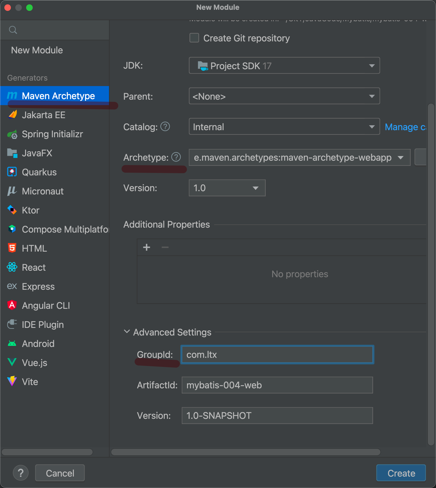
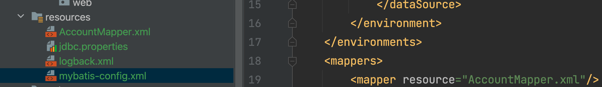
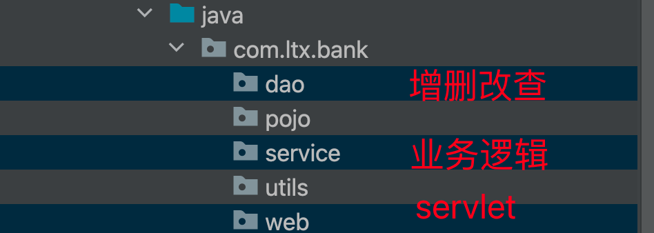
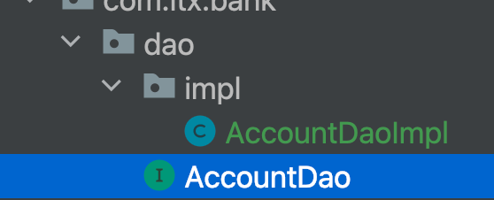
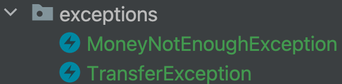
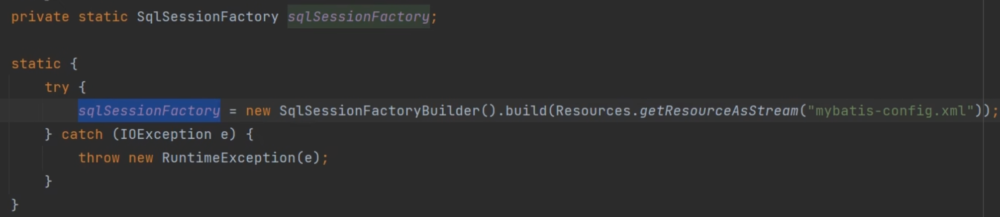
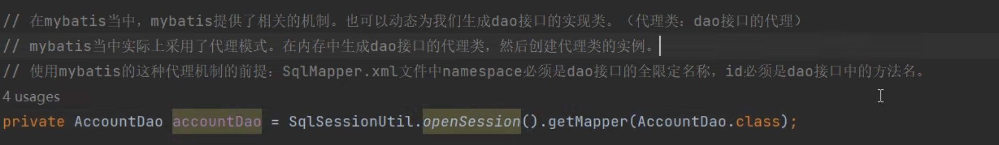

## 搭建数据库

## 新建模块



这一次与之前不一样了，直接从Generators中的Maven Archetype开始创建，注意选择Archetype为webapp

### 配置依赖

配置了Mysql、Mybatis、logback、servlet依赖

### 配置Tomcat

在上方的configuration界面配置Tomcat服务器

### 准备页面

在webapp-WebINF-index.html中写表单作为今后的web页面。

### 准备Mapper等资源



注意更改配置文件中的mapper resource资源路径名称。

### 填充java包



其中pojo包是普通java类代码;utils是工具类代码。

## 补全功能

以从前端往后端写这个思路写；整体的逻辑是以MVC架构来写：

- 层和层之间要以接口作为连接

### web下的servlet

- servlet作为中间桥梁，接受前端表单提交的数据，并且调用service层中的对象方法来去催动业务的实现（其自身并不实现业务） 

- ```java
  @WebServlet("/transfer")
  public class AccountServlet extends HttpServlet {
      //为了让此对象在其他方法中也可以使用，声明为实例变量
      private AccountService accountService = new AccountServiceimpl();//多态创建对象
      @Override
      protected void doPost(HttpServletRequest req, HttpServletResponse resp) throws ServletException, IOException {
          //获取表单数据
          String fromActno = req.getParameter("fromActno");
          String toActno = req.getParameter("toActno");
          double money = Double.parseDouble(req.getParameter("money"));//将money转为double类型进行接受
          //servlet作为中间桥梁(调度司令），不处理业务，调用service的方法来完成转账业务
          try {
              accountService.transfer(fromActno,toActno,money);
              //程序走到这里证明转账成功
              //调用视图层view完成展示结果
              resp.sendRedirect(req.getContextPath() + "/success.html");
          } catch (MoneyNotEnoughException e) {
              resp.sendRedirect(req.getContextPath() + "/error1.html");
          } catch (TransferException e) {
              resp.sendRedirect(req.getContextPath() + "/error2.html");
          }
      }
  }
  ```

### dao下的增删改查

- Dao对象中的任何一个方法与业务都不挂钩，就是做crud，方法名就是insert、delete、update

- 但是dao中的实现类要与Mapper中的真实的sql语句进行联动。

- ,实现类代码如下所示。

- ```java
  public class AccountDaoImpl implements AccountDao {
      @Override
      public Account selectByActno(String actno) {
          SqlSession sqlSession = SqlSessionUtil.openSession();
          Account account = sqlSession.selectOne("account.selectByActno", actno);//这里跟AccountMapper.xml中联动
          sqlSession.close();//后续会改动，不在这里关闭，因为sqlsession线程不安全
          return account;
      }
  
      @Override
      public int updateByActno(Account act) {
          SqlSession sqlSession = SqlSessionUtil.openSession();
          int count = sqlSession.update("account.updateByActno",act);//"sqlId",act 两个参数
          sqlSession.commit();//同上，会改动
          sqlSession.close();
          return count;
      }
  }
  ```

由于Dao实现类与业务无关，我们可以利用某种技术在**内存中自动生成Dao接口的实现类**——**Javassist框架**

### service中的核心业务逻辑

- ，service实现类代码如下所示。 

- ```java
  public class AccountServiceimpl implements AccountService {
      private AccountDao accountDao = new AccountDaoImpl();
      @Override
      public void transfer(String fromActno, String toActno, double money) throws MoneyNotEnoughException, TransferException {
          //具体实现,Mybatis应用在这里,但是数据库的crud操作应该在dao包里面去做
          //1判断转出账户余额是否充足(select)
          Account fromAct = accountDao.selectByActno(fromActno);
          Double balance = fromAct.getBalance();
          if (balance < money){//2如果账户余额不够，提示用户
              //抛出异常类
              throw new MoneyNotEnoughException("对不起，余额不足");
          }
          //3如果转出账户余额充足，更新余额(update)
          //先更新内存中java对象account的余额，然后更新数据库
          Account toAct = accountDao.selectByActno(toActno);
          fromAct.setBalance(fromAct.getBalance() - money);
          toAct.setBalance(toAct.getBalance() + money);
          //4更新余额
          int count = accountDao.updateByActno(fromAct);
          count += accountDao.updateByActno(toAct);
          if (count != 2){
              throw new TransferException("转账异常，未知原因");
          }
      }
  }
  ```

### 增加异常类包

专门存放异常信息

-  

### 事务的控制

- 将 `ThreadLocal` 与 `SqlSession` 结合使用的典型场景是在使用 MyBatis 框架进行数据库操作时。你可以使用 `ThreadLocal` 来存储每个线程的 `SqlSession` 实例。这样，每个线程都可以通过 `ThreadLocal` 安全地获取其独立的 `SqlSession` 实例，从而避免了线程安全问题
- 当前线程再次调用 `openSession` 方法时，可以直接从 `ThreadLocal` 中获取到已经创建的 `SqlSession`，而不需要重新创建。

```java
//修改utils中的代码
    private static ThreadLocal<SqlSession> local = new ThreadLocal<>();

    //获取会话对象
    public static SqlSession openSession(){
        SqlSession sqlSession = local.get();
        if (sqlSession == null){
             sqlSession = sqlSessionFactory.openSession();
             //第一次拿到sqlsession后绑定到当前线程上
            local.set(sqlSession);
        }
        return sqlSession;
    }
```

- 要保证Dao、Service中拿到的SqlSession对象都是同一个（绑定当前线程）

## 三大核心对象

`SqlSessionFactoryBuilder\SqlSessionFactory\SqlSession`

### 关系

- Builder它的唯一目的就是创建 `SqlSessionFactory`。
- 一旦 `SqlSessionFactory` 被创建，它应该在应用程序的**生命周期内一直存在**，通常作为单例使用。
- `SqlSession` 是 MyBatis 的核心接口，代表了与数据库的**一次会话**。
- 你首先使用 `SqlSessionFactoryBuilder` 来读取 MyBatis 的配置文件，然后创建出一个 `SqlSessionFactory` 实例。接着，通过 `SqlSessionFactory`，你每次需要与数据库交互时都会创建出一个新的 `SqlSession`。

### 生命周期

由三者的关系可知

- Builder作用域仅在局部变量中
- Factory需要一直存在，所以静态代码块中

- Session：一个线程一个Session实例，作用域为一次请求

## Javassit

## 动态提供Dao接口实现类




- getMapper是Mybatis内置的生成dao中实现类对象的方法，这样以后我们只需要在Dao中写接口和对应的mapper.xml文件中写好名称即可。（无需手动去写实现类）

## CRUD规范

之前的Dao包现在更名为Mapper包，以后重点就写`SqlMapper.xml`文件和`SqlMapper`接口。


以后就写这三个，`.java`结尾的是Mapper（Dao）接口，`xml`写SQL语句；`Test`进行单元测试