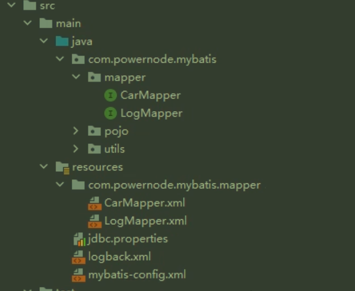

# Mybatis小技巧

## #{} ${}区别

`#`底层使用PreparedStatment，先进行SQL语句的编译，然后给占位符`？`传值：**先搭架子再传值**。

- 以**值**的形式放的

- 如果传的是SQL语句的关键字，如asc等，传入时会变为`'asc'`多了引号反而不能执行

`$`底层使用Statment（存在SQL注入风险），先拼接，再对SQL语句进行编译。

- 故优先使用`#`
- 拼接表名  

### 批量删除

一次删除多条语句,在Mapper.xml中：

```mysql
delete from t_car where id in(${ids})
```

在接口中：

```java
int deleteBatch(String ids);
```

### 模糊查询

如果`？`放在了单引号内部，其不会被当做占位符，而是一个单独的问号（JDBC特点）

- 使用concat拼接字符串或者$

```mysql
where 
	brand like '%#{band}%'
	brand like '%${band}%'
	brand like concat('%', #{brand}, '%')
  brand like "%"#{brand}"%"  让JDBC识别到？
```

## 全限定类名的别名

在xml配置文件中添加类型别名标签；注意，namespace不可以起别名，必须全限定类名。

```xml
    <typeAliases>
        <typeAlias type="com.ltx.mybatis.pojo.Car" alias="car"/>
        <typeAlias type="com.ltx.mybatis.pojo.Log" alias="log"/>
      <!--将此包下的所有类全部自动起别名 -->
      	<package name = "com.ltx.mybatis.pojo"/>
    </typeAliases>
```

- 如果不声明alias,就会有默认别名（类名）

## Mappers

有三个状态：resource\\url\class

- resouce指类的根路径下开始查找，
- url绝对路径（很少用，移植性太差）
- class：提供mapper的全限定接口名，必须带有包名；*保证xml文件与Mapper接口在同一目录下，并且名字一致*——在resources下新建目录（注意以/隔开）然后将xml放入目录中
- 

最后，全部**使用`package`的形式来包含mapper包下的所有Mapper文件**：`<package name = "com.ltx.mybatis.mapper"/>`**指定包的方式**——当然也得满足上述条件。

- 当你在<mappers>元素中使用<package>子元素时，你是在告诉Mybatis自动扫描指定的包以查找Mapper接口
- Mybatis将会搜索这个包下的所有接口，并将它们注册为Mapper

## 设置config和Mapper模版

在IDEA设置的File and Code Templates中设置模版，日后可以直接新建模版文件。

## 自动获取主键值到某个属性上

```xml
<!--使用自动生成的主键值+指定主键值赋值给对象的某个属性（id）-->
 <insert id="insertCarUseGeneratedKeys" useGeneratedKeys="true" keyProperty="id">
     insert into t_car values(null,#{carNum},#{brand},#{guidePrice},#{produceTime},#{carType})
 </insert>
<!--这样可以将主键值赋值给id属性上 -->
```

