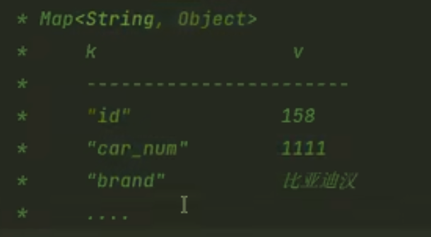

# 参数处理

这是Mybatis的一个重要问题——Mapper包下的**接口中定义的所有方法中的形参**。这些参数是要传入到Mapper.xml中的占位符中

## 单个参数简单类型

简单类型包括：

 

mybatis框架自身带有类型自动推断机制，故在SQL语句时parameterType属性可以省略不写。

- 

## Map参数

注意一点，`#{}`里面放的是Map集合里的key值


## 实体类参数pojo

注意，`#{}`里面放的必须是属性名


## 多参数

 mybatis框架会自动创建一个Map集合，以这种方式存储参数：


所以在`#{}`中应该填写`arg0,arg1`或者是`param1,param2`，注意arg从0开始的；当然二者可以一起使用。

## @Param注解

通过注解来告诉Mybatis多参数调用时Map中的key是什么（即使用自定义）

```java
List<Student> selectByNameAndSex2(@Param("name") String name, @Param("sex") Character sex);
```

会将name和sex作为上面的arg0和arg1；但是param1和param2还可以用

## @Param源码分析

### 代理模式


mapper指向了代理对象，调的方法也是代理方法，

注解内部源码解析：


底层是一个Map集合。

# 返回结果处理

## Map集合接收

### 单个map

如果没有合适的类型作为接受，使用Map集合接收。



### 多个map

- 如果使用`List<map<x,y>>`，在SQL语句中的返回值类型还是`map`(因为Mybatis关注的是集合中放的是什么东西)
- 但是取出某个具体字段比较麻烦

### 返回Map(主键id,Map)


用主键值作为外层Map作为Key，取出对应的Map集合更为方便

```java
    @MapKey("id")//将查询结果的id作为整个Map集合的key
    Map<Long, Map<String, Object>> selectAllRetMap();
```

### ResultMap结果映射

查询时起**别名**是为了与类（对象）的属性名相对应：**列名与对象属性名相对应**

ResultMap为了体现二者之间的关系：

需要单独写一个resultMap标签来配置对应信息。

```xml
<resultMap id="carResultMap" type="Car">
  <!--如果有主键，建议配置一个主键标签 -->
	<id property="id" column="id"/>
  <result property="carNum" column="car_num"/>
</resultMap>

这里的返回结果类型设置为resultMap标签的id
<select id="selectAllByResultMap" resultMap="carResultMap">

</select>
```

