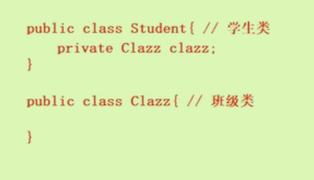
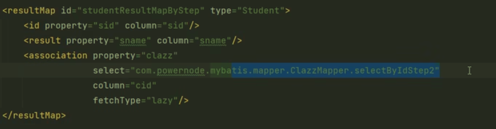
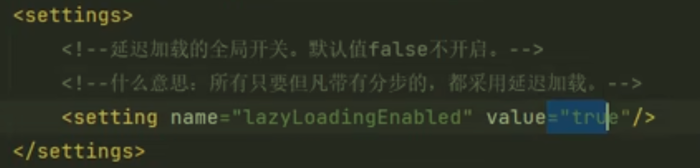
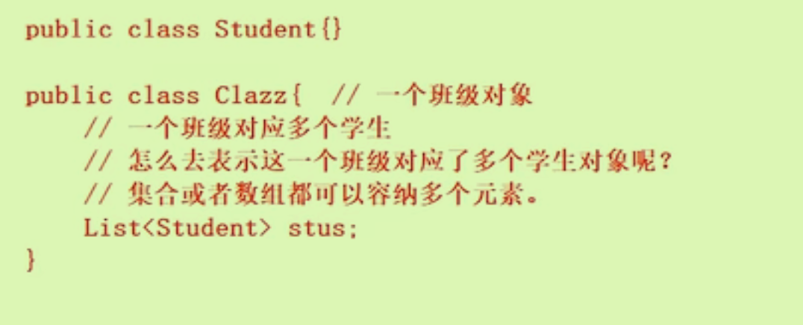

# 高级映射

数据存在多张表中，存在不止一个映射关系。

x张表对应一个实体类，对应x个Mapper接口，对应x个SQL映射xml文件（注意映射文件里的namSpace与mapper接口名称对应）

不论是多对一还是一对多都是**使用分布查询居多**。

## 多对一

多的表加外键（多个学生在一个班级里，学生表需要加外键）

需要判断主表：

- 谁在前谁是主表，多对一多在前，多是主表。（同理一对多，一是主表）
- 主表是JVM中的主对象
- 在主对象中想要用副对象，将其设置为自己的私有属性。

有三种处理方法：

### 一条sql语句级联属性映射

举例：根据学生的id查询学生的信息以及其所在班级的信息。

```xml
<resultMap id="studentResultMap" type="Student">结果映射的是主表Student
		<id property="sid" column="sid"/>
  	<result property="sname" column="sname"/>
  	<result property="clazz.cid" column="cid"/>
  	<result property="clazz.cname" column="cname"/> 这里列字段名对应对象中的属性名
</resultMap>

<select id="selectById" resultMap="studentResultMap">
		select
  		s.sid,s.sname,c.cid,c.cname
  	from
  		t_stu s left join t_clazz c on s.cid = c.cid
  	where
  		s.sid = #{sid}
</select>
```

### 一条sql语句Association

与上面的级联属性映射很像，多了在里面的association标签。

```xml
<resultMap id="studentResultMapAssociation" type="Student">结果映射的是主表Student
		<id property="sid" column="sid"/>
  	<result property="sname" column="sname"/>
  	这里使用association，不用副对象clazz.属性
  	property提供要映射的pojo类的属性名；javaType用来指定要映射的java类型
  	<association property="clazz" javaType="Clazz">
      <id property="cid" column="cid"/>
      <result property="cname" column="cnmae"/>
  	</association>
</resultMap>

<select id="selectById" resultMap="studentResultMap">
		select
  		s.sid,s.sname,c.cid,c.cname
  	from
  		t_stu s left join t_clazz c on s.cid = c.cid
  	where
  		s.sid = #{sid}
</select>
```

### 两条sql语句，分步查询

优点：**可复用，支持延迟加载**。

具体实施时会使用到两个Mapper接口以及两个Mapper.xml文件（因为用到了两张表）

主表主对象中的xml：

```xml
<resultMap id="studentResultMapBystep" type="Student">
	<id property="sid" column="sid"/>
  <result property="sname" column="sname"/>
  <association property="clazz"
               select="com.ltx.mybatis.mapper.ClazzMapper.selectByIdStep2"第二条sql语句的id，全类名限制修饰符——其实就是接口中方法的全类名
            	 column="cid"/> 将第一条sql语句查到的cid的值放到这里
</resultMap>

<select id="selectByIdStep1" resultMap="studentResultMapByStep">
	select sid,sname,cid from t_stu where sid = #{sid}
</select>
```

副对象中的xml：

```xml
<select id="selectByIdStep2" resultType="Clazz">
	select cid,cname from t_clazz where cid = #{cid}
</select>
```

### 延迟加载

用到的时候再执行查询语句，提高性能。尽可能的不查少查。

开启延迟加载：在association标签中添加`fetchType="lazy"`，只针对当前association起作用

全局延迟加载开关：

在配置文件中添加标签（默认是关闭的）



## 一对多

一个班级对应多个学生，在班级类中加上集合或者数组来容纳多个元素。



### collection

将之前的association换做collection，javaType换做ofType

```xml
<resultMap id="clazzResultMap" type="Clazz">
	<id property="cid" column="cid"/>
  <result property="cname" column="cname"/>
  <collection property="stus" ofType="Student">
  	<id property="sid" column="sid"/>
    <result property="sname" column="sname"/>
  </collection>
</resultMap>

<select id="selectByCollection" resultMap="clazzResultMap">
	select c.cid,c.cname,s.sid,s.sname from
  t_clazz c left join t_stu on c.cid=s.cid
  where c.cid = #{cid}
</select>
```


### 分布查询

在主对象的xml文件中

```xml
<resultMap id="clazzResultMapStep" type="Clazz">
	<id property="cid" column="cid"/>
  <result property="cname" column="cname"/>
  <collection property="stus"
              select="com.ltx.mybatis.mapper.StudentMapper.selectByCidStep2"第二条sql语句的全名称
              column="cid"/>
</resultMap>
<select id="selectByStep1" resultMap="clazzREsultMapStep">
	select c.cid,c.cname
  from t_clazz where c.cid=#{cid}
</select>
```

在副对象的xml文件中

```xml
<select id="selectByCidStep2" resultType="Student">
	select * from t_stu where cid = #{cid}
</select>
```

