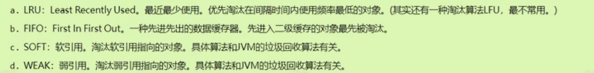
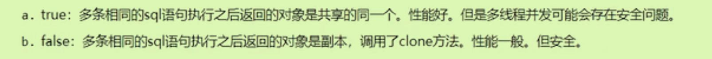

# Mybatis中的缓存

## 简介

一级缓存：数据存储在SqlSession中

二级缓存：存储在SqlSessionFactory中（范围更大）

也可以集成其他第三方的缓存

**缓存只针对于DQL语句，只对应Select语句，其他Update,delete都是现连数据库操作的**

## 一级缓存

- **同一个SqlSession对象**执行同一条SQL语句（查询条件一样），就会走一级缓存。

第一次DQL和第二次DQL之间做了某件事，会使缓存清空:

- 执行了SqlSession的clearCash方法，手动清空
- 执行了修改Insert等语句，*不论操作哪一张表都会清空一级缓存*。

## 二级缓存

首先需要几个条件才能够使用：

- 在使用的Mapper.xml文件中添加配置`<cache/>`
- 实体类对象实现`java.io.Serializable接口`
- SqlSession对象只有关闭后，一级缓存才会被放到二级缓存中。 

先从SqlSession一级缓存中找，除非一级缓存关闭后，才来二级缓存找。

### 二级缓存配置

- `eviction`缓存中的淘汰算法，即考研os中的那四个算法
- `flushInterval`
- `readOnly`
- `size`

## 集成EhCache（了解）

- 引入ehcache依赖
- 类的根路径下新建相关配置文件
- 修改Mapper.xml文件中的`<cache/>标签` ，添加Type属性

