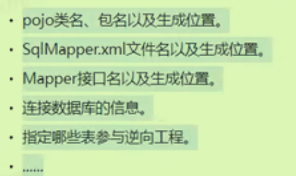
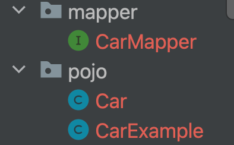
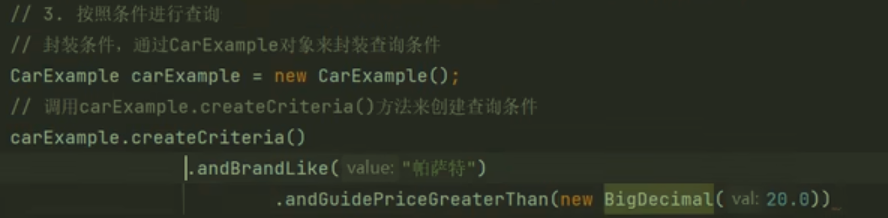
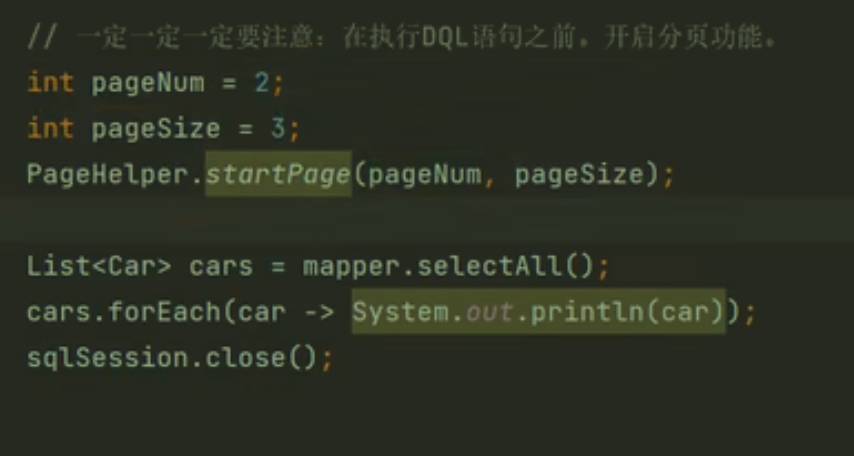
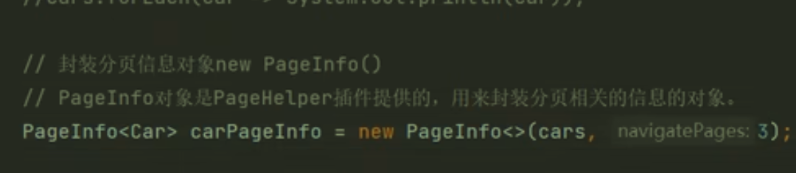

# 逆向工程

根据数据库表逆向推出java中的pojo类，Mapper接口，Mapper.xml的SQL标签



1、在配置文件中配置逆向工程的插件

2、在资源类的根路径下配置插件对应的xml文件



多出的CarExample用来封装查询条件——即按照条件查询。

体现QBC风格，面向对象来写SQL语句，看不到正常的SQL语句。



# 分页插件



更为困难的是获取分页信息，而并不只是直接分页。（即页面上的一些排列数据）



PageInfo还可以给出页间隔符navigatePages

# 注解编程

如果语句比较复杂，建议还是使用XML文件来映射语句；如果仅仅是单表的操作，可以使用注解（不再需要Mapper.xml文件）

```java
@Insert("insert into t_car values(null,#{carNum},#{brand},#{guidePrice},#{produce},#{carType})")
int insert(Car car);
```

