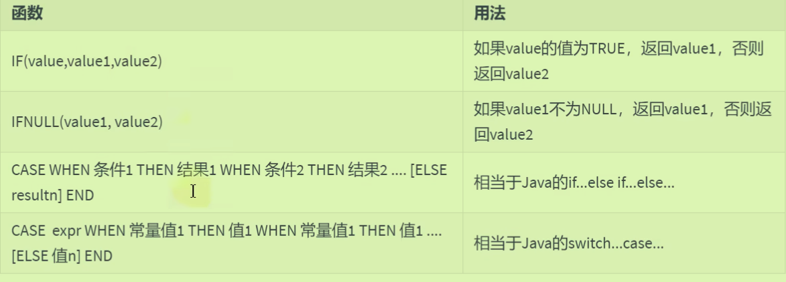
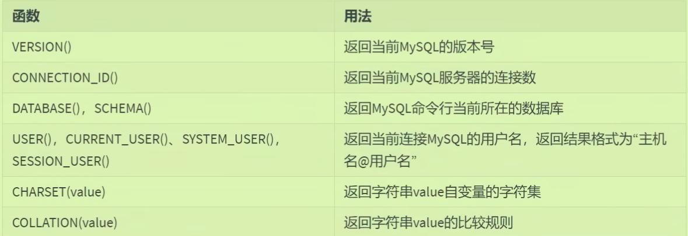

# Mysql06 单行函数

## 引入

- 不同的DBMS中函数的差别很大
- 函数分类：
- 单行：只对一行进行变换，每行返回一个结果，可以嵌套；参数可以是某一字段或者值

## 数值函数

### 四舍五入：

- `rand()`随机数会有两种使用方法，括号里可以放一个种子x——作用是**同一种子rand后的随机数相同。**
- `round()`四舍五入，分为`round(x,y)`y表示保留几位小数，注意**y可以为负数，往小数点前面舍入就行**
- ` truncate(x,y)`截断操作，一定要有y直接截断

### 三角函数：

- 所有的函数参数都要求是弧度制，所以先使用函数将角度转换为弧度。

```sql
#角度与弧度的互换
select radians(30),Radians(60),radians(90)
from dual;
#换为角度
select degrees(2*pi()),degrees(radians(60))
from dual;
```

### 进制转换：

```sql
SELECT BIN(10),HEX(10),OCT(10),CONV(10,10,8)
FROM DUAL;
```

## 字符串函数：

### 长度

- `char length()`表示的是*长度为多少个字符*，`length()`表示的是**底层存储的时候占多少个字节**
- 字符串的索引是从1开始的

### 替换：

- insert中的参数是从哪个索引开始，替换掉多少长度的字符（可以与后面要替换的长度不一样）

```sql
select insert('hello',2,3,'aaaa'),replace('hello','ll','mmm')
from dual
```

### 实现右对齐左对齐

- 参数的意思是填充最终有几位(下面就是用空格填充最后结果*带小数点*一共有10位)

```sql
SELECT employee_id,last_name,LPAD(salary,10,' ')
FROM employees;
```

### 判断是否相等

`nullif(s1,s2)`如果二者相等返回null，不相等返回前者；参数不只可以放字符串

## 日期时间函数

### 获取日期时间：

```sql
#获取日期时间
SELECT CURDATE(),CURRENT_DATE(),CURTIME(),NOW(),SYSDATE(),
UTC_DATE()
FROM DUAL;
```

### 日期与时间戳的转换：

- 上面是转换为时间戳，下面是转换回时间。

```sql
SELECT UNIX_TIMESTAMP(),UNIX_TIMESTAMP('2022-11-22 12:20:30'),
FROM_UNIXTIME(1700655571)
FROM DUAL;
```

### 日期的操作函数：

- 取出指定日期中的指定特殊属性

```sql
#Type from 时间
select extract(second from now())
from dual;
```

### 计算日期和时间的函数

```sql
select Now(),date_add(now(),interval 1 year),
date_add('2023-11-22 21:08:12',interval 1 minute ) "col4"
from dual;
```

### 日期的格式化与解析：（与字符串）

- 如果字符串本身写的形式与日期形式相同，会进行隐式地自动转换
- 年月日用-连接，时分秒用：连接
- 甚至可以获得指定格式

```sql
#格式第二个参数fmt有很多种
select date_format(now(),'%Y-%M-%D'),
date_format(now(),'%Y-%m-%d'),time_format(curtime(),'%h:%i:%S')
#解析，格式必须一致
select str_to_date('2023-11-22','%Y-%m-%d')
from dual;
#可以获得格式，不用自己去记很多格式
select get_format(date,'USA')
from dual;
```

## 流程控制函数：

- 

```sql
SELECT last_name,salary,IF(salary >= 6000,'high','low') AS col
FROM employees;
#ifnull
SELECT last_name,commission_pct,IFNULL(commission_pct,0) "details"
FROM employees;
#case when... then ... when... then... else end相当于if else，可以不要else但必须end
SELECT last_name,salary,CASE WHEN salary >= 15000 THEN 'high'
			     WHEN salary >= 10000 THEN 'mid'
			     WHEN salary >= 8000 THEN 'diaosi'
			     ELSE 'low' END "details"
FROM employees;	
#case..when..then when..then..有一个条件字段直接放在case之后，类似于switch
SELECT employee_id,last_name,department_id,salary,CASE department_id WHEN 10 THEN salary*1.1
								     WHEN 20 THEN salary*1.2
								     WHEN 30 THEN salay*1.3
								     ELSE salary * 1.4 END "details"
FROM employees;	
```

## 加密解密函数

- 加密过程在客户端就可以进行了
- 不可逆的加密方法：当其成为暗文到数据库当中后，下次再登陆时会自动拿着明文对应的暗文去比较。

```sql
select md5('mysql'),sha('mysql') # sha比md5更加安全
from dual;
```

- `Encode和Decode`一对加密解密方法在8.0版本后不再使用

## 信息函数：

- 用于维护开发Mysq
- 
