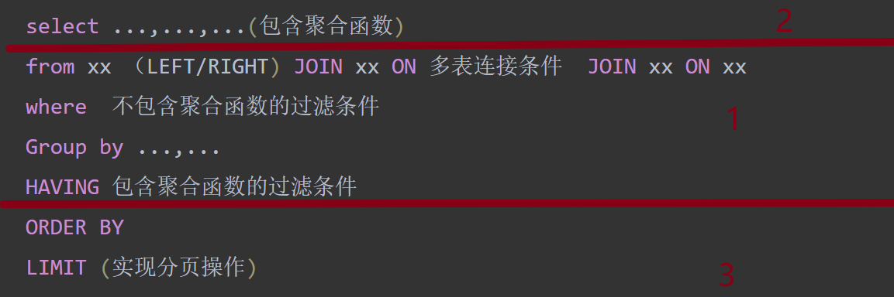

# Mysql07聚合函数（多行函数）

## 概念：

- 首先必须注意，输入多条，输出只能有一条
- 其次，数值类型、字符串类型、日期类型三个类型是数据库中最重要的三种类型。

## 常用的聚合函数：

- 聚合函数通常都会过滤掉NULL值
- Mysql当中聚合函数**无法嵌套使用**

### COUNT

- 指定字段在查询结构中出现的个数(**不计算NULL值的**)
- 如果想计算表中有多少条记录（几行），使用`count(1) count(*)`,而使用具体字段是不一定的（因为不管NULL）；但是如果不考虑这种情况，三者的效率取决于数据库采用的存储引擎（见下篇）

```sql
select count(employee_id),count(salary),count(1)#没有取具体的字段，而是用常数表示，整行数据用1这个数值去充当
from employees;
```

- 在计算平均值时有时存在值为NULL的数据会出现一些问题：使用`ifnull`将空值变为0，不再被过滤

```sql
select sum(commission_pct) / count(ifnull(commission_pct,0),
avg(ifnull(commission_pct),0)
from employees;
```

## GroupBy函数：

使用一些常见的组函数avg，sum等等

### 基本分组：

```sql
# 查询各个部门的平均工资(按照部门id分组)
select department_id,avg(salary)
from employees
group by department_id;
# 
select job_id,avg(salary)
from employees
group by job_id;
```

### 使用多个列分组：

- 注意：在Mysql中，`select`声明的非组函数的字段必须声明在`group by`中；反之没必要只是不好读

```sql
#查询各个部门及其工种的平均工资
select department_id,job_id,avg(salary)
from employees
group by department_id,job_id;
```

### 新特性With RollUP

- **子汇总生成**：当你对一组数据进行分组统计时（比如计算总和、平均值、计数等），`WITH ROLLUP` 会自动为你生成每个分组的子汇总。这意味着除了原始的分组统计数据外，你还会得到每个分组内的汇总数据。

```sql
#会在最后加上一条与组函数相同功能的汇总信息
select department_id,sum(salary)
from employees
group by department_id with rollup;#得到所有部门的总工资在最后一行
```

## Having函数

- 用来过滤数据
- 要求：**一旦过滤条件中出现了聚合函数（组函数）**，则必须使用Having替换`Where`;声明位置在GroupBy的后面
- 当不使用`GroupBy`的时候再去使用Having意义就不大了（因为退化为了一整个表）；开发中`Having`通常依赖于`GroupBy`

**值得注意的点**：

- 过滤条件中没有组函数的时候，即使有groupby，还是推荐使用`where`作为过滤条件，运行速度更快。
- 底层上`where`更为高效

```sql
#都放在having中
SELECT department_id,MAX(salary)
FROM employees
GROUP BY department_id
HAVING MAX(salary) > 10000 And department_id in (10,20,30,40);
#没有组函数时放在where中
SELECT department_id,MAX(salary)
FROM employees
where department_id in (10,20,30,40)
GROUP BY department_id
HAVING MAX(salary) > 10000;
```

## sql底层运行原理:

### sql92语法：

```sql
select ...,...,...(包含聚合函数)
from xx,xx,xx
where 多表连接条件 AND 不包含聚合函数的过滤条件
Group by ...,...
HAVING 包含聚合函数的过滤条件
ORDER BY 
LIMIT (实现分页操作)
```

### sql99语法：

不同点在于多表连接以及外连接

```sql
select ...,...,...(包含聚合函数)
from xx （LEFT/RIGHT) JOIN xx ON 多表连接条件  JOIN xx ON xx
where  不包含聚合函数的过滤条件
Group by ...,...
HAVING 包含聚合函数的过滤条件
ORDER BY 
LIMIT (实现分页操作)
```

### sql语句的执行过程

- 底层实质上是不断地去根据条件迭代虚拟表，而这个迭代的顺序非常重要（见下方图片三个步骤，先去判断表的各种条件，再去选择字段，最后根据结果进行排序等操作）
- 