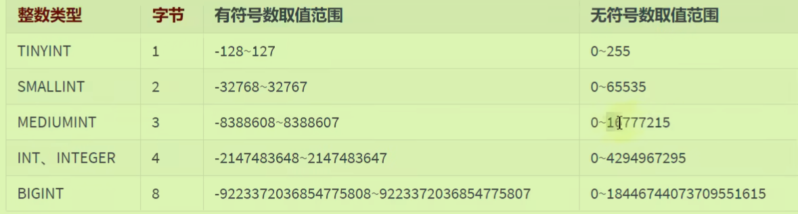
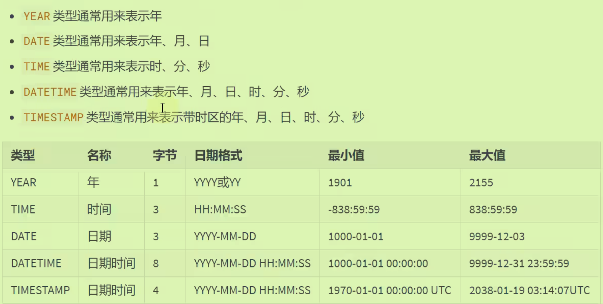
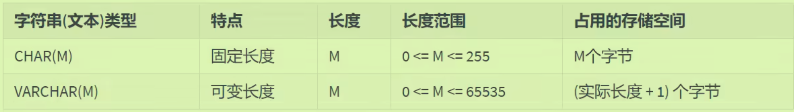
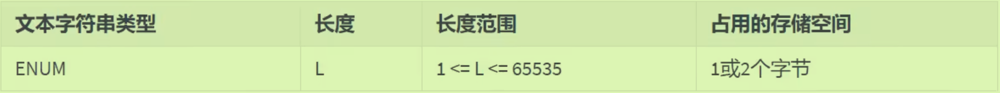

# Mysql11 数据类型

## 整型



### 数据宽度：

- 可以设定**至少的显示宽度**，不会影响元数据的类型宽度
- 从8.0开始不推荐使用此方法

```mysql
CREATE TABLE test_int2(
f1 INT,
f2 INT(5),
f3 INT(5) ZEROFILL #零填充。显示宽度为5，当insert不足5位时，使用0填充；超过5位不管
)

INSERT INTO test_int2(f3)
VALUES(123),(123456);
```

## 浮点类型：

### 精度误差:

- 浮点数存在精度误差，避免使用等号直接判断两个数是否相等
- 开发中尽量使用定点数`DECIMAL`——底层中使用字符串去存储的，所以使用它。

```mysql
create table test_double2(
f1 double
);
Insert into test_double2
values(0.47),(0.44),(0.19);

select sum(f1)
from test_double2;#这里并不等于1.1
```

## 定点数类型：

### 语法

- M为精度、D为标度

```mysql
DECIMAL(M,D)
```

- 将上面的改为定点数，结果为1.1

## 日期类型：



### DATRETIME与TIMESTAMP

- 存储的空间大小不同
- 后者可以设定时区，**底层以毫秒数**存储，根据不同时区进行输出显示。
- 一般都使用 `DATETIME`，但是**与计算相关的**建议使用`TIMESTAMP`

## 字符串类型：

### char与varchar



- `CHAR`类型不指明时默认长度为1字符，`VARCHAR`**定义时必须指明长度**——长度指的是字符，且前者存在空间浪费（但后者也会消耗一个字节来存储当前长度）

### 枚举ENUM



- 添加值时忽略大小写，每次只能从ENUM**所指定的元素中选一个**（先初始化再插入所给的值）

### 集合SET

- 可以添加多个元素（一个引号里放多个元素），自动去重

## 二进制类型

### BINARY


- 与char和varchar很像，但是**其指明长度为字节**，而非字符。

## JSON类型

实现服务器与客户端的不同格式的数据交换

```mysql
create table t1(
js json
);

```

