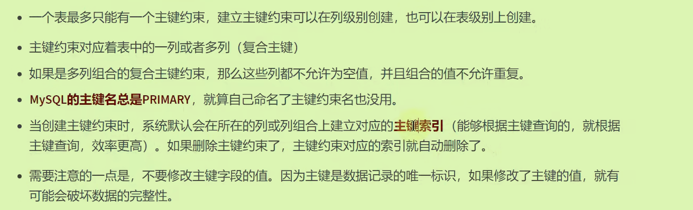
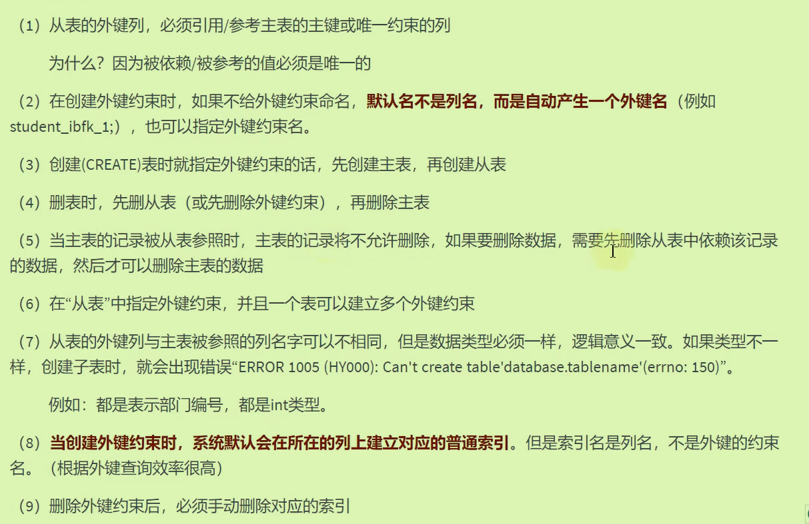
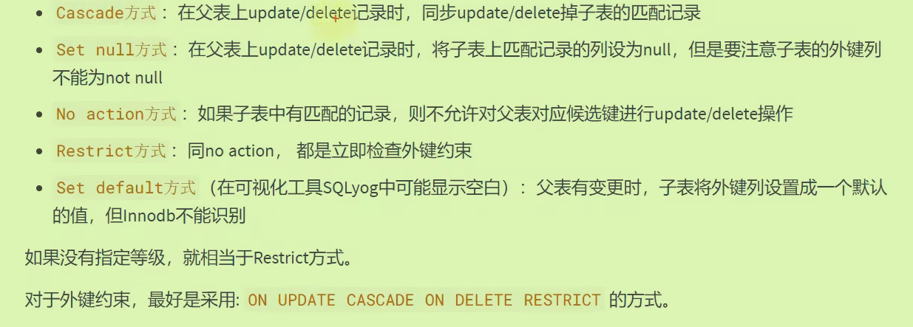

# Mysql12约束constraint

为了**保证数据的完整性，约束对表中字段进行额外强制的限制**。


查询约束,表名.`table_constrains`

```mysql
#查询约束
select * from information_schema.table_constraints
where table_name = 'employees'
```

## 非空约束NOT NULL

**只能使用列级约束**加在字段后面，影响的是添加修改数据。

不能复合约束。

```mysql
#在创建表时添加约束
CREATE TABLE test1(
id INT NOT NULL,
last_name VARCHAR(15) NOT NULL,
email VARCHAR(25),
salary DECIMAL(10,2)
);
#即使没有明显赋值，但是默认赋值为null，也会报错。
insert into test1(id,email)
values(2,'abc@126.com');

#在修改表时添加约束，但都是列级约束
ALTER TABLE test1
MODIFY email VARCHAR(25) NOT NULL;

#在alter table删除约束
alter table test1
modify email varchar(25) NULL;
```

## 唯一性约束UNIQUE

- 限制某字段的值不能够重复，既可以列级约束，也可以表级约束

- 创建唯一约束时，不给其命名约束名即为列名。
- 注意，**可以向UNIQUE字段添加多个NULL值**

```mysql
create table test2(
id int unique,
last_name varchar(15),
email varchar(25) unique,
salary decimal(10,2),

#表级约束,前面是约束的名字
constraint uk_test2_email unique(email)
);

#在修改时添加约束
ALTER TABLE test2
ADD CONSTRAINT uk_salary UNIQUE(salary);
#
ALTER TABLE test2
MODIFY last_name VARCHAR(15) UNIQUE;
```

### 复合的唯一性约束（多列）

- 对某些字段一起做了一个约束，只要这些字段别完全都一样即可。

```mysql
create table user(
id int,
`name` varchar(15),
`password` varchar(25),
#只有一个唯一性约束但作用在两个列上
constraint uk_user_name_pwd unique(`name`,`password`)
);
```

### 删除唯一性 约束

- 添加唯一性约束时会**自动创建唯一索引**，所以删除时**必须删除这个唯一索引才行**
- 未指定名称时：唯一索引名称=唯一约束名称（复合等于第一列）；

```mysql
#删除唯一性索引
ALTER TABLE test2
DROP INDEX last_name;

ALTER TABLE test2
DROP INDEX uk_test2_email;
```

## 主键约束

唯一性+非空性的组合，用于唯一地标识表中的某条记录；一般都不要更改主键：因为**整个表的数据就是依据主键索引构建B+树**



```mysql
# 主键约束
create table test3(
id int primary key,#列级约束
last_name varchar(15),
salary varchar(25),
#也可以在这里进行表级约束,但没有必要起名
constraint pk_test4_id primary key(id)
);
```

- 注意即使使用了复合约束，被约束的列也都不能为NULL

## 自增列Auto_Increment

- 声明在某个字段上，使这个字段会自动增长（**必须是整型变量**），一般都会声明在主键、唯一键上（**只能有一个自增长列**）
- 开发中添加数据时不用管自增列了。
- 默认从1开始，**但是一开始你插入的是n，以后都是从n开始**

### Mysql8.0中新特性：

在新版本中，自增的数值是**持久化**的，并**没有放在内存中保存**（即如果重启mysql服务器，自增出的数还是以前的顺序）

旧版本在内存中保存，所以关闭服务即丢失掉上一次的记录；新开时会看当前到n，再从n+1开始。

## 外键约束：

从表中的外键约束伴随着主表中的主键约束：（**引用完整性**）



- 与主表中名称可以不一样，但是**类型必须相同**。
- 主从不能跨存储引擎使用。

举例：

```mysql
CREATE TABLE emp1(
emp_id  INT PRIMARY KEY AUTO_INCREMENT,
emp_name VARCHAR(15),
department_id INT,
#表级约束定义外键,这里的语法
CONSTRAINT fk_emp1_dept_id FOREIGN KEY (department_id)
REFERENCES dept1(dept_id)
)

#删除外键约束
alter table emp1
drop foreign key fk_emp1_dept_id;
#删除外键约束对应的索引
show index from emp1;
alter table emp1
drop index fk_emp1_dept_id;
```

### 约束等级：



- 默认的是No action和Restrct
- 修改时使用Cascade、删除时使用RESTRICT方式——同步修改，严格限制删除。

```mysql
.....
constraint fk_emp1_dept_id foreign key (department_id)
references dept1(dept_id) on UPDATE CASCADE on DELETE RESTRICT
```

### 什么时候使用外键

- 数据库层面不要使用，**应用层解决**这些规范限制（Java中）
- 因为十分影响速度和成本。

## CHECK约束

检查某个字段值是否在某个范围之内。（5.7不支持，8.0支持）

```mysql
create table test10(
id int,
last_name varchar(15),
salary decimal(10,2) check(salary > 2000)
);
```

## Default约束

默认值；避免出现NULL值