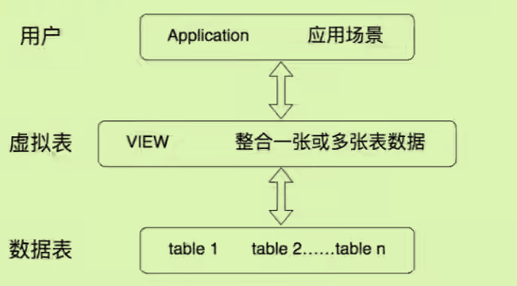
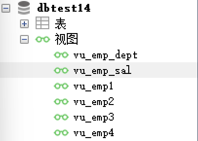

# Mysql13视图

## 常见数据库对象：


## 引入视图：

一张数据库表的全部信息并不是都可以被操作者拿到，为了让操作者仅拿到一部分的信息还能同步更改原表中的数据，采用视图View，

不同权限不同视图，相当灵活。

## 概念：

- 虚拟的表，实际上并没有存储数据；**建立在基表的基础之上**。
- 
- 可以**理解为一种存储起来的SELECT语句**

## 创建视图

### 语法

精简版：

```mysql
CREATE VIEW 视图名称
AS 查询语句
```

针对于单表：

```mysql
create view vu_emp1
as
select employee_id,last_name,salary
from emps;
#查询语句中字段别名=视图中字段名
create view vu_emp2
as
select employee_id emp_id,last_name lname,salary
from emps
where salary > 8000;
#字段方式二，小括号字段一一匹配
create view vu_emp3(emp_id,name,monthly_salary)
as
select employee_id,last_name,salary
from emps;

#查询一些表中原本不存在的字段
create view vu_emp_sal
as
select department_id,avg(salary) avg_sal
from emps
where department_id is not null
group by department_id;
```

针对于多表：

```mysql
create view vu_emp_sal
as
select department_id,avg(salary) avg_sal
from emps
where department_id is not null
group by department_id;
```

基于视图也可以创造视图：

```mysql
create view vu_emp4
as 
select employee_id,last_name
from vu_emp1;
```

## 查看视图



### 方式一：show tables

展示数据库中所有表和视图

### 方式二：desc 视图名称

### 方式三：show table status like 视图名

### 方式四：show create view 视图名