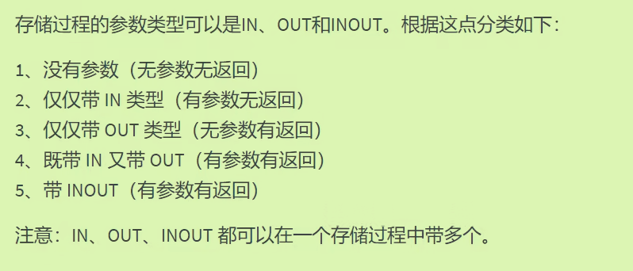

# Mysql14存储过程与函数

## 存储过程：PROCEDURE

### 概念：

**一组预先编译的sql语句封装在sql服务器**当中（一堆select语句），在应用端减少暴露select语句。

与函数的区别在于：**没有返回值**。

### 根据参数分类：

当我们说一个存储过程是“无参数有返回”的时候，通常是指这个存储过程**不接受任何输入参数（即没有 IN 或 INOUT 参数）**，但是会通过一个或多个 OUT 参数返回数据

并不是函数里面那个真正意义上的return返回值



### 创建调用存储过程

暂时省略语法中约束部分

1. **无参数无返回**

```mysql
#类型一：无参数无返回
#创建存储过程
DELIMITER $#为了可以以$为结束符不受存储体的影响

CREATE PROCEDURE select_all_data()
BEGIN
	SELECT * FROM employees;
END $
#调用存储过程(无参）
CALL select_all_data();
```

2. **带OUT无参数有返回**
   - 可以改变out变量

```mysql
delimiter $
create procedure show_min_salary(out ms double)#参数 变量名 类型
begin
	select min(salary) into ms#作为输出这里注意写法
	from employees;
end $
delimiter $

call show_min_salary(@ms);#@表示用户定义的变量
select@ms;
```

3. **带IN有输入无返回**

```mysql
DELIMITER $
CREATE PROCEDURE show_someone_salary(IN empname VARCHAR(20))
BEGIN
	SELECT salary FROM employees
	WHERE last_name = empname;
END $
DELIMITER $
#调用1
CALL show_someone_salary('Abel');
#调用2,设置变量
SET @empname = 'Abel';
CALL show_someone_salary(@empname);
```

4. **既有in又有out**

```mysql
DELIMITER $
CREATE PROCEDURE show_someone_salary2(IN empname VARCHAR(20),OUT empsalary DECIMAL(10,2))
BEGIN
	SELECT salary INTO empsalary
	FROM employees
	WHERE last_name = empname;
END $
#调用
SET @empname = 'Abel';
CALL show_someone_salary2(@empname,@empsalary);
```

5. **同时作为INOUT**

```mysql
DELIMITER $
CREATE PROCEDURE show_mgr_name(INOUT empname VARCHAR(25))
BEGIN
	SELECT last_name
	FROM employees
	WHERE employee_id =(#子查询
				SELECT manage_id
				FROM employees
				WHERE last_name = empname
	                    );
END $
```

## 存储函数创建与调用

与存储过程不同在于有**returns**；参数默认类型为**IN**（函数）；调用时使用**SELECT**

### 创建调用举例：

```mysql
DElimiter $
create function email_by_name()
returns varchar(25)
	deterministic
	contains sql
	reads sql data#需要加许多特性否则报错
begin
	return(SELECT email FROM employees where last_name ='Abel');
end $
delimiter;

#第二种方法不用添加许多特性防止报错
set Global log_bin_trust_function_creators = 1;
delimiter $
create function email_by_id(emp_id int)
returns varchar(25)
begin
	return(SELECT email FROM employees WHERE employee_id = emp_id);
end $
```

