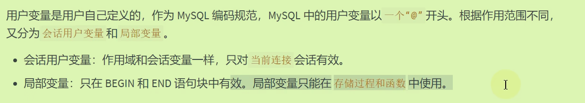

# Mysql15数据库中的变量

## 变量

### 系统变量

分为全局系统变量（**Global**）和会话系统变量（**Session**）；（有的既是全局又是会话,这种情况**使用时需要明确指定**）重启服务Global改变失效，关闭会话Session失效。

- 没有指明的话，默认是Session(可以视作local)
- 每一个客户端连接到Mysql服务器（建立连接）后都会产生对应的会话，服务器会生成该会话对应的会话变量
- 修改会话级不会影响其他会话级，但是修改全局就会影响所有。
- **使用@@开头的就是系统变量**

```mysql
#查看系统变量
SHOW GLOBAL VARIABLES;#617
SHOW SESSION VARIABLES;#640
SHOW VARIABLES;#640
#查看部分系统变量
SHOW GLOBAL VARIABLES LIKE 'admin_%';
SHOW VARIABLES LIKE 'character_%';
#查看指定的系统变量
SELECT @@global.max_connections; 
SELECT @@session.character_set_client;
SELECT @@character_set_client;#没有指明时先查询会话再查全局

#修改系统变量；针对当前服务实例有效，重启失效
set @@global.max_connections = 161;
set Global max_connections = 171;

```

### 用户变量



注意，一个@开头只用于会话用户变量，局部变量不需要。

- 有两种定义方式,注意另外一种等号`:=`

```mysql
#会话用户变量
set @m1 = 1;
set @m2 := 2;
set @sum := @m1 + @m2;
select @sum;
#第二种定义方式
select @count := count(*) from employees;
select avg(salary) into @avg_sal from employees;
#使用仍然是select
```

- 局部变量只能定义在语句块中,必须使用**`declare`声明，且再语句块的首行位置**

```mysql
#局部变量
DELIMITER $
CREATE PROCEDURE test_var()
BEGIN
	#声明
	DECLARE a INT DEFAULT 0
	DECLARE b INT;
	DECLARE emp_name VARCHAR(25);
	#赋值
	SET a = 1;
	SET b := 2;
	SELECT last_name INTO emp_name
    from employees
    WHERE employee_id = 101;
	#使用局部变量
	SELECT a,b,emp_name;
END $
```

## 定义条件与处理程序

定义条件：事先定义程序进行过程中可能遇到的问题；处理程序即处理错误

二者在存储过程和函数中均支持

### 定义条件：（可选，意义在于错误名称）

`DECLARE 错误名称 CONDITION FOR 错误码`

- 错误码：

- ```mysql
  #定义条件的两种格式
  declare Field_Not_Be_NULL condition for 1048;
  declare Field_Not_Be_NULL condition for sqlstate '23000';
  ```

### 处理程序：（必须）

`DECLARE 处理方式 HANDLE FOR 错误类型 处理语句`

处理语句可以简单赋值set也可以写一些存储过程

```mysql
delimiter $
create procedure insertDataWithCondition()
begin
	declare exit handler for 1062 set @pro_value = -1;#错误处理
	set @x = 1;
	insert into departments(department_name) values('调试');
	set @x = 2;
	insert into departments(department_name) values('测试');
	set @x = 3;
end $
```

## 流程控制

Mysql中的流程控制只用于存储程序。

### IF

注意最后的`end if`

```mysql
delimiter //
create procedure test_if()
begin
	Declare stu_name varchar(15);#声明局部变量
	if stu_name is NULL
		then select 'stu_name is null';
	end if;
	
	declare email varchar(25);
	if email is null
		then select 'email is null';
	else
		select 'email is not null';
	end if;
	
	declare age int default 20;
	if age>40
		then select'中老年';
	elseif age > 18
		then select'青壮年';
	elseif age > 8
		then select'青少年';
	else
		select'婴幼儿';
	end if;
end
```

### CASE


- 在存储过程中通常都是声明、赋值、条件判断设置三个过程。

### LOOP

```mysql
delimiter //
create procedure test_loop()
begin
	declare num int default 1;
	loop_label:LOOp
		set num = num + 1;
		if num>= 10 then leave loop_label;
		end if;
	end loop loop_label;
	
	select num;
end //
```

### While

大体框架都相同，与高级语言不同的就是需要`end`

### Repeat

不同点在于退出循环的方法，`until 条件`，满足这个条件即可退出循环；注意，until后面没有分号

### Leave

将leave视作break，但通常是**leave + 某个标签**；还可以结束存储过程和函数。

### Iterate

将Iterate理解为continue，同样也要+标签；只能用在循环当中。

## 游标的使用：Cursor

**逐行处理数据**：当你需要在存储过程中逐行处理查询结果时，游标提供了一种方式来实现这一点。你可以使用游标一次处理结果集中的一行，而不是一次处理整个结果集。

简单的select搞不定了，需要取出一条一条记录来解决了。

### 声明游标：

` 	declare emp_cursor cursor for select salary from employees order by salary desc;`

### 打开

`OPEN emp_cursor;`

### 使用

`fetch emp_cursor into emp_sal;`

### 关闭

`close emp_cursor`


## 
