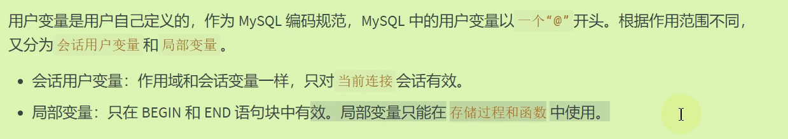

# Mysql15数据库中的变量

## 变量

### 系统变量

分为全局系统变量（**Global**）和会话系统变量（**Session**）；（有的既是全局又是会话,这种情况**使用时需要明确指定**）

- 没有指明的话，默认是Session(可以视作local)
- 每一个客户端连接到Mysql服务器（建立连接）后都会产生对应的会话，服务器会生成该会话对应的会话变量
- 修改会话级不会影响其他会话级，但是修改全局就会影响所有。
- **使用@@开头的就是系统变量**

```mysql
#查看系统变量
SHOW GLOBAL VARIABLES;#617
SHOW SESSION VARIABLES;#640
SHOW VARIABLES;#640
#查看部分系统变量
SHOW GLOBAL VARIABLES LIKE 'admin_%';
SHOW VARIABLES LIKE 'character_%';
#查看指定的系统变量
SELECT @@global.max_connections; 
SELECT @@session.character_set_client;
SELECT @@character_set_client;#没有指明时先查询会话再查全局

#修改系统变量；针对当前服务实例有效，重启失效
set @@global.max_connections = 161;
set Global max_connections = 171;

```

### 用户变量



注意，一个@开头只用于会话用户变量，局部变量不需要。

- 有两种定义方式,注意另外一种等号`:=`

```mysql
#会话用户变量
set @m1 = 1;
set @m2 := 2;
set @sum := @m1 + @m2;
select @sum;
#第二种定义方式
select @count := count(*) from employees;
select avg(salary) into @avg_sal from employees;
#使用仍然是select
```

- 局部变量只能定义在语句块中,必须使用**`declare`声明，且再语句块的首行位置**

```mysql
#局部变量
DELIMITER $
CREATE PROCEDURE test_var()
BEGIN
	#声明
	DECLARE a INT DEFAULT 0
	DECLARE b INT;
	DECLARE emp_name VARCHAR(25);
	#赋值
	SET a = 1;
	SET b := 2;
	SELECT last_name INTO emp_name
    from employees
    WHERE employee_id = 101;
	#使用局部变量
	SELECT a,b,emp_name;
END $
```

