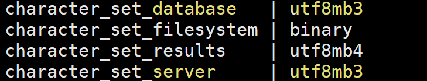
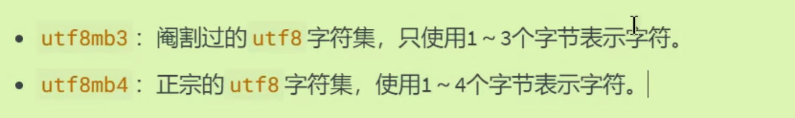
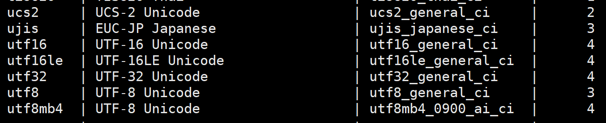
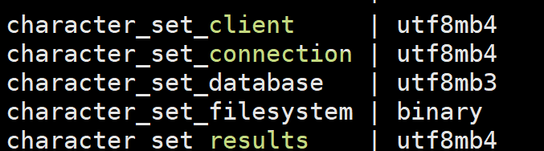
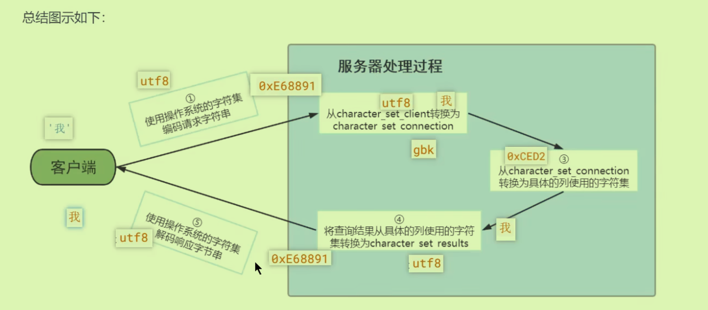
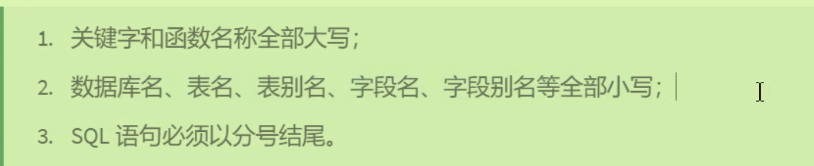

## 字符集相关操作

1. 启动mysql

`mysql -uroot -p`之后输入密码登录mysql服务；注意我的**192.168.77.7使用的是8.0的版本，另一个.8使用的是5.7的版本**

2. 修改字符集（5.7不是utf8）

- 打开相关配置文件：`vim /etc/my.cnf`,重启mysql服务：`systemctl restart mysqld.service`   

- 修改后效果：；如果未更改字符集时已经创建某数据库，则在此数据库下的表都不会受此次更改影响；只对新创建的数据库造成影响。

- 修改已有数据库的字符集（见上篇知识点）`alter table emp1 convert to character set 'utf8'`

### 各级别的字符集

从截图中可以看出，有很多级别都有设置其字符集：默认都是随着上一层的字符集，但是可以单独设置不同的字符集。

### 比较规则：

可以发现更改的字符集显示的是`utf8mb3`而不是`utf8mb4`,二者有什么区别呢：（utf8即utf8mb3)

使用`SHOW CHARSET`可以查看具体的：第三列展示了比较规则ci...

### 请求到响应字符集变化过程：

三者在客户端和服务器交互过程中会进行字符的编码与解码，详细过程如下（这里假设connection为gbk）

## Linux下的大小写规则：

- 库名、表名、变量名区分；但列名不区分：
- 编写建议：

## Sql_Mode

进行数据验证检查，语法校验的严格程度：分为宽松模式和严格模式。

- 可以使用临时配置+永久配置：前者在运行时使用（set session），后者作用于服务器重启时（配置文件）。