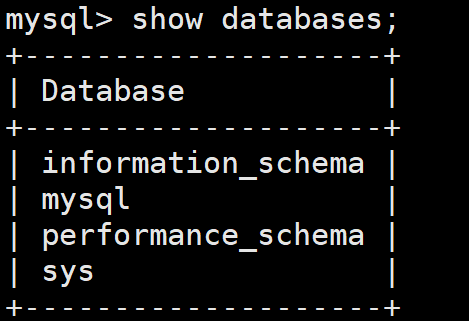
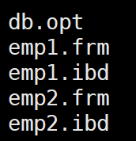
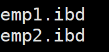

## 存储位置

### 数据库文件路径：

`/var/lib/mysql`存储的是数据库文件（例如dbtest1、dbtest2等等）；或者称为数据目录。

### 相关命令路径：

`/usr/bin + /usr/sbin`

### 配置文件路径：

` /etc/my.cnf`

## 数据库和文件系统

### 默认的四个数据库

### 数据库在文件系统中的表示

#### INNODB下的5.7版本

`frm`存储的是表emp1的表结构，`ibd`**独立表空间**存储的是表中的数据，（之前的版本还可以存放在**系统表空间**`ibdata1`当中）

#### INNODB下的8.0版本

8.0当中**表结构与表数据进行结合**都放在ibd里面。