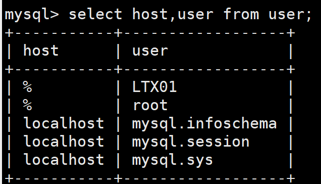
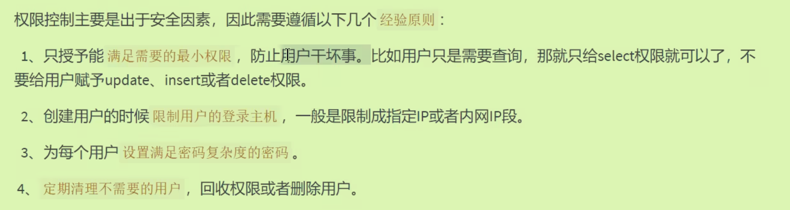
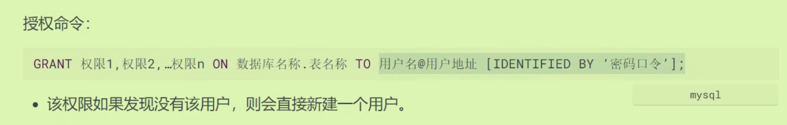
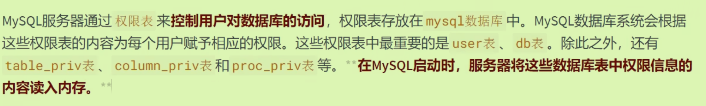
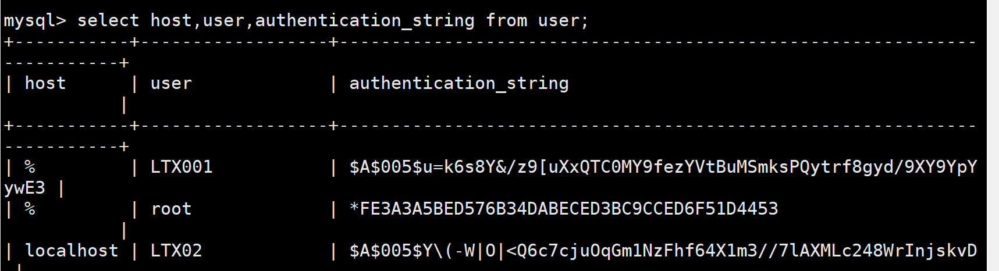
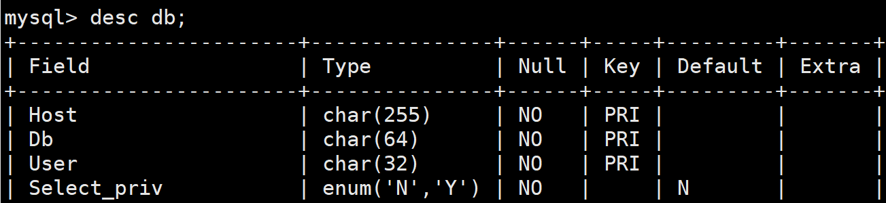
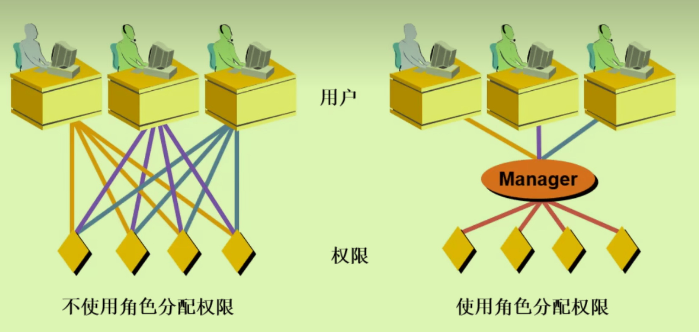

# 用户与权限管理：

## 用户管理：

### 创建用户：

在mysql数据库下，查看当前用户：`select host,user from user`,创建用户**在root用户下**进行创建

`create user 'LTX01'@'%' identified by 'iutaoL123'`默认host访问者为%(支持任何的连接)：

user表使用的是**联合主键**。

### 修改用户：(使用很少)

实际上修改的是user表中的字段，`update user set user = 'LTX001' where user = 'LTX01' and host = '%';`

### 删除用户：

`Drop user 'LTX02'@'localhost';`

### 设置密码：

修改自己的密码：

- `alter user 'LTX001'@'%' identified by 'iutaol123';`
- `set password = 'xxx';`

修改其他用户的密码：

一般都是用root用户登录后进行修改:

- `alter user 'LTX02'@'localhost' identified by 'iutaol123';`
- `set password for 'LTX02'@'localhost'='iutaoL123';`

## 权限管理

### 权限分类：

### 授予原则：

### 授予权限：

两种方式，先从直接赋予开始：(一般从root用户向其他用户进行授权)

- 展示当前所具有的权限：`show grants`；如果想一次性给所有的权限：`grant all privileges ON *.* To xxx`,与root用户不同点在于不能给别人授权。
- 何种操作权限即*纵向分组*，哪些数据库表即*横向分组*

### 回收权限：

### 底层原理：

- 存放在`show database`里面那个`mysql`数据库里面
- user表：后面的是密码
- db表体现的是针对某个**具体的数据库**操作权限：其中的字段具体化就是具体的用户和具体的数据库。

- table_priv是针对具体**某个表**的操作权限；column_priv是某个表的**某个字段**

## 角色：

角色是权限的集合：创建的角色也会在`user`表中出现。

### 上层创建角色等操作：

- 创建：`create role 'xxx'@'xxxx'`
- 授权：`grant select,update on dbtest1.* to 'manager'@'localhost';`
- 查看：`show grants for 'manager'@'localhost';`
- 回收：`revoke update on dbtest1.* from 'manager'@'localhost';`
- 删除权限：`drop role 'manager'@'localhost'`

### 将角色与用户相连：

- 将某角色授予某用户：`grant 'manager'@'localhost' to 'lll'@'%';`
- 默认角色没有激活，**用户想要使用角色必须进行激活**：`set default role 'manager'@'localhost'to'lll'@'%';`(因为不激活授权操作的那个数据库都不在用户的数据库里)
-  撤销用户的角色：`revoke 'manager'@'localhost' from 'lll';`