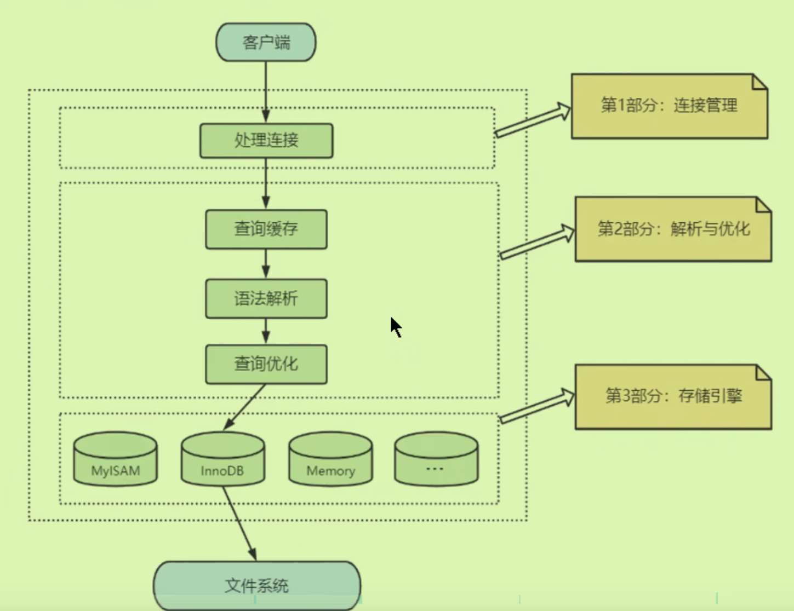
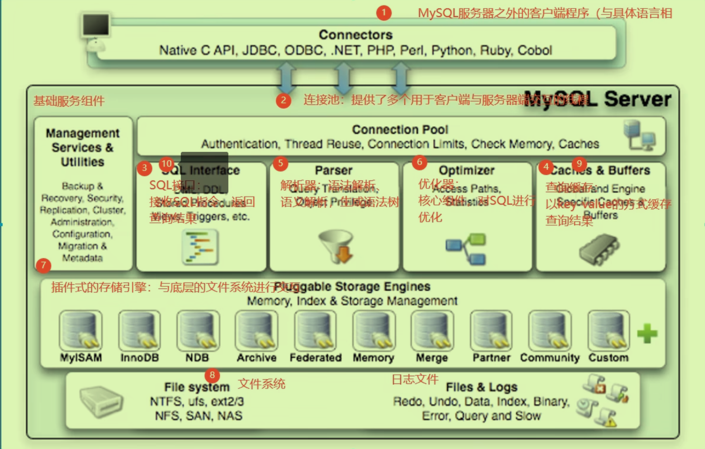
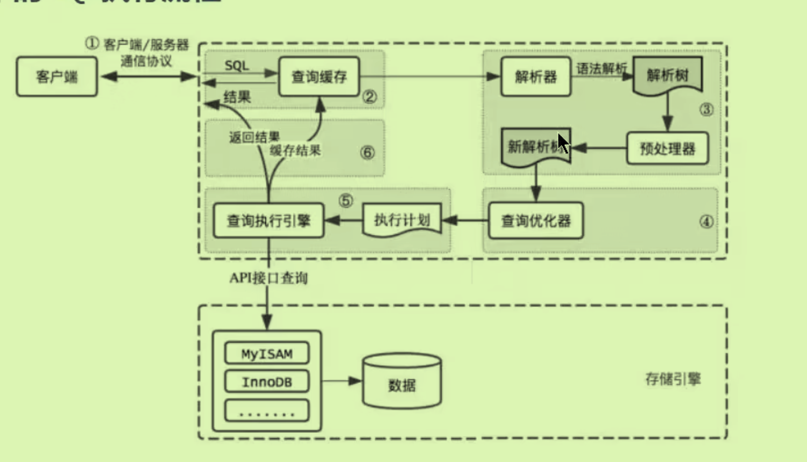
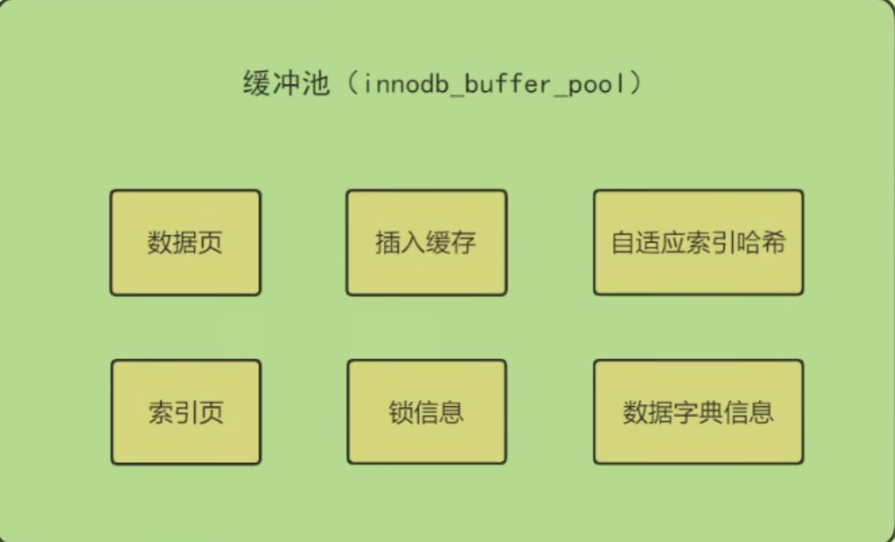

# 逻辑架构：

## 1服务器处理客户端请求：

典型的C/S架构：

详细过程架构：

客户端与服务前通过连接池中的SQL接口进行连接，（~~查询成功时到底过不过567~~）每次连接连接池都会**创建一个线程**来进行连接。

- 如果成功查到查询结果先放入缓存中再返回给客户端
- 如果没有查到结果进入解析器和**优化器**（核心组件，索引）这两者决定如何去检索；而后进入存储引擎，只有存储引擎可以直接访问数据库文件去查到真的结果；再与文件系统交互得到查询结果返回给接口。

### DBMS三层逻辑架构

- 第一层连接层：Connection Pool；
- 第二层服务层：3564
- 第三层引擎层：文件系统不属于DBMS

### DBMS中具体SQL执行流程：

重要的图：

1. **查询缓存** ：缓存以键值对的形式存在，每一条语句都是键，但是只要有一点不一样都不是同一条语句。
	- 故命中率低（**由于命中率较低，在新版本中被抛弃**）
	- 可以设置缓存开启或者指定缓存某条语句。
2. **解析器**：包括词法分析和语法分析，会生成一个语法树。（*知道你要干什么，查询还是修改还是其他操作*）
3. **优化器**：通过不同检索方式优化sql语句的执行过程。也分为逻辑查询优化和物理查询优化。（最终生成一个执行计划）
4. **执行器**：调用存储引擎API，再去调用物理文件进行执行。（最终得到查询结果）

## 2数据库缓存池：（Buffer Pool）

存储引擎在内存中申请**连续的内存空间**，减少磁盘IO：

- 缓存原则：位置*频率；预读特性即局部性原理
- 查看某存储引擎下的缓冲区大小：`show variables like 'innodb_buffer_pool_size';`
- 多线程情况下缓存会进行分块成为若干个小的

## 3存储引擎：

被上层所产生的执行计划调用**存储引擎的API**，去获取相应的数据。存储引擎本质是**表**的类型（也叫表处理器）:每个表对应一个自己的存储引擎（所以创建表的时候可以声明存储引擎`create table xxx(id int) engine = InnoDB`)

- `show engines`展示具有的引擎。（Mysql中默认为InnoDB `default_storage_engine`）

### InnoDB支持外键事务：

- 从5.5版本之后默认使用，最关键在于**支持事务（类似于一个原子性操作）**
- 处理巨大数据量的最大性能
- 支持**行锁，适合高并发的操作**。
- 对内存要求更高：因为是ibd单独存放了索引+数据，而MyISAM将二者分开存放。**加载时只需要索引**。

### MyISAM非事务级：

- 适合处理小型数据
- 崩溃后无法恢复
- 支持表级锁

