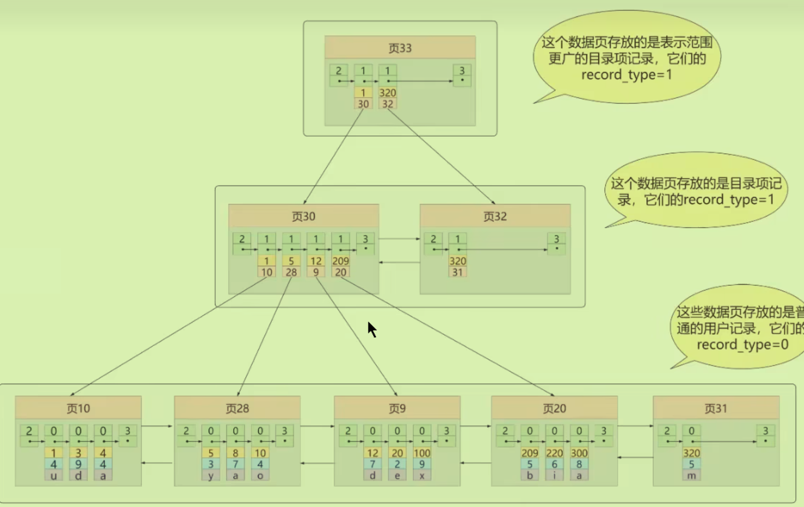
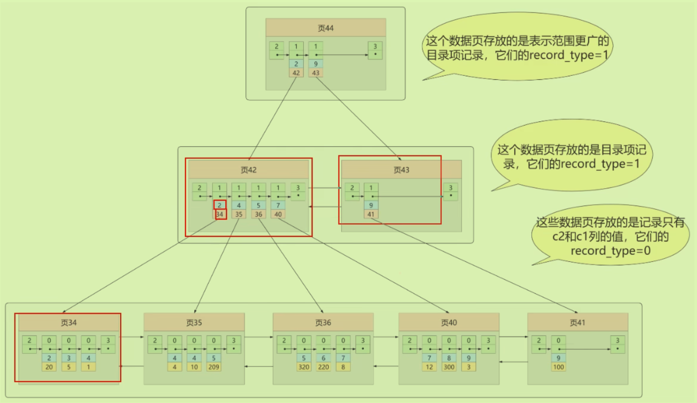
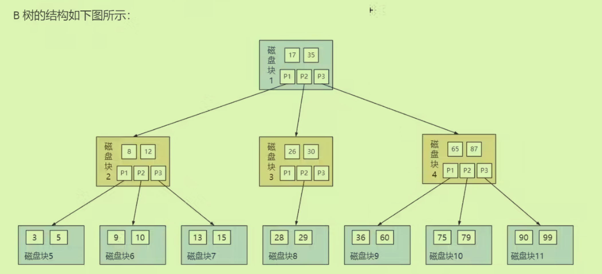

# 索引

## 何为索引：

- 帮助Mysql高效获取数据的**数据结构**，减少磁盘IO；不同的索引对应着不同的存储引擎；是一种排好序的数据结构。
- 降低了更新表的速度，表中数据进行crud时索引也要动态的维护。（最好**先删除表中的索引**，然后再插入数据最后再创建索引）

## 具体索引

存储的基本单位是**页**，一个页大小为16KB

在InnoDB下的索引底层是B+树，举例如下：数据在磁盘上的存储方式

- B+树的*叶子结点中存储实际数据，数据之间通过单链表连接，不同的页之间通过双链表连接*；非叶子结点存放的是目录项，不断地向上层提炼目录项。（许多目录项在一起也构成了页）
- B+树的**高度不能超过4层**，为了保证IO次数
- 数据库索引存储在外部磁盘上

## 常见的索引概念

### 聚簇索引：

概念：

- 即上图中的样子，**索引即数据，数据即索引**。数据行和相邻的键值聚簇地存储在一起。
- 非聚簇索引不包含一条条的数据。
- 具有两个特点：记录按照**主键的大小**顺序排成单链表，不同的页排成双向链表；叶子节点存放的是完整用户记录。**具有这两种特性的B+树称为聚簇索引。**
- InnoDB会自动创建聚簇索引。

限制：

- 物理存储排序方式只能有一种，每个Mysql的**一个表只能有一个聚簇索引（一个主键）**

- 如果没有主键，会隐式定义一个

### 二级索引（非聚簇索引）：

概念：

- 使用其他字段构成索引，不根据主键进行查找，故叶子结点中存放的**并不是完整数据**。 （如图没有c3字段）
- 如果想要查找显示所有数据，就需要进行**回表**（回到聚簇索引当中）
- 可以有多个二级索引。

### 联合索引

属于二级索引。

- 使用多个字段构成索引，但是其中又有索引的先后顺序。

## InnoDB的B+树索引的注意事项：

### 根页面万年不动：

- 创建B+树的过程是一直从根节点开始的，如果根节点内容满了，**会往下开辟空间将内容复制过去。原本的空间作为以后目录项的空间**；同一层上的页进行横向扩展叫做**页分裂**。依此类推如果目录项也满了，也会向下开辟空间复制。
- 所以整个过程是**从上往下**生成的。

### 非叶子结点目录项内容唯一：

- 可以把主键添加到二级索引的非叶子节点中。

### 一个页面最少存储两条记录

- 至少能构成二叉树吧

## MyISAM索引方案

同样使用B+树，叶子节点data域存放的是**数据记录的地址**；但是其中没有聚簇索引（数据与索引分离），所以一定会去回表，根据地址去取数据。

## 注意：

主键不建议过长字段，因为非聚簇索引都会使用到主键，不要牵扯的太长。

## 为什么不用其他的数据结构：

### 哈希

哈希的查找效率是比B+树更高的，为什么不用呢？

- 进行范围索引时使用树型结构更有优势，**等值查找哈希**才有优势
- 哈希无序。
- 某字段的重复值较多，又得从链表中搜索。

在Redis和Memory适合Hash搜索；但是B+树也提供自适应Hash索引（经常操作的某个数据页地址）

### 平衡二叉搜索树AVL

### BTree

多路平衡查找树，使其高度比AVL树降低，变胖。

- 与B+树不同的是**数据分布在叶子结点和非叶子结点之中（都会有）**
- B+树的查询效率更高（IO次数更少）：所有数据都在叶子节点上**范围查找**更快；存的东西更多,分的叉更多导致深度低，因为非叶子结点只存储键而不存储数据，所以可以存储很多的键来降低树的高度。