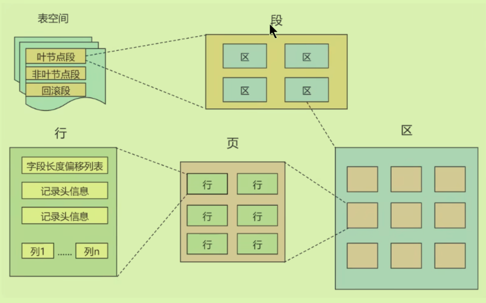
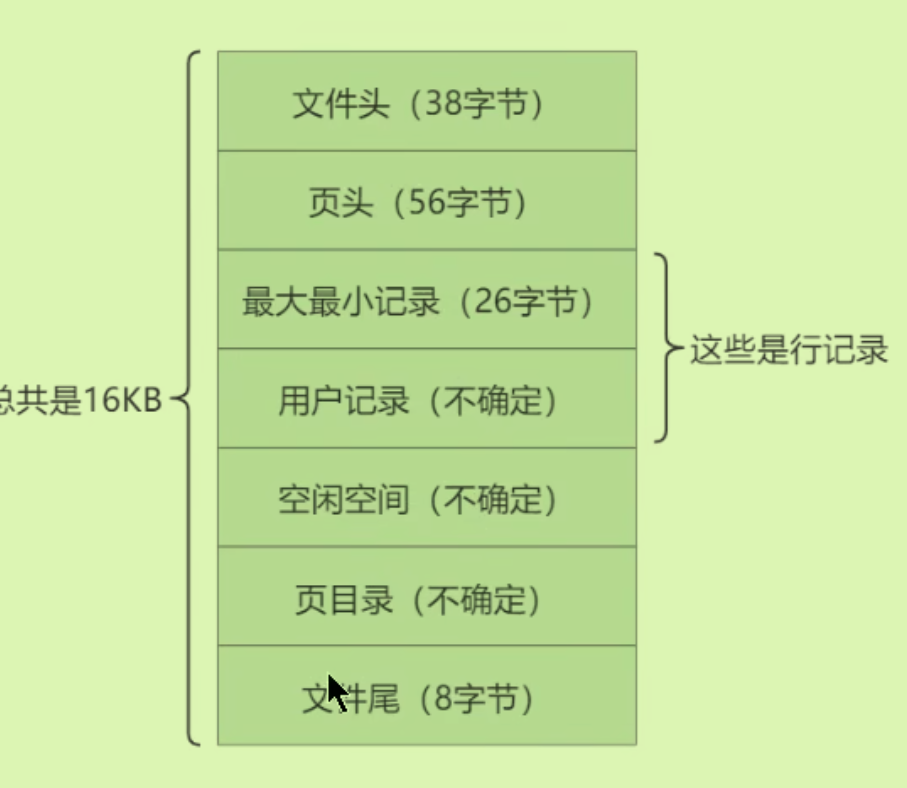
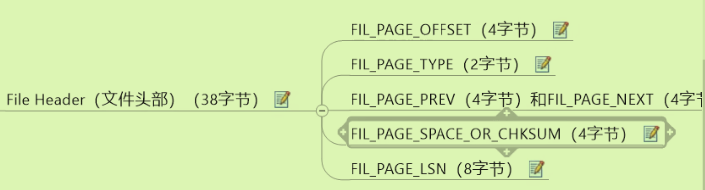
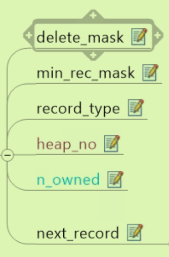

# 06InnoDB的数据存储结构

## 磁盘与内存交互的基本单位：页

基本单位：即使只修改了页内的一条记录，I/O时都要传输一整个页。

页内单链表，页间双链表（无需物理相连）；**每个数据页会为存储在其中的目录生成一个目录页**。

### 页的上层结构：

- 一个区里面会有64个连续的页，一个段里面又会有多个区（多个区之间不要求连续）

- 段是数据库的分配单位，不同类型的数据库对象以不同的段形式存在。
- 表空间存储的是段，是一个逻辑容器。

## 页结构：

划分为7个部分：

### 第一部分：

#### 文件头：

整体结构：

- 文件头偏移量：**页号**
- 文件头类型：页类型
- 文件的上一个下一个*页号*
- 文件校验和：为了处理特殊情况（如同步过程）判断当前页是否正确。
- 文件头日志序列位置：也是用来校验完整性。

#### 文件尾

### 第二部分：

#### 空闲空间

#### 用户记录

#### 最大组最小记录

记录之间比较大小靠比较主键的大小。

### 第三部分：

### 格式

#### COMPACT行格式

- 变长
- NULL
- 记录头信息：记录是否被删除0/1（但在物理上还未真正删除）；标记非叶子结点的最小记录；当前记录类型；当前记录在本页中的位置（*会添加两条伪记录：最小最大记录*）；；下一条**记录的偏移量**

 