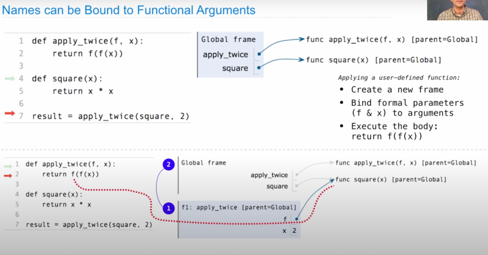
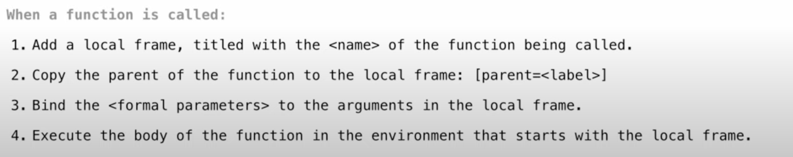
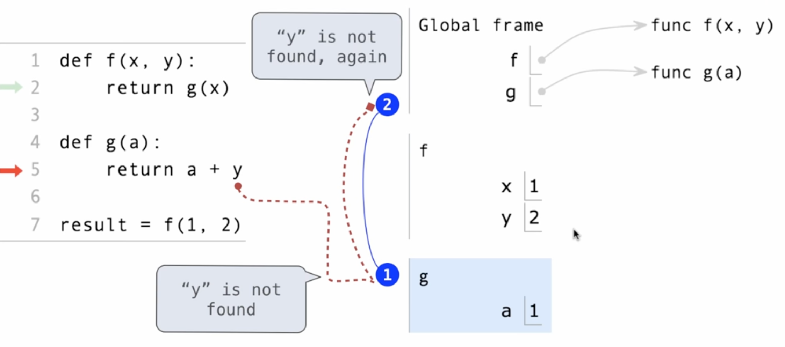
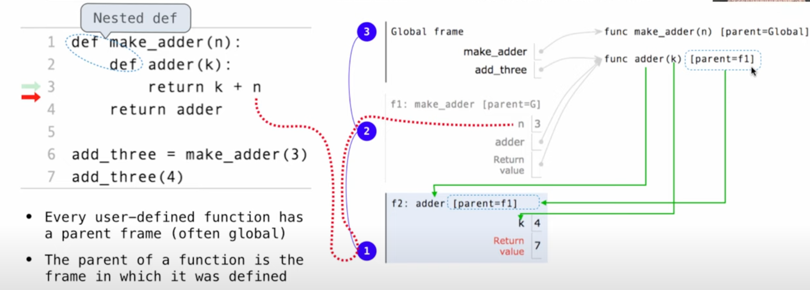

# CS61A W201
##课程内容：
###Names have Different Meaning in Different Environments
- 本节就在讨论Global frame和Local frame以及其在整个环境中的地位
- 对于评估变量这一过程，要去其所在的frame中最早出现的地方寻找
- 调用自定义的函数时，会创建Local frame来执行函数体



-  注意，如果没有从某个Local框架里return，我们在全局框架中是无法引用它的；==这就是return的作用：==将Local frame调回到我们call它的地方
-  各个框架之间通常也会有父子关系——调用的时候就可以确定；目的是在遇到变量时从当前帧一步一步找到"最"父节点帧，直到找到为止。==这种情况在**嵌套函数**中最为常见==
-  
###对比两个程序深入体会local frame

- 
- 

###Lambda表达式
- 如果内部有其他语句，如while之类的，不能使用lambda 
- 与def进行对比：只有def语句为函数提供一个==intrinsic name==（即lambda是匿名的）
###Self-reference
- 其实还是高阶函数的应用，只是在环境frame中十分复杂。
```python
def print_sum(x):
	print(n)
	def next_sum(k):
		return print_sum(n + k)
	return next_sum
	
print_sum(1)(3)(5)#运行这行代码自己分析返回结果以及原因。
#####################
def delay(arg):
	print('delayed')
	def g():
		return arg
	return g	
########################	
def pirate(arggg):
	print('matey')
	def plunder(arggg):
		return arggg
	return plunder
```
###Decorators装饰器
- 装饰器（Decorators）是 Python 中的一个强大的工具，允许你修改或增强函数的行为。装饰器是一个接受函数作为输入并返回一个新函数的函数。装饰器通过 "@" 符号应用于函数
- 代码示例（也用到了高阶函数，嵌套函数）
```python
def trace1(fn):
    '''跟踪fn函数的执行步骤'''

    def traced(x):
        print('Calling', fn, 'on argument', x)
        return fn(x) #会根据传入的函数进行相应的计算
    return traced #返回了一个内部函数

@trace1
def square(x):
    return x * x
@trace1
def sum_squares_up_to(n):
    k = 1
    total = 0
    while k <= n:
        total,k = total + square(k),k + 1
    return total     
```
##细节
##Lab02
