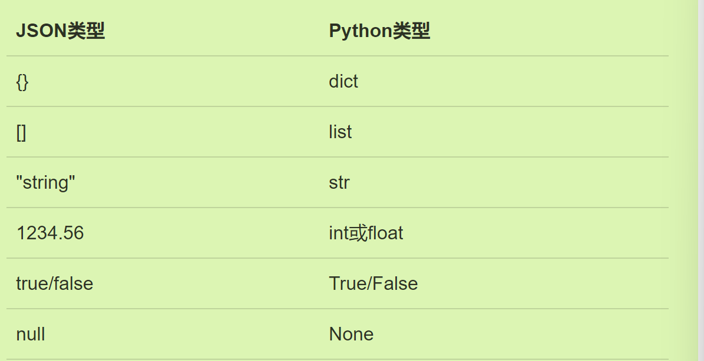

# Python07IO操作

## 文件读写：

### 读文件：

使用with来自动调用`close()`

```python
#普通写法
f = open('C:/Users/ASUS/Desktop/text.txt','r')
print(f.read())
f.close()
#使用with
with open('C:/Users/ASUS/Desktop/text.txt','r') as f:
    print(f.read())
```

还有其他的读文件方式：

```rust
read(size)`方法，每次最多读取size个字节的内容。另外，调用`readline()`可以每次读取一行内容，调用`readlines()`一次读取所有内容并按行返回`list
```

如果要打开二进制文件，将`open`最后的参数r改为rb；要打开其他非UTF-8的文件，需要添加`encoding`

```python
f = open('/Users/michael/test.jpg', 'rb')
f = open('/Users/michael/gbk.txt', 'r', encoding='gbk')
```

### 写文件：

与读文件的唯一区别：调用`open()`函数时，传入标识符`'w'`或者`'wb'`表示写文本文件或写二进制文件

```python
f1 = open('C:/Users/ASUS/Desktop/text.txt','w')
f1.write('ltx')
f1.close()
#使用with最为保险，以防忘记写close了
with open('C:/Users/ASUS/Desktop/text.txt','w') as f1:
    f1.write('ltx')#会把原来的内容直接覆盖掉，如果我们希望追加到文件末尾怎么办？可以传入'a'以追加（append）模式写入
#将w改为a
with open('C:/Users/ASUS/Desktop/text.txt','a') as file:
    file.write('Additional content.\n')
```

操作系统往往不会立刻把数据写入磁盘，而是放到内存缓存起来，空闲的时候再慢慢写入。只有调用`close()`方法时，操作系统才保证把没有写入的数据全部写入磁盘

## StringIO

在**内存中**读写字符串str

- 读写时都需要创建一个`StringIO`

```python
#write
from io import StringIO
f2 = StringIO()
f2.write('hello')
f2.write(' ')
f2.write('world')
print(f2.getvalue())
#read
f3 = StringIO('hello!\nhi!\nGoodbye!')
while True:
    s = f3.readline()
    if s =='':
        break
    print(s.strip())
```

## ByteIo

内存中读写二进制文件

```python
from io import BytesIO
f5 = BytesIO()
f5.write('中文'.encode('utf-8'))
print(f5.getvalue())
```

二者的目的：使得和读写文件具有一致的接口：`read,write`；且在内存中操作，速度很快。

## 操作文件和目录

### 使用os模块

可以查看当前操作系统名称、环境变量、当前路径、创建删除文件等操作

```python
import os
print(os.name)
print(os.environ)
print(os.environ.get('PATH'))
print(os.path.abspath('.'))
#在某目录下创建一个新目录
os.path.join('/Users/michael','testdir')
os.mkdir('')
os.rmdir('')
```

### 使用shutil模块

作为os模块的补充，比如复制文件操作。

## 序列化pickle

我们把变量从内存中变成可存储或传输的过程称之为序列化，序列化之后，就可以把序列化后的内容写入磁盘，或者通过网络传输到别的机器上

- `pickle.dumps()`方法把任意对象序列化成一个`bytes`，然后，就可以把这个`bytes`写入文件
- 当我们要把对象**从磁盘读到内存**时，可以先把内容读到一个`bytes`，然后用`pickle.loads()`方法反序列化出对象，也可以直接用`pickle.load()`方法从一个`file-like Object`中直接反序列化出对象

```python
#序列化，从内存中变为可存储的
import pickle
d = dict(name='Bob', age=20, score=88)
pickle.dumps(d)
#反序列化，变成内存中可灵活操作的
f = open('dump.txt','rb')
d = pickle.load(f)
f.close()
print(d)
#注意，直接序列化时使用dumps,而经由file-like Object时使用dump，两个方法有差别。
```

### 序列化的标准格式JSON



- `dumps()`方法返回一个`str`，内容就是标准的JSON
- 序列化（为JSON）反序列化同上

```python
#将pyhton对象转化为JSON
import json
d1 = dict(name='Bob', age=20, score=88)
json.dumps(d1)
```

### 定制化序列化JSON

通常JSON只会与字典对象进行序列化，所以我们需要自行在`class`类对象与字典对象之间进行转换后再序列化。