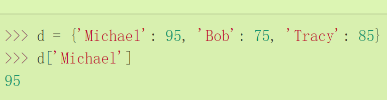
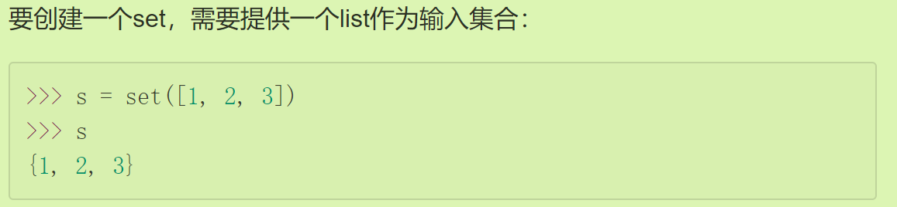

# Python遇到的问题01

## 一个Print里有多个换行

- 这个问题核心在于你是在交互式命令行里面写的还是在编辑器里面写的；语法是`print(''' ... ''')`
- 前者我们需要自己添加...；后者我们不需要自己添加

```python
# 交互式
>>> print('''line1
... line2
... line3 ''')
line1
line2
line3
#编辑器
print('''line1 
line2
line3 ''')
```

## 编码知识补充

- **Unicode**把所有语言都统一到一套编码里，这样就不会再有乱码问题了。
- **ASCII编码**是1个字节，而Unicode编码通常是2个字节。
- 为了节省空间，**UTF-8编码**把一个Unicode字符根据不同的数字大小编码成1-6个字节，常用的英文字母被编码成1个字节，汉字通常是3个字节，只有很生僻的字符才会被编码成4-6个字节
- 在计算机**内存**中，统一使用**Unicode**编码，当需要保存到硬盘或者需要传输的时候，就转换为UTF-8编码。
- 由于Python源代码也是一个文本文件，所以，当你的源代码中包含中文的时候，在保存源代码时，就需要**务必指定保存为UTF-8编码**

## 列表知识补充

### List

- 将List视作一个更加灵活的数组，类型灵活，索引灵活

### Tuple

- Tuple内的**元素指向永远不变**
- 要创建一个内容也不变的tuple怎么做？那就必须保证tuple的每一个元素本身也不能变。
- 如果单纯使用（1）会视作数字1。所以，**只有1个元素的tuple定义时必须加一个逗号`,`**，来消除歧义

## 模式匹配知识补充：

- 代替`switch`,而是**使用`match`语句**时，我们依次用`case xxx`匹配，并且可以在最后（且仅能在最后）加一个`case _`表示“任意值
- 除了可以匹配简单的单个值外，还可以匹配多个值、匹配一定范围，并且把匹配后的值绑定到变量：

```python
age = 15
match age:
    case x if x < 10:#注意这里的写法
        print(f'< 10 years old: {x}')
    case 10:
        print('10 years old.')
    case 11 | 12 | 13 | 14 | 15 | 16 | 17 | 18:#这里的写法也很重要
        print('11~18 years old.')
    case 19:
        print('19 years old.')
    case _:
        print('not sure.')
```

- `match`语句还可以匹配列表，功能非常强大

## 循环的打断：

- `break`语句可以在循环过程中直接退出循环，而`continue`语句可以提前结束本轮循环，并直接开始下一轮循环。这两个语句通常都*必须*配合`if`语句使用。

## 使用dict和set

### dict

- 即字典（在Java中表现为哈希表），特点是以空间换时间
- 牢记dict的key必须是**不可变对象**：在Python中，字符串、整数等都是不可变的，而列表是可变的
- 创建：使用大括号直接声明键值对，或者通过key放入value
- 

### set

- 就是Java中的`Hashset`,不存储value值，自动去重

### 对于不可变对象

- 如果使用元组`tuple`，其内部元素均是不可变时可以作为二者的元素；而一旦内部存在可变元素就不行
- 区分初始化和集合中元素：**用来初始化集合的可迭代对象本身（例如列表）并不需要是不可变的**
- 列表 `[1, 2, 3]` 只是临时用来提供初始化元素的。一旦集合创建完毕，列表本身与集合就没有直接关联了