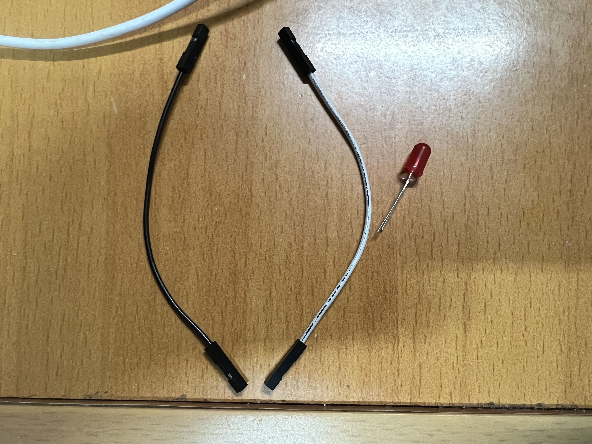
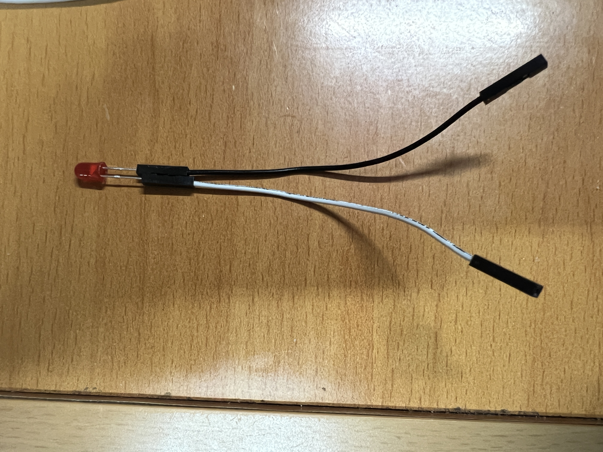
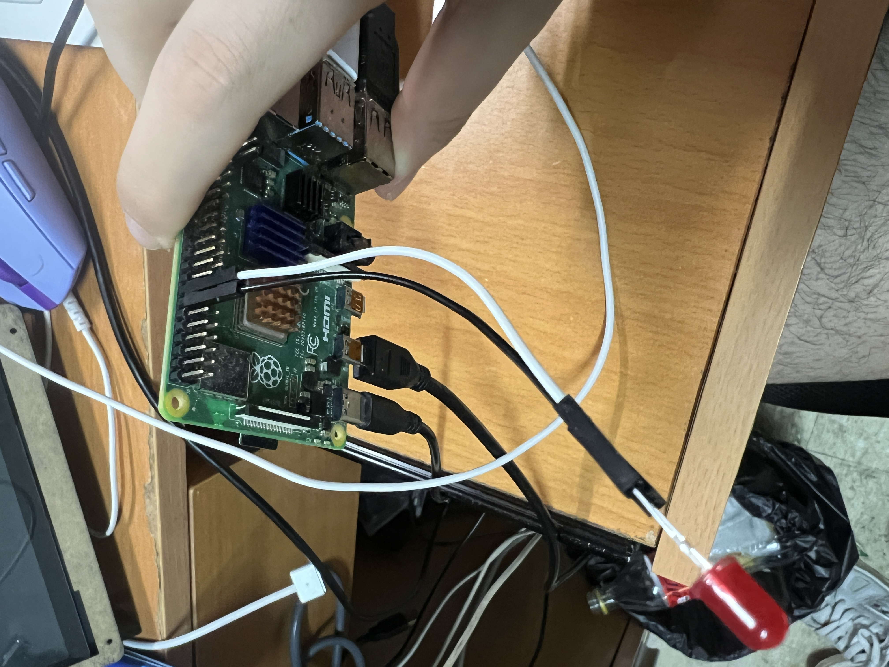

# 树莓派点亮LED灯

## GPIO


### 引脚分类

## 物理零件连接

### 物理零件陈列：

使用到了树莓派，两条母对母的杜邦线，以及一个LED灯管。



<center><p>物理器件图片</p></center>

### 连接方式：

将LED灯管的长脚（正极）连接到其中一条杜邦线上，短脚（负极）连接到另外一条杜邦线上；连接好后准备将其连接到树莓派的引脚上。



<center><p>杜邦线连接LED灯管</p></center>

将正极的杜邦线与树莓派的GPIO引脚连接，负极的杜邦线与树莓派的地线Ground连接——GPIO可以控制与地线之间的电位差，当GPIO引脚被设置为输出模式并输出高电平与地线之间产生电位差，电流从GPIO引脚通过LED流向地线，使LED发光；输出低电平时，电位差消失，LED灯熄灭。

具体连接引脚号码为正极16号，负极14号。



<center><p>连接到树莓派</p></center>


## 代码编写

 BCM模式与BOARD模式

### 普通点亮

使用Python的GPIO库进行操作，见下方Python代码

```python
import RPi.GPIO as GPIO
import time

#设置编码模式
GPIO.setmode(GPIO.BOARD)
#设置GPIO引脚,16是正极引脚，需要对其进行电流操作
GPIO.setup(16, GPIO.OUT);
#使用16号引脚输出一个高电平，LED灯亮,这里也可以设置为True或者False来设置高低电平
GPIO.output(16, GPIO.HGIH)
#设置低电平，灯灭
GPIO.output(16, GPIO.LOW)

/*
ON=True
OFF=False
GPIO.output(16, ON)
GPIO.output(16, ON)
*/
#记得使用结束一定要释放引脚，否则下次使用会报错
GPIO.cleanup()
```

如果使用BCM模式

- 在`BOARD`模式下，引脚编号是根据树莓派上的物理位置编号的（例如，第16号物理引脚）。在`BCM`模式下，引脚编号是基于Broadcom芯片的引脚编号

 ```python
 import RPi.GPIO as GPIO
 import time
 
 # 设置编码模式为BCM
 GPIO.setmode(GPIO.BCM)
 # 设置GPIO引脚，23是正极引脚，在BCM模式下对应原来BOARD模式的16号引脚
 GPIO.setup(23, GPIO.OUT)
 # 使用23号引脚输出高电平，LED灯亮
 GPIO.output(23, GPIO.HIGH)
 # 暂停一段时间
 time.sleep(1)
 # 设置23号引脚为低电平，LED灯灭
 GPIO.output(23, GPIO.LOW)
 # 清理设置
 GPIO.cleanup()
 ```

### 有需求的点亮

编写代码询问用户可以让LED闪烁多少次，闪烁完后再问。