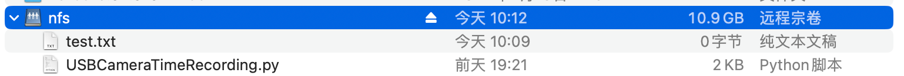

# Samba File Server

## Samba:

File sharing across operating systems

## Procedure

### Install the Samba

First of all, always update and upgrade all packages in your device

```bash
sudo apt-get update
sudo apt-get upgrade
```

If all are up to date,install the Samba package

```bash
sudo apt-get -y install samba samba-common-bin
```

Then,make a directory as the bridge among different systems to share files

```bash
mkdir /home/pi/myshare
chmod 777 /home/pi/myshare #give the permission for all users 4,2,1
```

Edit the configuration about the samba:

```bash
sudo nano /etc/samba/smb.conf
#add this in the end
[myshare]
path = /home/pi/myshare
writable = yes
create mask = 0777
directory mask = 0777
public = no
```

After this,we should set a Samba user,(make the pi as this user):

```bash
sudo smbpasswd -a pi
#add the passwd
```

In the end,restart the Samba

```bash
sudo systemctl enable smbd
sudo systemctl restart smbd
#
sudo systemctl status smbd
```

### Connection

In macOS,in Finder,use the go to connect the server:


Input the path about the user:`smb://IP Address/share directory`


In windows...wait : )


# MariaDB Server

## MariaDB

It's a branch of Mysql

## Procedure

### Install MariaDB

```bash
#ignore update
sudo apt-get -y install mariadb-server
```

### Configure MariaDB

```bash
sudo mysql_secure_installation
#set the passwd
```

After this,we can use the MariaDB as the SQL server in Raspberry Pi

### Use MariaDB

`sudo mysql -u root -p`Enter it

```mysql
#SQL
create database mydatabase;
show databases;
...
```


#NFS File Server

## NFS

Network File System

## Procedure

### Install the NFS on Pi as Server side

```bash
sudo apt-get install portmap
sudo apt-get install nfs-kernel-server
```

### Edit the configuration

```bash
cd /mnt
sudo mkdir /mnt/nfs
sudo vi /etc/exports #or nano
```

Then add this line in it`/mnt/nfs *(rw,sync,no_root_squash)`

### Start NFS server

```bash
sudo /etc/init.d/nfs-kernel-server restart
```

Ps.This command is important,because you don't know when your connection or something was wrong,so you can use this to restart.

OK,after that,the work on RaspberryPI is finished,then we turn to your PC or anything transfering with the Pi

In my Mac,I should use the `sudo -i` to enter the root module,and use this command to mount the NFS

```bash
sudo mount -t nfs -o nolock,resvport 172.20.10.11:/mnt/nfs /Users/lutao/Resp
```

In this command,`IP:file in your Pi  file in your PC`

As result,your own folder will be replaced by the nfs folder.



### Make the other's configuration

When I finish these things,I find that I can't edit any files in the nfs folder,so in the server side(Raspberry Pi),I change the authority about any file

`sudo chmod 666 test.txt`

But I can't edit the file in nfs with my client side.
