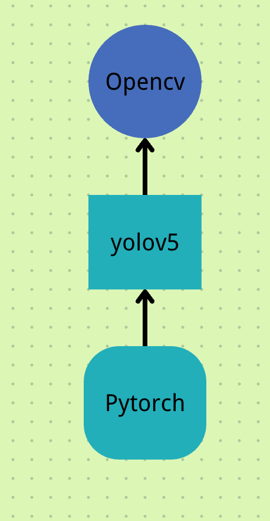
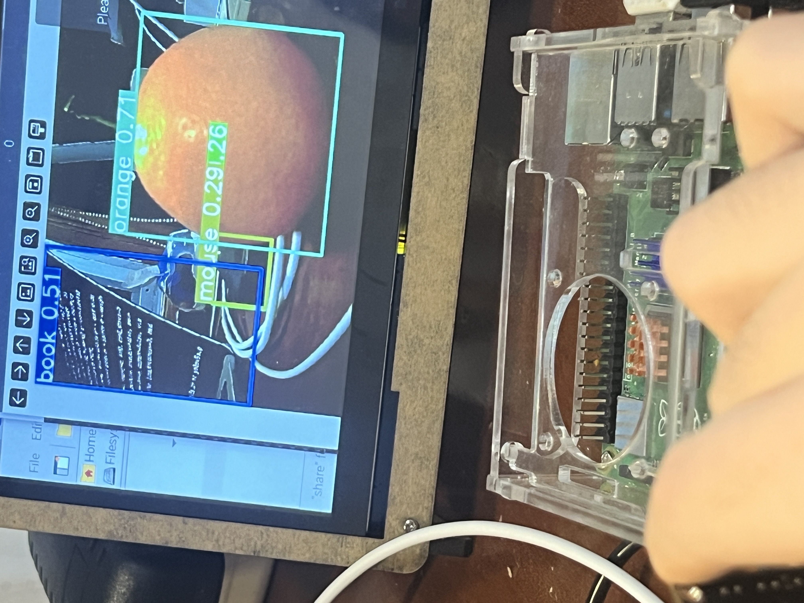

# 如何部署yoloV5模型到树莓派上

前提：树莓派的版本是


## 创建虚拟环境

在根目录下创建了project目录，在其下创建Env目录作为今后所有项目创建时虚拟环境的创建文件夹。

在Env中创建yolov5env文件夹用来存储yolov5项目。（为何要创建虚拟环境见“遇到的问题.md”）

```bash
cd ~
mkdir project
cd project
mkdir Env
cd Env
python3 -m venv yolov5env #这条指令十分重要，是创建yolov5env这个虚拟环境的关键
source yolov5env/bin/activate #激活虚拟环境
```

进入此虚拟环境后我们开始安装模型所需要的库和一些有关的包。

## 安装必需的库和包

首先我们需要明确我们要安装什么库，以及他们之间的关系



- **PyTorch**是基础，因为YOLOv5是基于PyTorch构建的。这意味着YOLOv5用PyTorch定义了它的网络架构，进行训练和推理。
- **YOLOv5**位于中间层，表明它依赖于PyTorch来执行其对象检测任务。
- **OpenCV**在顶层，表示它通常用于辅助任务，如图像预处理和可视化结果，尽管它不是YOLOv5运行所必需的。

### Opencv

注意以下操作都在虚拟环境中进行。

```bash
pip install opencv-python-headless
#成功后会出现
Successfully installed numpy-1.26.4 opencv-python-headless-4.9.0.80
#检查是否安装完成
python
import cv2
cv2.__version__
'4.9.0'
```

### 其他Python库

再安装些其他yolov5所需的Python库

```bash
sudo apt-get install libatlas-base-dev
pip3 install tqdm # 可扩展的Python进度条库，可以在长循环中添加一个进度提示信息，用户只需要封装任意的迭代器tqdm(iterator)。
pip3 install pyyaml # 用于解析和生成YAML格式的数据。YOLOv5使用YAML文件来配置模型参数和训练设置
pip3 install matplotlib #用于创建静态、交互式以及动画可视化的Python库。YOLOv5可能使用它来绘制训练过程中的损失曲线或评估结果。
pip3 install seaborn # 基于matplotlib的Python数据可视化库，提供了更高级的接口，用于制作吸引人的统计图形。
pip3 install cython # OLOv5可能在一些需要高性能计算的地方使用Cython来加速。
pip3 install thop #用于估算模型的理论浮点运算次数（FLOPs）和参数数量的库，有助于评估模型的复杂度和性能。
```

### yolov5相关API

从Github上克隆相关API

```bash
git clone https://github.com/ultralytics/yolov5
```

### Pytorch

```bash
pip install torch torchvision torchaudio
pip install numpy --upgrade
#检查是否安装成功
python
import torch
torch.__version__
'2.2.0'
```

### 最后补充

如果执行某些检测指令时出现包的缺失，使用如下指令来自动安装yolov5所需的所有包。

```bash
pip install -r requirements.txt
```


## 进行测试

使用此指令可以利用默认的摄像头进行实时的视频监测

```bash
python3 detect.py --source 0 --weights yolov5s.pt --conf 0.25
```

图像如下：



1. **书（Book）**：用蓝色边界框标出，置信度为0.51，表示模型认为有51%的概率这个物体是一本书。
2. **橙子（Orange）**：用绿色边界框标出，置信度为0.71，表示模型认为有71%的概率这个物体是一个橙子。
3. **鼠标（Mouse）**：用黄色边界框标出，置信度为0.29，并且标记了它的类别索引号26，表示模型认为有29%的概率这个物体是一个鼠标。

## 工程化

## 总结

感谢此链接中的教程：https://medium.com/@elvenkim1/how-to-run-yolov5-successfully-on-raspberry-pi-3f90db518e25


