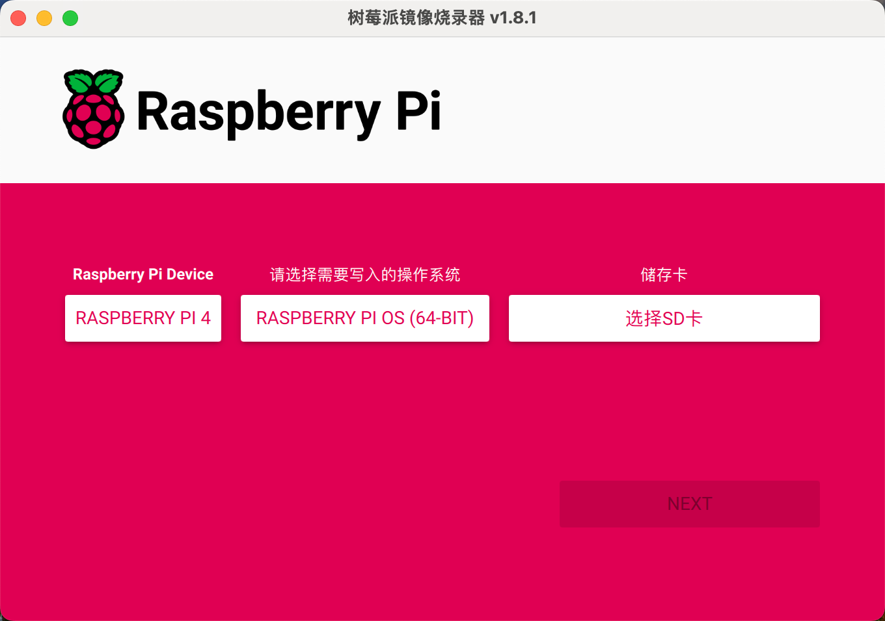
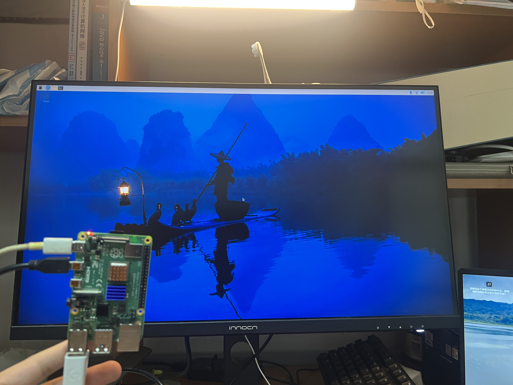

# Raspberry01

## 1Structure：


​       	Power         Index1                Index2        CSICamera  Sound		KeyBoard&Mouse

### Burn the system

Use this App to Get the System into the SDcard



### Get The Power(But no SDcard)


Two Lights :Green one & Red One

	- Red one is the Power status,when it is stable,it turns out the Power is sustainable
	- Green one is the SDcard status,when it is flashing,it turns out the Raspberry is scanning the SDcard;but if it was stable,there maybe a problem;
	- Just Like this:

### First Open

When i Connect the Power,the HDMI Line,and the Keyboard & Mouse,it appear to me an amazing view:



Just this Small piece show the Big world 


## 2Use the GPIO 

### WiringPi

First of all,I just simulate the book to use the WiringPi to control the GPIO(General Purpose IO),but unfortunately,it dosen't work

```vim
sudo gpio readall
bash:gpio:command not found
```

So,I search for Google,it shows the WiringPi maybe dosen't exist in Raspberry Pi OS.Then i make another library to accomplish it.

```vim
sudo apt-get update
sudo apt-get install python3-rpi.gpio
```


## 3 Try the RTMP

RTMP(Real Time Messaging Protocol),

## 4Reload the System

Caused by the offical sysytem can't find the Camera option in GUI,so I change it to the system which is given by the saler.