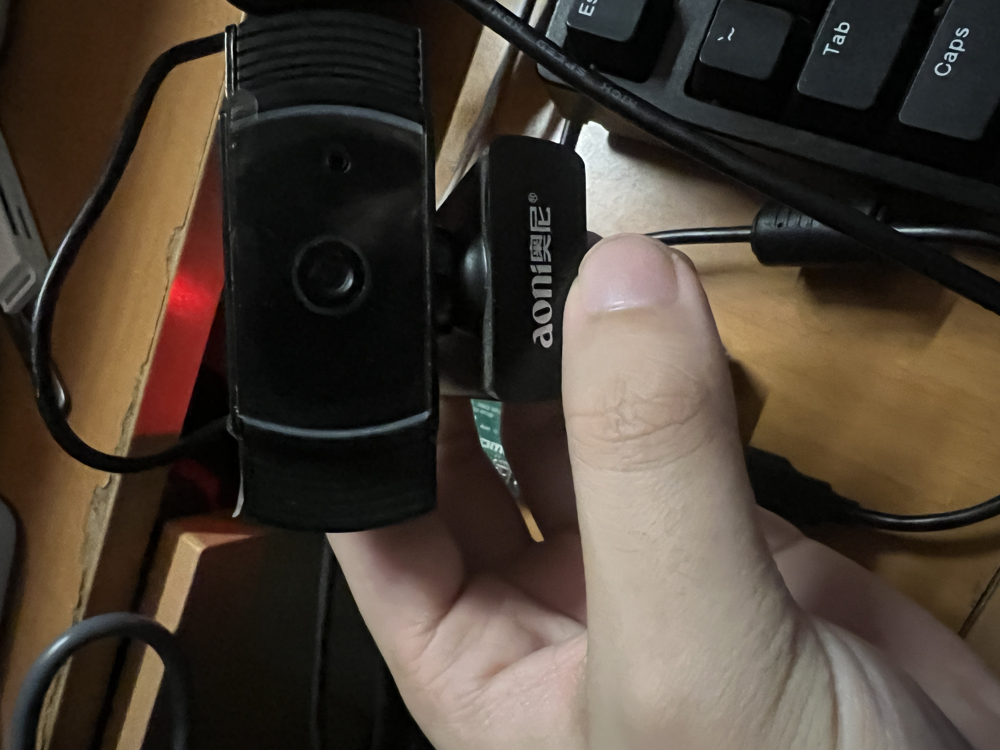
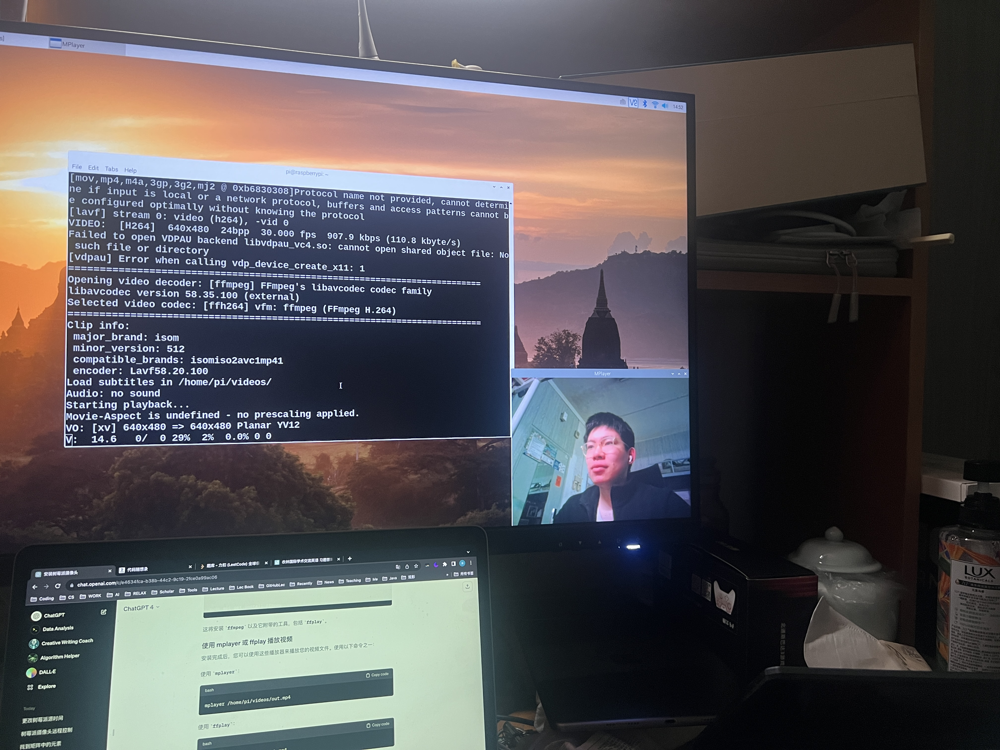
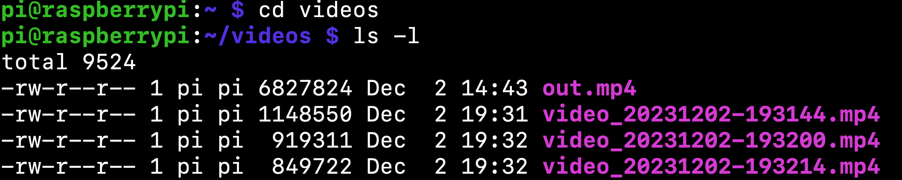
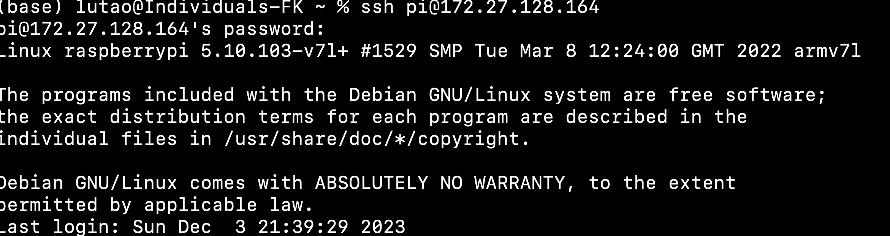
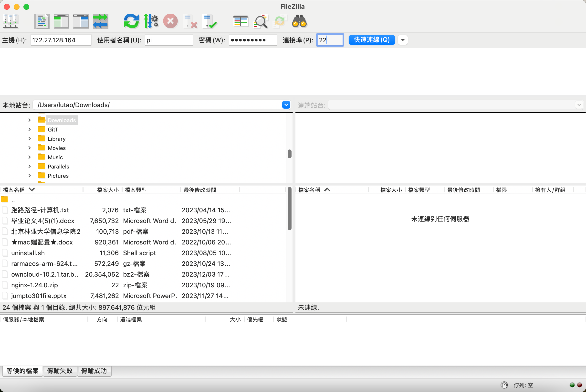

# Raspberry Day2

## 1 Change the Source

As many applications,using the offical source always cause the net error,so I change the source to the aliyun .

```bash
sudo nano /etc/apt/sources.list
```

Make the offical source unvalid,add two new sources from aliyun.

Since then we can install any application whatever we want

## 2 Use the camera(USB)

In raspberry Day1,I change the system to another one,this GUI has the 'camera' option,so I add an old camera on raspberry.



### Camera Applications

#### Motion

Motion is an app to record the videos about dynamic things,but when I install motion and try to record a video,it dosen't work.

I guess maybe this camera is an old one and it is not the offical camera.Or maybe motion is an automatical app in videos,it just catch the dynamic things?

#### FFMPEG

Upon the reason I put,I use the ffmpeg to finish this.

```bash 
sudo apt-get install ffmpeg
```

Using it start to record a video:(With its detailed information)

```bash
ffmpeg -f v4l2 -i /dev/video0 -t 00:01:00 /home/pi/videos/out.mp4
```

Note: 'v4l2' not 'v412',please pay attention to it.

Explain this command line:

`-f`: this denotes the Video4Linux2,a general format in Linux's camera

`-i`:From the video0 to make this video

`-t`: Record a one minute video

The last is the video path

### Open the video

First of all,I use the VLC(default video playing app),but as expected,it failed.  :(

So I search and find another app to open the video—mplayer

```bash
sudo apt-get install mplayer
mplayer /home/pi/videos/out.mp4
```

right,it was OK!



### Make a script to execute the video

We can write a script to start the ffmpeg app to record a video,just like this:

```bash
nano capture_video.sh #initialize and edit the script

#This script:
#!/bin/bash

# 获取当前日期和时间，格式为 YYYYMMDD-HHMMSS
current_time=$(date +"%Y%m%d-%H%M%S")

# 设置视频文件的保存路径和文件名
file_path="/home/pi/videos/"
file_name="video_$current_time.mp4"

# 使用 ffmpeg 进行录制，假设录制时长为10秒
ffmpeg -f v4l2 -i /dev/video0 -t 00:00:10 "${file_path}${file_name}"

# 打印保存的视频文件路径
echo "Video saved to ${file_path}${file_name}"

#end scri
chmod +x capture_video.sh #Give the authority to use this script

./capture_video.sh # excute the script
```

When we execute the script,we get the videos as the script writing.

Finally,I make three videos :

### Get the videos

These three videos are in Raspberry's SDcard,if you want to handle them in your PC,you need to copy them to your own room.

Notes:Don't use this command on ssh's command view,you'd better make a new command line to write it.

### Photo script

#### Capture the single frame

```bash
#!/bin/bash

# 获取当前日期和时间，格式为 YYYYMMDD-HHMMSS
current_time=$(date +"%Y%m%d-%H%M%S")

# 设置图像文件的保存路径和文件名
file_path="/home/pi/images/"
file_name="image_$current_time.jpg"

# 使用 ffmpeg 捕获单帧图像
ffmpeg -f v4l2 -i /dev/video0 -frames 1 "${file_path}${file_name}"

# 打印保存的图像文件路径
echo "Image saved to ${file_path}${file_name}"

```

#### Interval 2 second

Capture five photos.

```bash
#!/bin/bash

# 获取当前日期和时间，格式为 YYYYMMDD-HHMMSS
current_time=$(date +"%Y%m%d-%H%M%S")

# 设置图像文件的保存路径
image_path="/home/pi/images/"

# 确保保存图像的文件夹存在
mkdir -p "${image_path}"

# 拍摄图像的数量
num_images=5

for (( i=0; i<num_images; i++ ))
do
    # 为每张图像生成一个时间戳
    timestamp=$(date +"%Y%m%d-%H%M%S")

    # 图像文件名
    file_name="image_${timestamp}.jpg"

    # 使用 ffmpeg 捕获图像
    ffmpeg -f v4l2 -i /dev/video0 -vframes 1 "${image_path}${file_name}"

    # 打印保存的图像文件路径
    echo "Image saved to ${image_path}${file_name}"

    # 等待2秒
    sleep 2
done

```


## 3 Use the VNC（Graphical interface)

So,all the measures are with the HDMI line,I want use my PC to control the raspberry.The VNC is the suitable APP to do that.

First,I install the VNC Viewer on my Macbook;Second I get the raspberry IP address：**172.27.128.164**（Problem occured,please read the Problem Solving)

```bash
hostname -I
```

Then I make a new File in VNC Viewer,finally I get the control about my raspberry on my Macbook


## 4 Use the SSH(Command Interface)

Different with VNC,SSH shows the terminal view for us,in other word,*we can use our PC's terminal line to control Raspberry.*

### Connect

Use this command to connect with Raspberry

```bas
ssh pi@172.27.128.164
```

Then enter your password about Raspberry to accomplish it.




```bash
scp pi@172.27.128.164:/home/pi/videos/video_20231202-193214.mp4 /Users/lutao/RaspberryVideos/
```

## 5 Make a ownCloud

### Apache2

Install the Apache server,it is a open source web server.

```bash
sudo apt-get install apache2
```

### Mysql

Install mysql server

```bash
sudo apt-get install mariadb-server-10.0
```

### Php

Install php

```bash
sudo apt-get install php7.1-mysql php7.1-curl php7.1-
json php7.1-cgi libapache2-mod-php7.1 php7.1

sudo apt-get install php-mcrypt php-imagick
```

### Owncloud

Install the owncloud,first of all I download the owncloud by this command line

```bash
wget https://download.owncloud.org/community/owncloud-10.2.1.tar.bz2
```

But maybe caused by the net error,it didn't work,just a HTML file not a bzip file,so I can't get this owncloud.

This event puzzle me a lot,so I ask it for ChatGpt,it offers me another way to solve this trouble:Using the FileZilla app to transport the bzip file.(Please remeber the connection pot 22)



#### FileZilla:

So what is the FileZilla?It is my first time to hear about that.

FileZilla is a free and open-source software application that serves as an FTP (File Transfer Protocol) client.(So this interface like our ftp server in our daily homework day)

#### Finish the owncloud

Change the apache2's config,make the 'AllowOverride' from None to All

```bash
sudo nano /etc/apache2/apache2.conf
```

Then make a database to save the data in owncloud,restart the Apache2 to test it.

