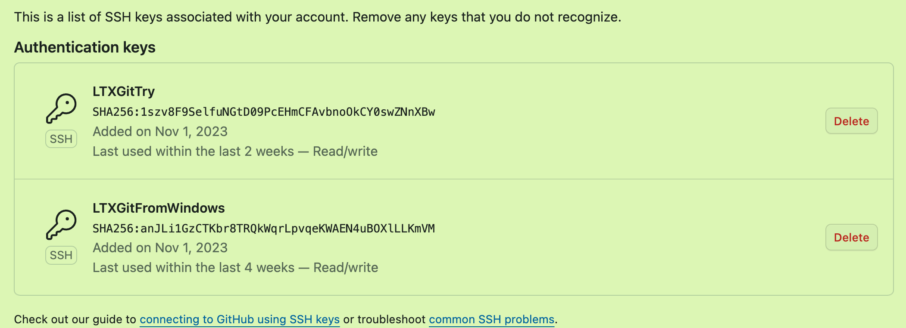
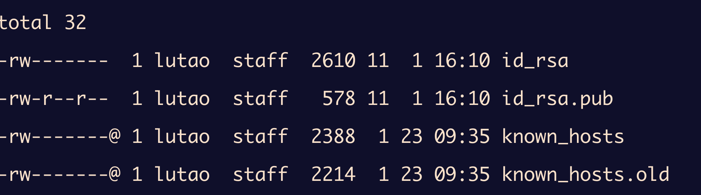

# SSH

## 应用场景

### 连接树莓派

`ssh pi@172.27.130.19`ssh + SSH Server Name + IPAddress

输入密码后进入

### 上传GitHub

使用`git push`命令时，会调用SSH客户端，并请求与GitHub服务器上配置的SSH端口（通常是22）建立连接。

## 何为SSH

### 历史

Tailnet，可以远程控制计算机，但是并不安全，别人可以截获你所发的信息

90年代中期，为了安全考虑，SecureShell出现，即SSH（encrypted connection)

### 原理

形象地来说：

- 我和你之间传递数据，将数据放在一个盒子里面，我向你传递的时候上锁，你得到后也上锁再传给我，我得到后解我的锁再传给你，最后你得到后解你的锁，获取数据。这样其他人在这个传递过程中就没有办法获取盒子里的数据了。

- 但是其他人还是可以看见谁在传递数据（IP），传递的数据的大小（盒子的大小），有多少数据流过。

严肃地来讲：

- **连接建立**：
  - 用户向SSH服务器发送连接请求，SSH服务器响应并提供其公钥证书，以便客户端验证服务器的身份。

- **密钥交换**：
  - 客户端和用户协商一套共同支持的加密算法，用于后续的加密。
  - 利用公钥加密技术，客户端和服务器共同生成一个临时的、私密的会话密钥。*这个密钥在整个会话中用于对称加密。*（这对密钥与之前的私钥公钥不同）
- **身份验证**：
  - 客户端需要通过某种方式证明其身份，这通常可以通过密码、公钥认证或其他方法实现。
  - *如果使用公钥认证，客户端将使用其私钥对服务器发送的挑战进行签名*，并将签名发送回服务器。服务器使用存储的公钥验证签名。

- **加密通信**：
  - 一旦身份验证通过，客户端和服务器之间建立起一个加密的通信通道。
  - 所有通过该通道的数据都使用会话密钥进行加密。这确保了传输的数据不会被中间人读取或修改。

理论上，其在应用层，使用的是传输层的TCP协议，端口号为22。

#### 数据包结构


`Padding data`用来填充Payload以满足加密算法对数据报大小的要求；Mac收发双方在传递之前都会计算，用来验证数据报在传递过程中是否被更改。

## 如何加密

### 公钥与私钥

对于上面的密钥，我是不太理解的，所以什么是密钥，公钥和私钥？

在SSH中，公钥和私钥的主要目的是验证服务器的身份和用户认证。

验证服务器：

- 当SSH客户端第一次连接到SSH服务器时，服务器会提供其公钥。
- 客户端可以使用一个受信任的方法（例如通过预先获取的公钥或手动验证）来验证这个公钥，**确保正在连接到正确的服务器**

用户认证：

- **生成密钥对**：用户在客户端生成一对密钥（公钥和私钥）。
- **配置服务器**：用户将公钥放置在服务器上（例如，在`~/.ssh/authorized_keys`文件中）。

如何认证：

- 当用户尝试通过SSH连接到服务器时，服务器使用用户的公钥对一个随机数（挑战）进行加密，然后发送给客户端。
- 客户端使用私钥解密这个挑战，并将结果发送回服务器。
- 如果服务器能够验证解密结果，这证明客户端拥有匹配的私钥，从而完成认证。

所以，公钥是用来验证服务器身份并且后续生成挑战消息用来验证客户端，公钥可以放置在任何服务器上；私钥是用来证明你是你的工具，必须存放在本地，如果泄漏则会假冒你的身份来访问存放你的公钥的服务器。

### 加密算法

#### 密钥交换算法

**Diffie-Hellman**（DH）：用于安全地交换密钥，即使是在被监听的通道上。有多种变体，包括标准的Diffie-Hellman和椭圆曲线Diffie-Hellman（ECDH）。

#### 对称加密算法

1. **AES（高级加密标准）**：非常流行和安全的加密算法，通常使用128位或256位密钥。
2. **3DES（三重数据加密算法）**：比较老的算法，使用三次DES加密来提高安全性。
3. **Blowfish**：一种设计简单、速度快的算法，通常用于较早版本的SSH。
4. **Chacha20**：一种流加密算法，以其高速度和安全性而知名，有时会被用作AES的替代品。

#### 散列函数和MAC算法

1. **HMAC（基于散列的消息认证码）**：与散列函数结合使用，例如HMAC-SHA1或HMAC-SHA256，来提供消息认证。
2. **SHA-1**：以前广泛使用的散列函数，但由于安全性问题，现在不推荐使用。
3. **SHA-2**：一组散列函数，包括SHA-256和SHA-512，提供比SHA-1更强的安全性

#### RSA非对称加密算法

1. **密钥生成**：
   - 选择两个大质数 *p* 和 *q*。
   - 计算它们的乘积 *n*=*pq*，这个 *n* 将作为公钥和私钥的一部分。
   - 计算 *n* 的欧拉函数*ϕ*(*n*)=(*p*−1)(*q*−1)。
   - 选择一个整数 *e*，使得 *e* 与*ϕ*(*n*) 互质，且 1<*e*<*ϕ*(*n*)，通常 *e* 选择65537（因为它的性质使得加密计算较快）。
   - 计算 *e* 相对于 ϕ*(*n*) 的模逆 *d*，即找到一个*d* 使得 *ed*≡1mod*ϕ*(*n*)。
2. **加密过程**：
   - 假设有一段明文信息 *M*，它必须是一个小于 *n* 的正整数。
   - 密文 *C* 通过公钥(*n*,*e*) 计算为 C*=*M**e*mod*n*。
3. **解密过程**：
   - 使用私钥 (*n*,*d*) 来恢复明文，计算M*=*C**d*mod*n*。

## 处理问题

我在Github上面存储我的笔记仓库，为了可以在不同的设备之间同步我的笔记，但是我发现某一天两台呢设备在使用SSH远程访问Github仓库时都出现了

```bash
ssh:connet to host github.com port 22: Connection timed out
fatal: Could not read from remote repository

Please make sure you have thecorrect access rights
and the repository exists.
```

很奇怪啊，之前一直可以的，于是我查了查本地存储的公钥来对照我GIthub后台的公钥。



```bash
cd ~/.ssh
ls -l
cat id_rsa.pub
```



其中`id_rsa`是私钥文件，`id_rsa.pub`是公钥文件，二者成为文件对。

最后我发现是终端的网络问题，于是使用vpn当中的“复制终端代理命令”的功能，再后续push的过程中出现来自github的提示

```bash
remote: Support for password authentication was removed on August 13, 2021.
remote: Please see https://docs.github.com/en/get-started/getting-started-with-git/about-remote-repositories#cloning-with-https-urls for information on currently recommended modes of authentication.
fatal: Authentication failed for 'https://github.com/LTXWorld/LTXNode/'
```

原来github从2021年就已经不再支持这种密码的登录方式，转而使用个人访问令牌的方式进行认证

```bash
git remote set-url origin  https://<your_token>@github.com/<USERNAME>/<REPO>.git
```

之后再进行`git push git pull`就没有问题了。


