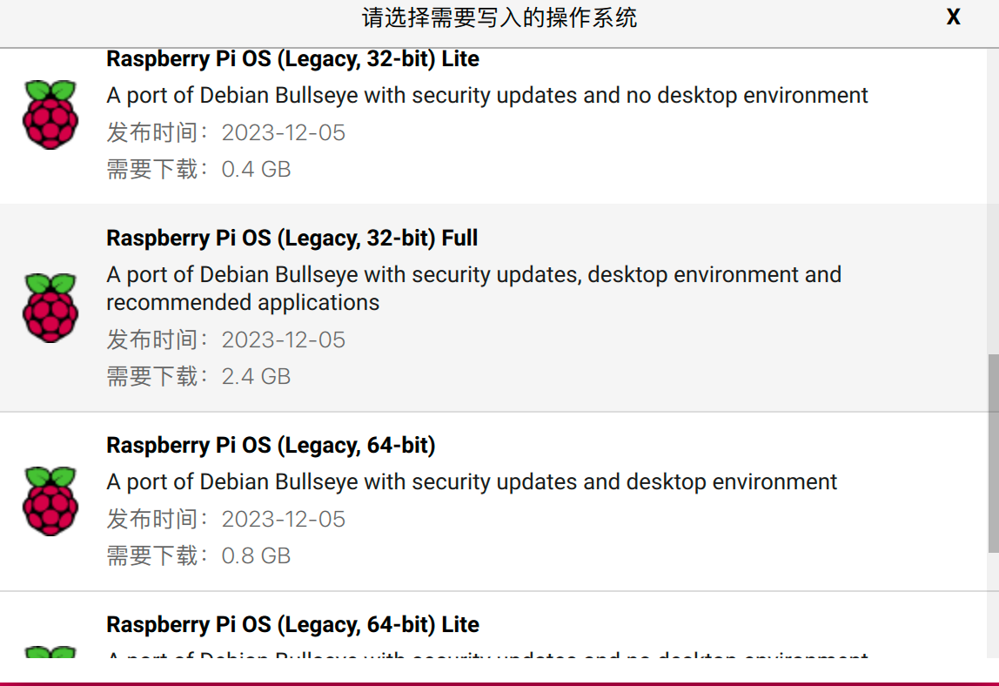
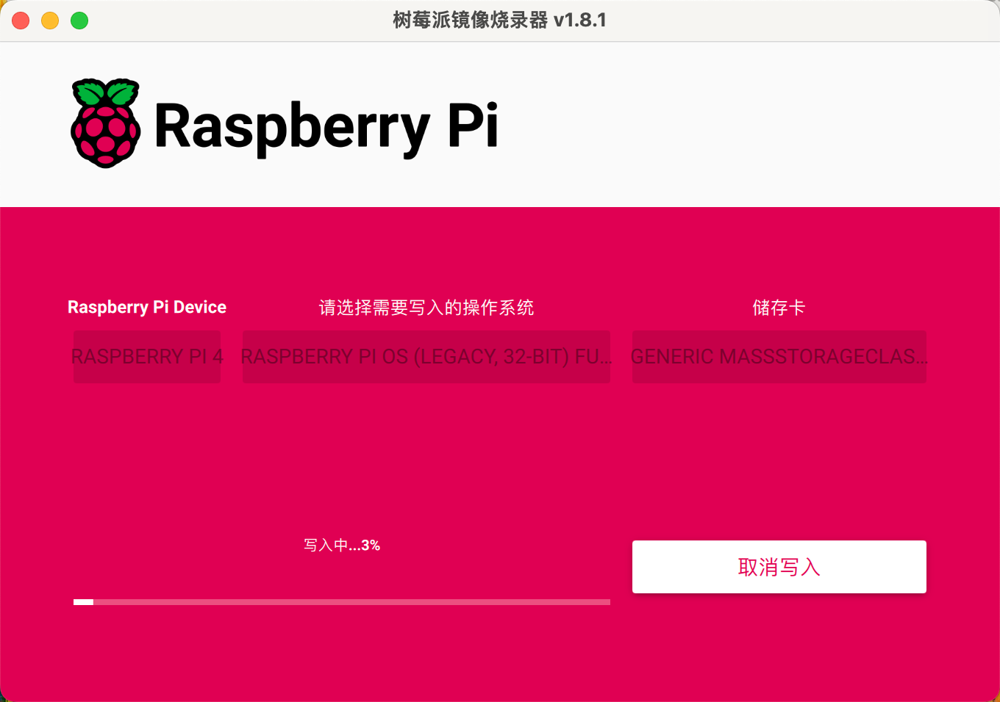

# Rasp开发指北1.0

## 前言：

emmm....为什么会有前言这个东西？要什么前言，撸起袖子加油干，Let's dive into the Raspberry Pi!

哦对了，还是得提一嘴，当前操作系统在macos，不过其实没有什么大的区别，最终我们都是在Linux下操作树莓派对吧，so whatever,操作系统没那么重要。也许，在开发指北2.0,3.0我会使用windows操作系统来演示，先在1.0画个饼吧哈哈 :) 

**Stay hungry.Stay foolish.**

## 开始吧

首先你得有一个树莓派 :)  其次你得会一点Linux :(  最好再会一点Pyhton 

当然我知道一切都是进行时，Sometimes when you innovate,you make mistakes.It is best to admit them quickly,and get on with improving your other innovations.

最好也要有一个屏幕用于初始操作（或者之后的一些问题处理，比如无法远程连接的情况）

### 认识一下树莓派

结构图：

实例图：

### 烧录系统

首先，everything you should know why,为什么我们要烧录系统？（写到这里我也思考了一下怎么去解释，这或许就是思考为什么的意义）

- 因为树莓派相当于一个微型计算机，他的一切都存储在那张SD卡上面，我们需要将操作系统放入SD卡，再将SD卡插入树莓派，这样一件冷冰冰的机器就有了热的灵魂。
- From ChatGpt: *The Raspberry Pi requires an OS to be installed (or "flashed") because it does not come with a pre-installed operating system. The Raspberry Pi is a small, powerful computer, but to maintain flexibility and cost-effectiveness, it typically does not include a built-in operating system.*

既然如此，怎么烧录呢——官网下载烧录软件：https://www.raspberrypi.com/software/

下载完成后，你会得到这样一个软件：

- 第一项是选择设备，根据自己的设备进行选择（通常是4）
- 第二步选择操作系统，这里选择多，坑也多
  - 
  - 虽然第一个系统后面有个recommended,是最新的系统，但是新代表着不稳定，代表着有许多与之前不同的地方，我希望使用稳定的系统。
  - 并且我用红色标出的地方是指不同的Debian操作系统的版本（就跟Ubuntu有很多不同的版本号一样），版本号的不同导致后续操作不同比如换源操作。这里Bullseys是一个较为稳定的版本，但请你先别急。

- 为了演示，我选择进入最下面的那个other里面的32bit版本

- 接着进行写入即可，选择是：

烧录完成后就可以拔出SD卡并插入进树莓派中了

### 打开树莓派

第一次操作我们必须要连接一个屏幕，鼠标和键盘，因为如果你想远程连接也得知道其IP地址不是吗？

- 这里注意你的树莓派指示灯，刚打开的时候红灯和绿灯应该都在闪烁，并且绿灯是不断闪烁，红灯是一直闪烁——绿灯代表着树莓派正在读取SD卡的内容，红灯代表着真正的电源状态，所以一旦成功打开树莓派，绿灯就不再这样闪烁，只会偶尔闪烁一下，红灯依然一直闪烁。

接下来我们进行一下初始配置

- 点击左上方的树莓派标志，选择Performance中的Appearance Settings，在这里我们可以更换壁纸，并适配屏幕大小，接着在Taskbar中选取Positon为Bottom，将任务栏放到底部（是不是立马正常多了，不知道为什么默认在上面lol）
- 当然这只是一些基础的设置，欢迎自定义。Make innovation（对了字体设置时注意与自己的屏幕素质）
- 接着，从Performance中打开Raspberry Pi Configuration，系统设置中更改密码和主机名称，主机名称我们习惯更改为pi；在Interface界面我们打开SSH和VNC，（后面详细讲解其原理:)）；在Localisation界面可以设置地区时区，时区我们设置为上海，地区以及键盘配置设置为美国。

