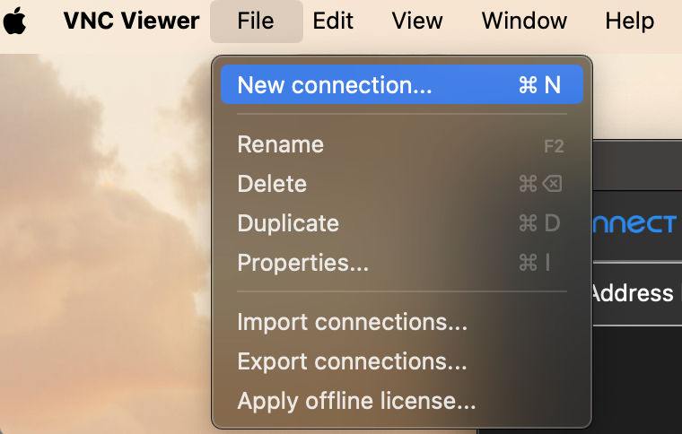

# Rasp开发指北1.0

## 前言：

emmm....为什么会有前言这个东西？要什么前言，撸起袖子加油干，Let's dive into the Raspberry Pi!

哦对了，还是得提一嘴，当前操作系统在macos，不过其实没有什么大的区别，最终我们都是在Linux下操作树莓派对吧，so whatever,操作系统没那么重要。也许，在开发指北2.0,3.0我会使用windows操作系统来演示，先在1.0画个饼吧哈哈 :) 

**Stay hungry.Stay foolish.**

## 开始吧

首先你得有一个树莓派 :)  其次你得会一点Linux :(  最好再会一点Pyhton 

当然我知道一切都是进行时，Sometimes when you innovate,you make mistakes.It is best to admit them quickly,and get on with improving your other innovations.

最好也要有一个屏幕用于初始操作（或者之后的一些问题处理，比如无法远程连接的情况）

### 认识一下树莓派

结构图：

实例图：

### 烧录系统

首先，everything you should know why,为什么我们要烧录系统？（写到这里我也思考了一下怎么去解释，这或许就是思考为什么的意义）

- 因为树莓派相当于一个微型计算机，他的一切都存储在那张SD卡上面，我们需要将操作系统放入SD卡，再将SD卡插入树莓派，这样一件冷冰冰的机器就有了热的灵魂。
- From ChatGpt: *The Raspberry Pi requires an OS to be installed (or "flashed") because it does not come with a pre-installed operating system. The Raspberry Pi is a small, powerful computer, but to maintain flexibility and cost-effectiveness, it typically does not include a built-in operating system.*

既然如此，怎么烧录呢——官网下载烧录软件：https://www.raspberrypi.com/software/


下载完成后，你会得到这样一个软件：


- 第一项是选择设备，根据自己的设备进行选择（通常是4）

- 第二步选择操作系统，这里选择多，坑也多（我以最新的操作系统为例）
  - 
  
    
  
  - 并且我用红色标出的地方是指不同的Debian操作系统的版本（就跟Ubuntu有很多不同的版本号一样），版本号的不同导致后续操作不同比如换源操作。这里Bullseys是一个较为稳定的版本。
  
- 接着进行写入即可，选择是：

烧录完成后就可以拔出SD卡并插入进树莓派中了

### 打开树莓派

第一次操作我们必须要连接一个屏幕，鼠标和键盘，因为如果你想远程连接也得知道其IP地址不是吗？

- 这里注意你的树莓派指示灯，刚打开的时候红灯和绿灯应该都在闪烁，并且绿灯是不断闪烁，红灯是一直闪烁——绿灯代表着树莓派正在读取SD卡的内容，红灯代表着真正的电源状态，所以一旦成功打开树莓派，绿灯就不再这样闪烁，只会偶尔闪烁一下，红灯依然一直闪烁。

接下来我们进行一下初始配置

- 点击左上方的树莓派标志，选择Performance中的Appearance Settings，在这里我们可以更换壁纸，并适配屏幕大小，接着在Taskbar中选取Positon为Bottom，将任务栏放到底部（是不是立马正常多了，不知道为什么默认在上面lol）
- 当然这只是一些基础的设置，欢迎自定义。Make innovation（对了字体设置时注意与自己的屏幕素质）
- 接着，从Performance中打开Raspberry Pi Configuration，系统设置中更改密码和主机名称，主机名称我们习惯更改为pi；在Interface界面我们打开SSH和VNC，（后面详细讲解其原理:)）；在Localisation界面可以设置地区时区，时区我们设置为上海，地区以及键盘配置设置为美国。

#### 检查树莓派配置

```bash
cat /etc/os-release #这个命令将显示包括操作系统名称、版本号等在内的详细信息。
lsb_release -a # 同样提供操作系统的详细信息，但格式可能略有不同
uname -a #显示关于内核版本的信息，但可能不会直接显示操作系统的发行版名称。
getconf LONG_BIT #查看是32位还是64位
```

请注意，本例的版本是`aarch 64`以及`bookworm`

#### 更换用户密码

以用户名pi为例

```bash
sudo passwd pi
#输入新的密码（无需旧密码）
```


#### 换源

我觉得这一步反而是最重要的，最该先做的。(我们需要将软件的下载更新源切换到国内，这样下载速度更快)
```bash
sudo nano /etc/apt/sources.list
```

然后更改其中原本的设置（建议将原本的设置进行注释即可不要删除）

其中要注意你的树莓派Debian版本，是bookworm,还是bullseye还是buster（*但是我发现怎么在bullseye系统上镜像写的是buster还能够更新成功啊？*）

```bash
deb https://mirrors.tuna.tsinghua.edu.cn/debian bookworm main contrib non-free-firmware
deb https://mirrors.tuna.tsinghua.edu.cn/debian-security bookworm-security main contrib non-free-firmware
deb https://mirrors.tuna.tsinghua.edu.cn/debian bookworm-updates main contrib non-free-firmware
```

再去更改另外一个文件的源设置

```bash
sudo nano /etc/apt/sources.list.d/raspi.list
```


```bash
deb https://mirrors.tuna.tsinghua.edu.cn/raspberrypi bookworm main
```
检查是否换源成功，执行软件包的更新获取操作.如果可以成功更新，则证明换源成功。
```bash
sudo apt update
sudo apt upgrade
```

## 远程连接操作

### 使用SSH连接树莓派

使用`sudo raspi-config`指令打开树莓派的设置面板（这是在VNC Viewer模式下截的图，关于VNC我们后面再说），选择其中的`Interface Options`


打开其中的SSH和VNC

接着，在你的PC终端上使用`sudo ssh username@ IPAddress`的方式远程连接树莓派,在第一次连接时会出现如下提示：


- 原因如下（来自ChatGpt）：当您第一次通过SSH（Secure Shell）连接到树莓派或任何其他计算机时，您的系统无法验证您正在连接到的设备的身份。这是因为您的计算机还没有存储任何关于该设备的安全凭证（通常是SSH密钥）。

  所以，为了保护您免受中间人攻击，您的SSH客户端会询问您是否信任您正在连接的主机。它会显示主机的SSH密钥指纹，这是一个通过安全散列算法（如SHA256）生成的一串字符，用于唯一标识主机的公钥。

  如果您确定这是您的树莓派，并且没有人在网络上冒充它，您可以接受这个密钥指纹。通过输入“yes”，您的SSH客户端将此密钥添加到您的`known_hosts`文件中，以便在将来的连接中自动识别这台设备。

- 更多有关于SSH的信息见SSH Explaination文档中

接着输入pc密码与树莓派的密码，如果没有错误则会进入到树莓派当中


现在你就可以通过你的PC的终端来直接操纵树莓派了，相当于你直接在操纵树莓派的终端，但是没有可视化界面，如果你想要可视化界面的话，使用下面这个方法——VNC Viewer

### 使用VNCViewer连接树莓派

下载VNC Viewer软件


在VNC软件中添加连接，通常快捷键都是`command + N`



填写VNC服务端的IP地址，即树莓派的IP地址，Name可以自主设定（表示这一次VNC连接的名称）


建立好链接之后还需要输入树莓派的名称以及密码，成功后即可进入可视化界面。


## 搭建文件共享服务器

### NFS

### Samba

## 使用摄像头

### 官方摄像头

### USB摄像头

1、查看当前的连接外设


## 使用一些模型

### Opencv

#### 安装Thony编辑器

### 安装Opencv

我选择在虚拟环境中安装Opencv的轻量级版本

1、创建虚拟环境

```bash
pi@raspberrypi:~/project/Env $ python3 -m venv yolov5env #在我的project目录下的Env目录下创建一个名为yolo5env的虚拟环境
source yolov5env/bin/activate #激活虚拟环境
```

2、安装opencv

这里选择的是轻量级版本

```bash
(yolov5env) pi@raspberrypi:~/project/Env $ pip install opencv-python-headless #注意此时虚拟环境已经激活，前面有(yolov5env)的提示
```


### TensorFlow

#### 虚拟环境

```bash
sudo apt install python3-venv
python3 -m venv my_virtualenv/venv
#
source my_virtualenv/venv/bin/activate
#
deactivate
```

### Pytorch

因为之后需要使用yolov5模型，所以我们在一个专门为yolov5模型创建的虚拟环境中完成安装。(激活虚拟环境同上)

此时我们已经在(yolov5env)这个虚拟环境中，接下来安装Pytorch

```bash
$ pip install torch torchvision torchaudio
$ pip install opencv-python #opencv在上面我们已经安装过了
$ pip install numpy --upgrade
```

安装完成后我们照例进行检查

```bash
python
import torch
torch.__version__ #得到所安装的pytorch的版本
```

