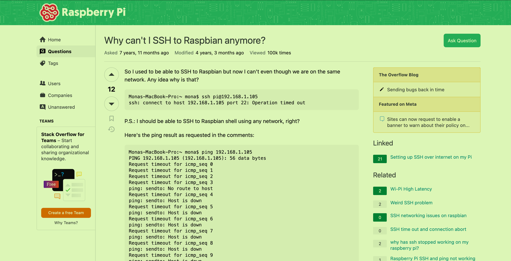
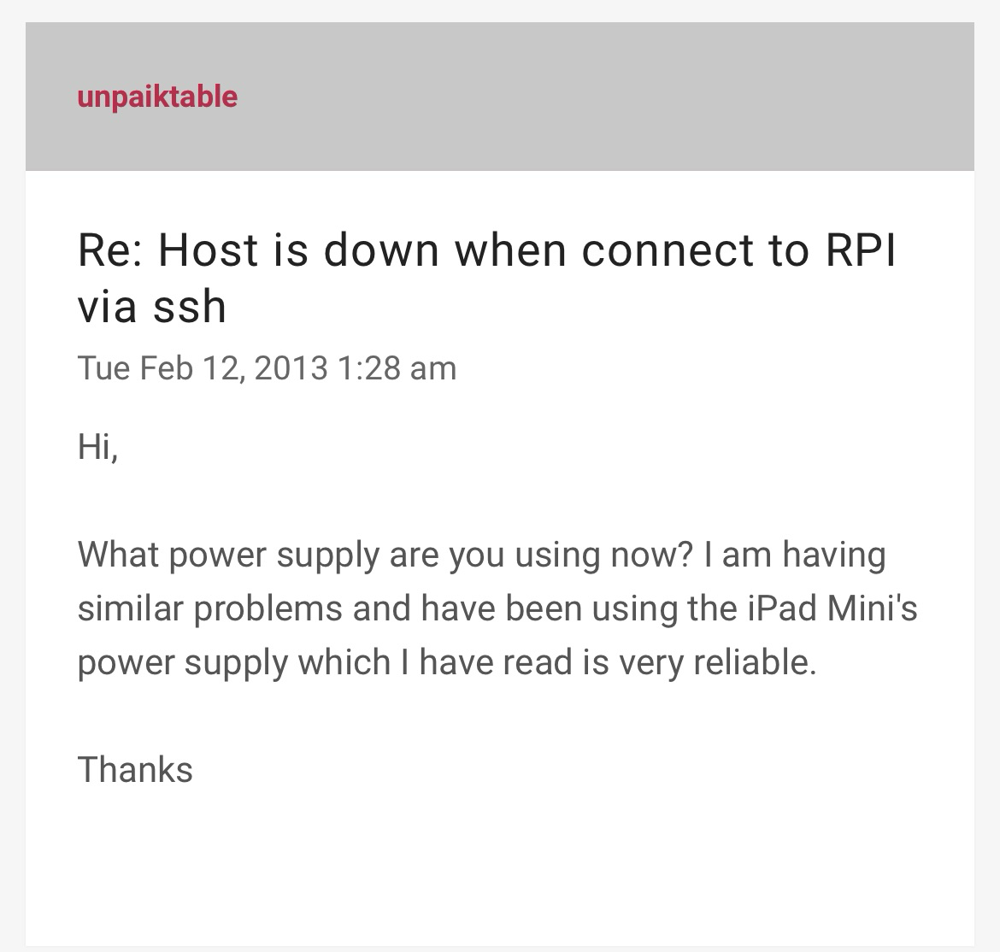
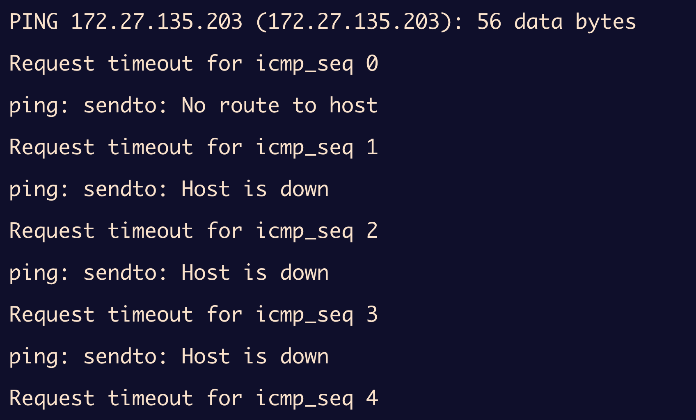

## SSH连接问题1

上来就遇到无法连接上ssh的问题，


重启，更新软件包均不可以解决此问题。

后来经过查询，先试了试`ping 172.27.135.203`,果然，没有ping通。

那怎么办呢？怎么办呢？当然是狠狠地谷歌了：`"raspberry pi ssh timeout"  inurl:stackoverflow` 

翻了又翻，没找到什么解决办法，因为你的问题是一个属于自己的独立的问题，属于自己特定环境下的问题。但是还是得到了一些灵感，试试互相ping，试试用其他的电脑来ping

tmd都没ping通，但都能联网！那具体到这个场景了，我就再来问问Chatgpt吧：

```bash
#iptables是一个树莓派上的防火墙
sudo iptables -P INPUT ACCEPT
sudo iptables -P FORWARD ACCEPT
sudo iptables -P OUTPUT ACCEPT
#允许ssh连接
sudo iptables -A INPUT -p tcp --dport 22 -j ACCEPT
#允许ping
sudo iptables -A INPUT -p icmp --icmp-type echo-request -j ACCEPT

```

但是，依然失败了。我不断地搜寻如何解决，发现有人也跟我一样遇到相同的问题：



然后我看到了树莓派官方论坛中也有这个问题，下面有一些讨论，我截取了这样有趣的一条：



也没有其他办法了，试试吧。换电源！（可是我一直用的是官方电源啊）

阿米诺斯，居然成功了。哈哈哈哈哈哈，我不知道是该笑还是该哭。还是忘记了事物的本质，树莓派原本就是个小型器件，电源的供应影响到他的网络配置好像也没毛病。

2024/1/21 18:36

再次出现ping不通的情况



这回又该如何解决呢？电源我已经更换了啊？

那就再更改方式呗，直接连我的手机热点，嘿，您猜怎么着，又好了哈哈哈哈，真可以；这样看来其实也不是电源的问题，反倒是校园网的问题，不会是校园网禁止了同一个子网里面的两台设备相互访问吧，（但是半个学期了，今天第一次遇到这种情况）

## SSH连接问题2

当我们尝试连接到某个SSH服务器时，如果该服务器的SSH密钥与之前保存在您的 `known_hosts` 文件中的密钥不匹配时，就会出现这种情况。

```bash
(base) lutao@HonorMgicM2 ~ % ssh pi@172.27.135.203
@@@@@@@@@@@@@@@@@@@@@@@@@@@@@@@@@@@@@@@@@@@@@@@@@@@@@@@@@@@
@    WARNING: REMOTE HOST IDENTIFICATION HAS CHANGED!     @
@@@@@@@@@@@@@@@@@@@@@@@@@@@@@@@@@@@@@@@@@@@@@@@@@@@@@@@@@@@
IT IS POSSIBLE THAT SOMEONE IS DOING SOMETHING NASTY!
Someone could be eavesdropping on you right now (man-in-the-middle attack)!
It is also possible that a host key has just been changed.
The fingerprint for the ED25519 key sent by the remote host is
SHA256:X92wKAwURwyNMPToywGqy8j4lWYIX9I5CGwDvuKIenw.
Please contact your system administrator.
Add correct host key in /Users/lutao/.ssh/known_hosts to get rid of this message.
Offending ED25519 key in /Users/lutao/.ssh/known_hosts:12
Host key for 172.27.135.203 has changed and you have requested strict checking.
Host key verification failed.
```

从原理上讲，这是因为我重新烧录了树莓派（即服务器端）的系统，所以服务器与客户端之间的SSH密钥就会被重新生成，客户端之前保存的密钥不再生效，由于客户端无法验证服务器的身份，就会显示警告。

### 处理方法

删除之前客户端所保存的密钥，使用下面命令删除保存的有关树莓派ip地址的特定行

```bash
ssh-keygen -R 172.27.135.203
```

## 无法连接外接HDMI屏幕
