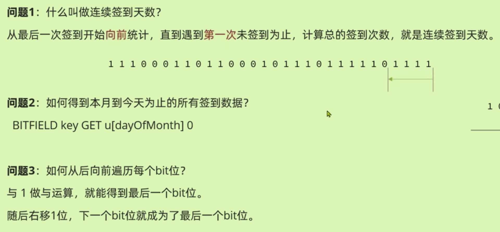
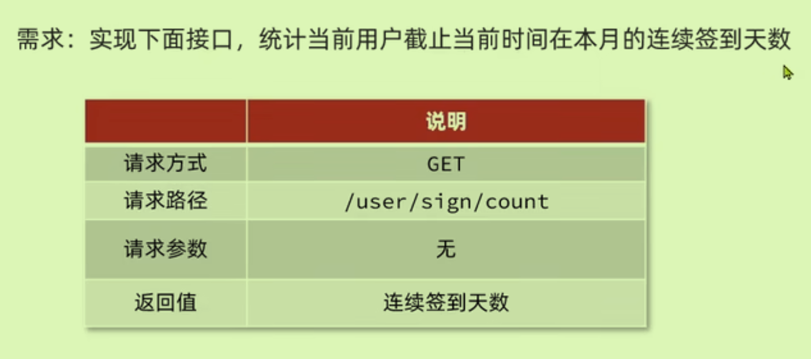

# 达人探店

## 发布探店笔记

两个接口，发布+上传照片


先修改上传图片的地址，由于开始时将资料中nginx拷贝入本机的nginx目录下，所以此地址应该是本机的nginx目录下

`/opt/homebrew/var/www/hmdp/imgs`

## 实现查询探店笔记

前端请求：


代码实现

```java
    /**
     * 根据博客id查询博客以及对应的用户信息
     * @param id
     * @return
     */
    @Override
    public Result queryBlogByID(Long id) {
        //查询blog
        Blog blog = getById(id);
        //查询blog有关的用户
        if (blog == null){
            return Result.fail("笔记不存在");
        }
        queryBlogUser(blog);
        return null;
    }
//热点博客
    @Override
    public Result queryHotBlog(Integer current) {
        //根据用户查询
        Page<Blog> page = query()
                .orderByDesc("liked")
                .page(new Page<>(current, SystemConstants.MAX_PAGE_SIZE));
        //获取当页数据
        List<Blog> records = page.getRecords();
        //查询用户,这是一个遍历过程。
        records.forEach(blog -> {
            queryBlogUser(blog);
        });
        return Result.ok(records);
    }
```

```java
    /**
     * 根据博客查询用户
     * @param blog
     */
    private void queryBlogUser(Blog blog) {
        Long userId = blog.getUserId();
        User user = userService.getById(userId);
        blog.setName(user.getNickName());
        blog.setIcon(user.getIcon());
    }
```

## 点赞

前端请求：

 

- 要求做到一人一赞，再次点击取消点赞。
- 如果已经点赞，则点赞按钮高亮显示（前端已实现）

代码实现

- 需要先判断用户是否已经点赞。
- 

添加点赞功能，利用Redis的set集合保存用户信息来判断是否点过赞。（前两个步骤）

```java
    @Override
    public Result likeBlog(Long id) {
        //判断当前用户是否已经点赞
        Long userId = UserHolder.getUser().getId();
        String key = "blog:liked:" + id;
        Boolean isMember = stringRedisTemplate.opsForSet().isMember(key, userId.toString());
        //将blogid和用户id作为key-value放入redisset集合中
        //如果未点赞，可以点赞
        if (BooleanUtil.isFalse(isMember)){
            //数据库点赞数+1，用户信息保存在redis集合中，为了下一次用来判断是否点过赞了
            boolean isSuccess = update().setSql("liked = liked + 1").eq("id", id).update();
            if (isSuccess){
                stringRedisTemplate.opsForSet().add(key, userId.toString());
            }
        }else{
            //如果已经点赞，取消点赞，数据库点赞数-1，将用户从redis集合移除——因为点两次取消
            boolean isSuccess = update().setSql("liked = liked -1 ").eq("id", id).update();
            if (isSuccess){
                stringRedisTemplate.opsForSet().remove(key, userId.toString());
            }
        }
        //
        return Result.ok();
    }
```

在两个功能中添加是否点赞。

```java
//是否点过赞    
private void isBlogLiked(Blog blog) {
        Long userId = UserHolder.getUser().getId();
        String key = "blog:liked:" + blog.getId();
        Boolean isMember = stringRedisTemplate.opsForSet().isMember(key, userId.toString());
        blog.setIsLike(BooleanUtil.isTrue(isMember));//如果是true，证明点过赞了
    }
```

### 点赞排行榜

前端请求发送：（并且形成最早的点赞Top5）


为了实现排行榜，采用Redis中的`SortedSet`数据结构——**根据score值排序，元素唯一**

代码实现：

- 将上方的点赞中的`opsForSet`改为`opsForZSet`以及对应的api
- 并添加Top5点赞用户功能

```java
   /**
     * 返回点赞用户top5
     * @param id
     * @return
     */
    @Override
    public Result queryBlogLikes(Long id) {
        String key = BLOG_LIKED_KEY + id;
        //查询top5点赞用户 zrange key 0 4
        Set<String> top5 = stringRedisTemplate.opsForZSet().range(key, 0, 4);
        if (top5 == null || top5.isEmpty()){
            return Result.ok(Collections.emptyList());
        }
        //解析出用户id，根据id查询用户，返回用户
        List<Long> ids = top5.stream().map(Long::valueOf).collect(Collectors.toList());
        List<UserDTO> userDTOS = userService.listByIds(ids).stream()
                .map(user -> BeanUtil.copyProperties(user, UserDTO.class))
                .collect(Collectors.toList());
        //
        return Result.ok(userDTOS);
    }
```

# 好友关注

## 关注和取关

前端请求：


代码实现：

尝试关注用户

```java
   public Result follow(Long followUserId, boolean isFollow) {
        //获取登录用户
        Long userId = UserHolder.getUser().getId();
        //1判断要来关注还是取关
        if (isFollow) {
            //关注，新增数据
            Follow follow = new Follow();
            follow.setUserId(userId);
            follow.setFollowUserId(followUserId);//将用户和被关注用户放入follow类（关系数据库）
            save(follow);
        }else {
            //取关 delete from tb_follow where userId = ? and follow_user_id = ?
            remove(new QueryWrapper<Follow>()
                    .eq("user_id", userId).eq("follow_user_id", followUserId));
        }

        return Result.ok();
    }
```

判断是否关注了用户

```java
public Result isFollow(Long followUserId) {
        //获取登录用户
        Long userId = UserHolder.getUser().getId();
        //select count(*) from tb_follow where user_id = ? and follow_user_id = ?
        Integer count = query().eq("user_id", userId).eq("follow_user_id", followUserId).count();
        //
        return Result.ok(count > 0);
    }
```

## 共同关注

首先点击进入用户的头像进入其首页，会产生两个请求：根据id查询当前用户，根据用户查询已有笔记。

共同关注使用Redis中的set集合求交集，需要将每个用户的关注用户放入到集合中——key(当前用户)-value(关注的用户id)

共同关注的前端请求：


代码实现：

```java
    /**
     * 获取当前用户与指定用户的共同关注
     * @param id 指定用户
     * @return
     */
    @Override
    public Result followCommons(Long id) {
        Long userId = UserHolder.getUser().getId();
        String key = "follows:" + userId;
        //求交集
        String key2 = "follows:" + id;
        Set<String> intersect = stringRedisTemplate.opsForSet().intersect(key, key2);
        if (intersect == null || intersect.isEmpty()){
            return Result.ok(Collections.emptyList());//如果无交集返回空集合
        }
        //解析交集中的id集合
        List<Long> ids = intersect.stream().map(Long::valueOf).collect(Collectors.toList());
        //根据共同关注的id查询具体的用户
        List<UserDTO> users = userService.listByIds(ids).stream()
                .map(user -> BeanUtil.copyProperties(user, UserDTO.class))
                .collect(Collectors.toList());
        return Result.ok(users);
    }
```

## 关注推送Feed流

### TimeLine

类似朋友圈，按照时间排序，只展示你的好友发的朋友圈。

#### 拉模式（读扩散）

消息只保存一份在发件箱，拉取到收件箱再按时间排序。高延时。


#### 推模式（写扩散）

没有发件箱。发的时候扩散n份，内存占用率高。


#### 结合模式


对于普通进行拉模式，临时拉取；对于活跃进行推模式，立即推送。

### 智能排序

抖音等投送用户感兴趣的信息。

### 基于推模式实现Feed流

业务需求：


Feed流分页模式的难点：数据更新时，分页角标也在不断变化。不能采取传统的静态分页模式，需要滚动分页。（不依赖于角标）

故选取Redis数据结构中的SortedSet，按照score值进行排列。

代码实现：

- 推送到粉丝收件箱

```java
    /**
     * 根据博客名称保存博客,并发送到粉丝的收件箱中
     * @param blog
     * @return
     */
    @Override
    public Result saveBlog(Blog blog) {
        //获取当前登录用户（也是写博客的用户）
        UserDTO user = UserHolder.getUser();
        blog.setUserId(user.getId());
        //保存博客到数据库
        boolean isSuccess = save(blog);
        if (! isSuccess){
            return Result.fail("新增笔记失败");
        }
        //开始推送给粉丝，但是首先需要查询当前用户的所有粉丝
        List<Follow> follows = iFollowService.query().eq("follow_user_id", user.getId()).list();
        //
        for (Follow follow : follows) {
            //获取粉丝id
            Long userId = follow.getUserId();
            //推送
            String key = "feed:" + userId;
            stringRedisTemplate.opsForZSet().add(key, blog.getId().toString(), System.currentTimeMillis());
        }
        return Result.ok(blog.getId());//返回博客的id
    }
```

- 查询收件箱数据时，实现分页查询（滚动查询，每一次查询都去找上一次的最小值作为下一次的开始）

`ZREVRANGEBYSCORE name max min WITHSCORES LIMIT OffSet Count `注意Offset是`<=`上一次末尾

- 本次查询需要依靠前一次查询的结果
- 

前端请求：


```java
    /**
     * 分页滚动查询
     * @param max 本次查询的最大值（也是上次查询的最小值）
     * @param offset 要查多少，偏移量
     * @return 返回一个ScrollResultDTO,里面有三个参数：博客、当前最小值、偏移量（有几个与最小值相等的）
     */
    @Override
    public Result queryBlogOfFollow(Long max, Integer offset) {
        //获取当前用户id，为了获取其信箱中的博客
        Long userId = UserHolder.getUser().getId();
        String key = FEED_KEY + userId;
        //将sortedset集合中（信箱）的键值对进行按照时间排序,即执行redis中的语句
        Set<ZSetOperations.TypedTuple<String>> typedTuples = stringRedisTemplate.opsForZSet()
                .reverseRangeByScoreWithScores(key, 0, max, offset, 2);
        //
        if (typedTuples == null || typedTuples.isEmpty()){
            return Result.ok();
        }
        //解析存入信箱中的数据，博客id，时间戳，偏移量
        //定义保存博客id的集合，时间戳偏移量的默认值
        ArrayList<Object> ids = new ArrayList<>(typedTuples.size());
        long minTime = 0;
        int of = 1;
        //举例score：5，4，4，2，2
        for (ZSetOperations.TypedTuple<String> typedTuple : typedTuples) {
            //获取博客id
            ids.add(Long.valueOf(typedTuple.getValue()));
            //获取时间戳，即sortedset集合中的分数
            long time = typedTuple.getScore().longValue();
            //根据时间戳来推断出偏移量
            if (time == minTime){
                of ++;
            }else {
                minTime = time;//每次来找到新的最小时间戳
                of = 1;
            }
        }
        //根据id查询blog
        String idStr = StrUtil.join(",", ids);
        List<Blog> blogs = query().in("id", ids)
                .last("ORDER BY FIELD(id," + idStr + ")")
                .list();
        //对每个博客进行相关操作：查询有关用户，是否被点赞
        for (Blog blog : blogs) {
            queryBlogUser(blog);
            isBlogLiked(blog);
        }
        //封装三个信息返回
        ScrollResult result = new ScrollResult();
        result.setList(blogs);
        result.setMinTime(minTime);
        result.setOffset(of);
        return Result.ok(result);
    }
```

# 附近商户

Redis中基于地理坐标进行查询。

## GEO数据结构

## 附近商户搜索

前端请求：


代码实现：

- 将经纬度和店铺id存放在Redis的GEO中，查询结果为id，利用此id到数据库中查询具体的商铺信息
- 如何根据类型过滤（因为Redis中没有存放类型）：

导入店铺数据到GEO中：

```java
void testShopLoad(){
        //查询店铺信息
        List<Shop> list = shopService.list();
        //将店铺按照typeId分组，一致的在一个集合（为什么不直接遍历list）——直接遍历需要一个一个单独处理
        Map<Long, List<Shop>> map = list.stream().collect(Collectors.groupingBy(Shop::getTypeId));//stream流操作对集合进行聚合操作
        //写入redis
        for (Map.Entry<Long, List<Shop>> entry : map.entrySet()) {
            //获取类型id
            Long typeId = entry.getKey();
            String key = "shop:geo:" + typeId;
            //同类型的放入一个List集合中
            List<Shop> shops = entry.getValue();
            //为了更快，将店铺集合转换为GeoLocation；在这里先声明locations集合
            List<RedisGeoCommands.GeoLocation<String>> locations = new ArrayList<>(shops.size());
            //真正写入redis GEOADD key 经度 纬度 member
            //先将店铺集合转换为GeoLocation
            for (Shop shop : shops) {
                locations.add(new RedisGeoCommands.GeoLocation<>(
                        shop.getId().toString(),
                        new Point(shop.getX(), shop.getY())
                ));
            }
            stringRedisTemplate.opsForGeo().add(key, locations);//使用了Iterable写入redis
        }
    }
```

- 注意，GeoLocation中存放着店铺id和店铺坐标

实现附近商铺功能

```java
    /**
     * 通过店铺类型和经纬度进行店铺的分页查询
     * @param typeId
     * @param current
     * @param x
     * @param y
     * @return
     */
    @Override
    public Result queryShopByType(Integer typeId, Integer current, Double x, Double y) {
        //判断是否需要根据坐标查询
        if (x == null || y == null){
            //不需要坐标时，使用数据库查询
            Page<Shop> page = query().eq("type:id", typeId)
                    .page(new Page<>(current, SystemConstants.DEFAULT_PAGE_SIZE));
            return Result.ok(page.getRecords());
        }
        //如果需要坐标查询，即将使用Redis
        //先计算分页参数
        int from = (current - 1) * SystemConstants.DEFAULT_PAGE_SIZE;
        int end = current * SystemConstants.DEFAULT_PAGE_SIZE;
        //查询redis，按照距离排序并分页；查询得到店铺id以及距离
        String key = SHOP_GEO_KEY + typeId;
        GeoResults<RedisGeoCommands.GeoLocation<String>> results = stringRedisTemplate.opsForGeo()// GEOSEARCH key,
                .search(
                        key,
                        GeoReference.fromCoordinate(x, y),
                        new Distance(5000),
                        //这里limit end 返回的是0-end，所以必须在下面进行截取（利用stream流截取）
                        RedisGeoCommands.GeoSearchCommandArgs.newGeoSearchArgs().includeDistance().limit(end)
                );
        //
        if (results == null){
            return Result.ok(Collections.emptyList());
        }
        //将结果集合转换为list集合（这一步为什么多转化一步）
        List<GeoResult<RedisGeoCommands.GeoLocation<String>>> list = results.getContent();
        //用于存储
        List<Long> ids = new ArrayList<>(list.size());//用于保存店铺的id
        Map<String, Distance> distanceMap = new HashMap<>(list.size());//用于将距离和店铺联系在一起
        //截取from-end的部分，跳过前from个记录
        list.stream().skip(from).forEach(result ->{
            //获取店铺id并放入ids列表中
            String shopIdStr = result.getContent().getName();
            ids.add(Long.valueOf(shopIdStr));
            //获取距离,并联系店铺放在map中
            Distance distance = result.getDistance();
            distanceMap.put(shopIdStr, distance);
        });
        //根据id去数据库里查询店铺
        String idStr = StrUtil.join(",", ids);
        List<Shop> shops = query().in("id", ids).last("ORDER BY FIELD(id," + idStr + ")").list();
        for (Shop shop : shops) {
            shop.setDistance(distanceMap.get(shop.getId().toString()).getValue());//shop的有一个属性是距离
        }
        return Result.ok(shops);
    }

```

# 用户签到

## 位图BitMap


底层是String类型，Java中`stringRedisTemplate`没有对应的opsForBit,还是使用ForValue那一套操作。

## 实现当日签到

前端请求：


Key:用户以及年月；Value：一个月的签到信息BitMap

代码实现：

```java
    /**
     * 实现用户签到功能，将一个月的签到信息保存在一个Redis的BitMap中
     * @return
     */
    @Override
    public Result sign() {
        //获取当前登录用户
        Long userId = UserHolder.getUser().getId();
        //获取日期
        LocalDateTime now = LocalDateTime.now();
        //拼接成为当前key
        String keySuffix = now.format(DateTimeFormatter.ofPattern(":yyyyMM"));
        String key = USER_SIGN_KEY + userId + keySuffix;
        //获取今天是本月的第几天（第几位要改变签到）
        int dayOfMonth = now.getDayOfMonth();
        //写入Redis的bitMap中 SETBIT key offset
        stringRedisTemplate.opsForValue().setBit(key, dayOfMonth-1, true);
        return Result.ok();
    }
```

## 实现签到统计

统计连续签到天数+总的签到次数。



前端需求：



代码实现：

```java
    /**
     * 统计当前用户本月截止今天为止的连续签到天数
     * @return
     */
    @Override
    public Result signCount() {
        //获取当前登录用户
        Long userId = UserHolder.getUser().getId();
        //获取日期
        LocalDateTime now = LocalDateTime.now();
        //拼接成为当前key
        String keySuffix = now.format(DateTimeFormatter.ofPattern(":yyyyMM"));
        String key = USER_SIGN_KEY + userId + keySuffix;
        //获取今天是本月的第几天（第几位要改变签到）
        int dayOfMonth = now.getDayOfMonth();
        //获取本月截止今天为止的所有签到记录，返回的是一个十进制数，对其进行后处理
        List<Long> result = stringRedisTemplate.opsForValue().bitField(
                key,
                BitFieldSubCommands.create()
                        .get(BitFieldSubCommands.BitFieldType.unsigned(dayOfMonth))
                        .valueAt(0)
        );//BITFIELD sign:13:202404 GET u14 0
        //注意返回结果为list，是因为这个命令不止有get
        if (result == null || result.isEmpty()){
            //
            return Result.ok(0);
        }
        Long num = result.get(0);//得到签到结果的十进制数
        if (num == null || num == 0){
            return Result.ok(0);
        }
        //循环遍历
        int count = 0;//记录最大连续签到天数（从第一天开始，第一天是最低位）
        while (true){
            //将数字与1进行与运算，得到数字的最后一个bit位，来判断bit位是否为0
            if ((num & 1) == 0){
                //未签到，结束
                break;
            }else {
                count ++;
            }
            //每次操作完都得往下一个bit位
            num >>>= 1;
        }
        return Result.ok(count);
    }
```

# uv统计

相同元素只统计一次。

## HyperLogLog

一种概率算法（推断），内存占用较小，但是存在一定的误差。

命令：`PFADD  PFCOUNT`

